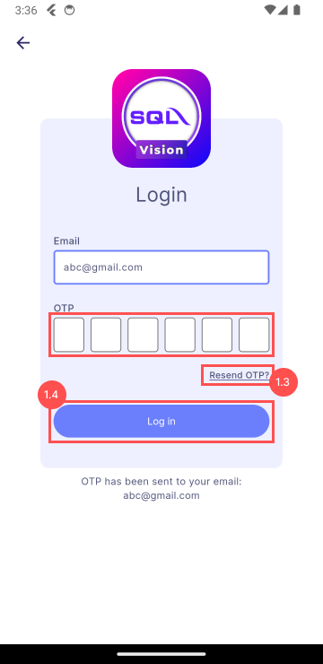

# Login Page

## 1. Login

Enter the user company email address (**highlighed** in red)

### 1.1 Submit Email

- This button allows user to submit their email
- Wait to receive an email that include an One-Time Password(OTP)

    

### 1.2 Enter OTP

Enter the OTP (**highlighed** in red)

### 1.3 Resend OTP

This text button allows user to request again an One-Time Password(OTP) 

### 1.4 Verification

- This button allows user to submit the OTP for verification
- After verification, the user is ready to start using the application
