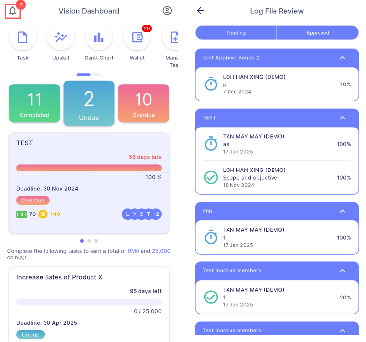

# Main Dashboard

## Quick Action Buttons

### Task

- Displays all available quests and tasks assigned to the user.

### Upskill

- Displays all available courses and courses in which the user is currently enrolled.

### Gantt Chart

- Displays a visual timeline of tasks and deadlines, allowing the user to track progress across project.

### Wallet

- Displays earned cash and coins, transaction history, and available rewards for redemption.

### Manage Task

- Allows user to create, edit and update tasks, track task progress and review completed tasks.

### Manage Upskill

- Allows user to create, edit and update courses, track course progress and review completed course.

### Manage Group

- Allows user to view, create, edit and delete groups.

## Status Card

- Displays the total number of tasks categorized by their current status:
        - Green: Completed tasks
        - Blue: Undue tasks
        - Red: Overdue tasks
- **Navigation**: Selecting a status card redirects the user to the task list, with the tasks automatically filtered according to the selected status.

## Overdue Tasks

- Displays up to three tasks that have exceeded their deadlines, providing the user with a clear overview of the most urgent overdue items.

## Undue Tasks

- Displays up to three tasks that are currently in progress and have not yet reached their deadlines, providing the user with a quick view of ongoing responsibilities.

## Earned Card

- Displays the cash and coin rewards earned by the user for the current or previous month, allowing easy tracking of monthly earnings.

## Account Setting

### Profile

- Displays the user's basic information.
- **Statistics**: Shows the total cash and coin rewards earned by the user, along with the number of quests joined and courses registered.
- **Completion**: Provides progress indicators for targets, assignments, and courses, displaying both numeric counts and percentage completion.
- **Achievements**: Displays badges earned by the user for completing various activities, with an option to view all achievements.

- The top-right button allows managers to search employees and view their details, but cash and points earned are not shown.

|  | ➜ |  |
 |:---:|---|:---:|

:::info NOTE
Details are **view-only** and **cannot be edited** or **modified** from the mobile application.
:::

### Company Configuration (Manager)

- Enables managers to view and modify company settings, including the closing period (days), estimated payout day, and payment strategies.
- Managers can switch between Default and Customize strategies and use the search bar to quickly locate specific strategies.
- For more details about strategy, refer to [**Linking to SQL Account | Strategy**](./linking-to-account.md#strategy).

:::warning NOTE
*This function is accessible only to users with manager permissions.*
:::

### Switch Company

- Shows all companies the user is associated with, allowing seamless switching between different company accounts.

### Help

- Directs users to SQL Vision’s documentation page for support resources and user guides.

### Logout

- Ends the current session, logging the user out of the application and returning them to the login screen.

## Log File Review

- Allows the user to view and manage pending and approved log files for assignments that have not been finalised yet.
