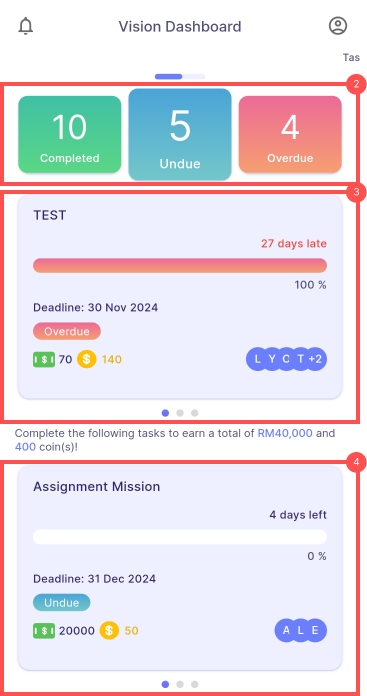
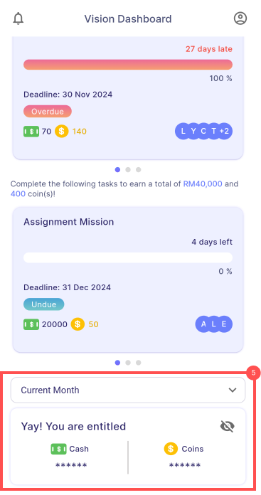
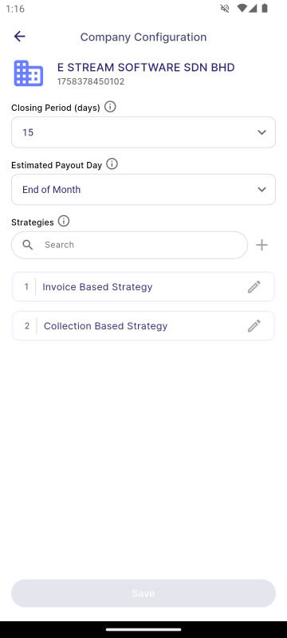

# Main Dashboard

## 1. Quick Action Buttons
### 1.1 Task:
- Display all available quest and tasks assigned to the user.

### 1.2 Gantt Chart:
- Display a visual timeline of tasks and deadlines, allowing the user to track progress across project.

### 1.3 Wallet:
- Display cash and coins earned, transaction history and redeem gift.

### 1.4 Upskill:
- Display all available courses and those the user is currently enrolled in.

### 1.5 Manage Task:
- Allows user to create, edit and update tasks, track task progress and review completed tasks.

### 1.6 Manage Upskill:
- Allows user to create, edit and update courses, track course progress and review completed course.

## 2. Status Card
- Displays the count of tasks where: 
    - Green: Completed tasks
    - Blue: Undue tasks
    - Red: Overdue tasks
- Clicking the status card navigates the user to the task list, and filter will be applied based on the status clicked.

## 3. Overdue Tasks
- Displays up to 3 tasks that have passed thier deadlines.

## 4. Undue Tasks
- Displays up to 3 tasks that are currently in progress and have not yet reached their deadlines.

## 5. Earned Card
- Allows the user to view the cash and coin rewards they are entitled to for the current month or the previous month.

## 6. Account Setting

### 6.1 Personal Information
- Displays the user's profile information in the company payroll system, organized into sections for general details, employment grouping and family information.

:::info NOTE
Details are **view-only** and **cannot be edited** or **modified** from the mobile application.
:::

### 6.2 Company Configuration (Manager)
- Allows managers to modify settings such as the closing period, estimated payout day and strategies. 
- For more details about strategy, see [**Linking to SQL Account | Strategy**](./linking-to-account.md#strategy).

:::warning NOTE
*This function is accessible only to users with manager permissions.*
:::

### 6.3 Switch Company
- Displays a list of companies the user is enrolled in, allowing them to switch between different company accounts.

### 6.4 Help
- Directs the user to the company website for support resources and guides.

### 6.5 Logout
- Logs the user out of the application, ending the current session and returning them to the login screen.

## 7. Log File Review

- Enables the user to view and manage pending and approved log files for assignments that have not been finalised yet