# Task

## User View
    User view is for employees who will accomplish the task. 

### 1. Target
    Users can view the target detail such as title, task creator, description, start date, end date, strategy, rewards, and ranking.

    :::note Note

    Team task will only **visible** for team leader.

    :::

    :::info Info

    Progress of the task will be calculated based on the target type.

    **Individual**: Progress of the employee himself

    **Team**: Total progress of all members (include team leader)

    :::

    | Individual                                                | Team                                         | 
    |-----------------------------------------------------------|----------------------------------------------|
    |  | | 

### 2. Assignment
    Users can view the assignment detail such as title, description, start date, end date, consultant, rewards, bonus criteria, and other progress. 

    :::info Info

    **Consultant**: responsible for providing expert guidance to the user in completing the task.

    :::

    :::note Note

    The bonus will only be available when the log file's percentage reaches **100%**.

    :::

    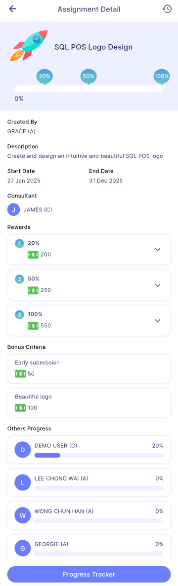

### 2.1 Milestone and Reward

    Users can view the reward for each milestone and are entitled to it once the task's completion percentage reaches the milestone percentage (after manager **approved** the submitted log file).

    :::tip Tips

    - The percentage displayed in the chat bubble corresponds to the rewards section. 
    - The progress bar displays the user's completion percentage.

    :::

### 2.2 Progress Tracker 

    - This button allows user to view his submitted log file and milestone reward obtained.

            
            Indicates the log file is in **Pending** status

            
            Indicates the log file is in **Approved** status

    - The rewards are entitled once the **approved** log file percentage is achieved.

    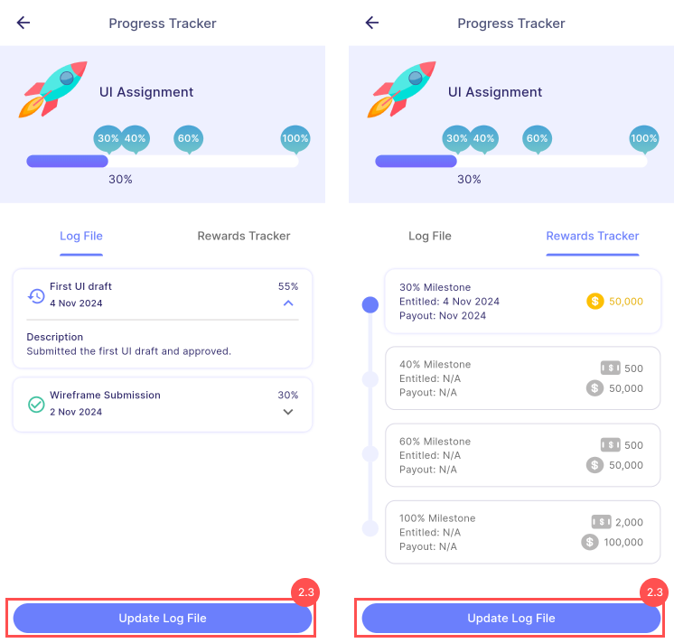

### 2.3 Update Log File 
   This button allows user to create a new log file, fill in the details, and submit it by clicking **Submit** button.

   - Users **must** fill in all the details.

   - Submitted log file cannot be **edit**.

   - Users are not be able to **submit** log file **before** manager **approve** the previous one.

    

### 2.4 Submission Bonus Request
    Users are allowed to submit bonus request by choosing the bonus criteria and add on remark.
    
    :::note Note
    
    This form is only available when the log file submission is **100%**.

    :::

    :::warning Alert

    Bonus request can only be submitted once.

    :::

    

### 3. Quest
    - Users can join available quests by clicking **Join Quest** button
    - Some quests require manager approval, which places the request in **Pending** status
    - Users can cancel a pending request by clicking **Cancel Join Quest**
    - Quests that don't require join permission will allow users to join directly.
    - After joining, users will be navigate to [**Target**](#1-target) or [**Assignment**](#2-assignment)

    :::warning Alert

    After joining, users **cannot** quit the task.

    :::

    

## Manager View
    Manager view is for users who will assigned the task to employee. 

### 1. Target (Manager)
    Managers can view the target detail that are created such as title, task creator, description, start date, end date, strategy, rewards, and employee's progress.

    | Individual                                                  | Team                                            | 
    |-------------------------------------------------------------|-------------------------------------------------|
    | | 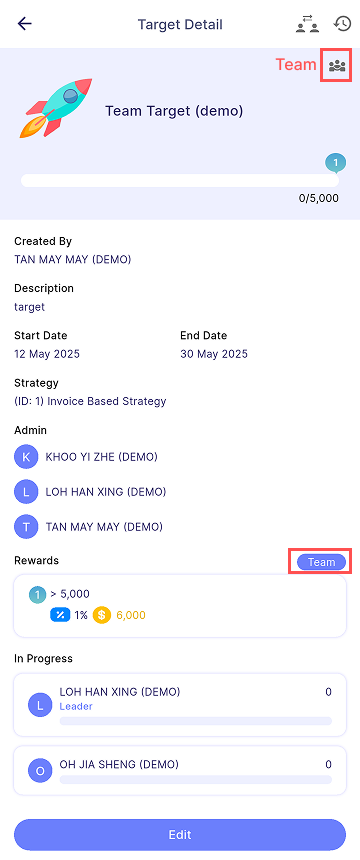| 

### 1.1 Employee Progress Card
    This button allows the manager to view employee's target info

    | Individual                                             | Team                                      | 
    |--------------------------------------------------------|-------------------------------------------|
    |  | |

### 1.2 Edit
    This button allows the manager to edit the target details. 

    For more information, please refer [**Edit Task**](task_creation/task-edit.md)

    

### 2. Assignment (Manager)
    Managers can view the assignment detail that are created such as title, description, start date, end date, consultant, rewards, and bonus criteria.

    | Undue/Overdue                                                | Completed                                                | 
    |--------------------------------------------------------------|----------------------------------------------------------|
    | 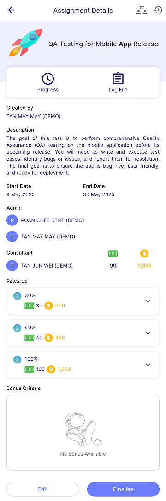 | |

### 2.1 Progress 
    This button allows manager to view the progress of each employee.

    :::note Note
    
    **Progress** tab bar: Display the employee that are still havent reached **100%**.

    **Completed** tab bar: Display the employee that reached **100%**.

    :::

    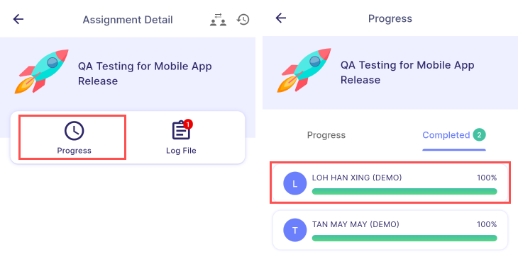

### 2.2 Log File
    This button allows the manager to view all unapproved log files submitted by employees.

    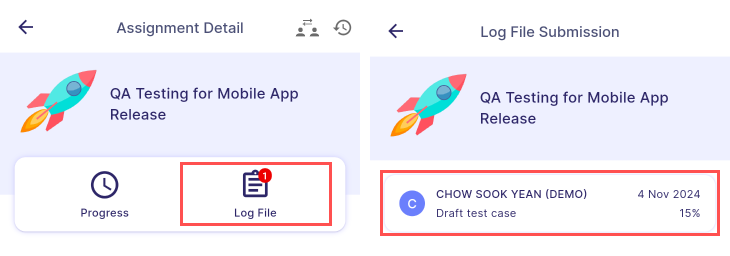

### 2.3 Edit
    This button allows the manager to edit the assignment details. 

    For more information, please refer [**Edit Task**](task_creation/task-edit.md)

    

### 2.4 Finalize
    - This button allows the manager to finalize assignment.

    - To finalize assignment, all log file should be **approve**.

    - After finalizing, consultant reward will be entitled.

    :::danger Warning
    
    Finalizing assignment is an **irreversible** action.

    :::

    

### 2.5 Employee Progress Card
    - This button allows manager to view employee's assignment info.

    - (**Highlighted in red**) The total cash and coin(s) earned by the employee in this assignment.

    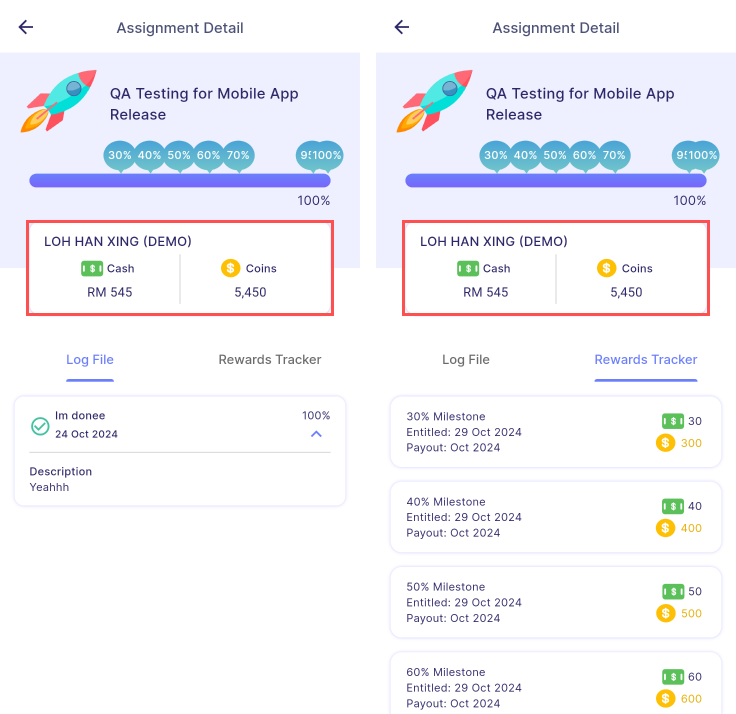

### 2.6 Log File Card
    This button allows the manager to view the log file details submitted by employee.

    

### 2.7 Log File Override
    This button allows the manager to override the log file's progress percentage by clicking **Save** button.

    :::info Info
       Manager will not be able to override progress percentage that is **lower** than the previous progress percentage.
    :::

    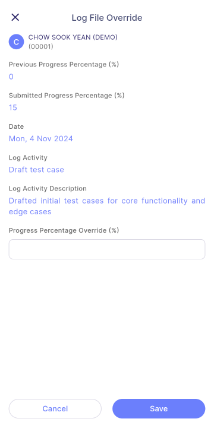

### 2.8 Approve Log File
    - This button allows the manager to approve the employee's log file.

    - After approving, manager can view the bonus request submitted by the employee.

    :::note Note
    
    - Bonus Review is only available when the log file submission is **100%**.
    - The colored bonus card represents the bonus requested by the employee. (**highlighted in red**)

    :::

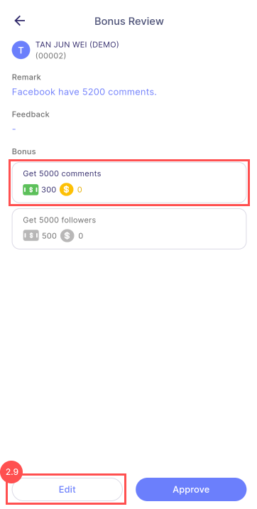

### 2.9 Edit Bonus
    - This button allows the manager to edit the bonus request from the employee.

    - Managers can choose the bonus criteria, and edit the amount.

    :::note Note
    
    - Edit amount cannot **exceed** the maximum amount as shown.
    - Manager can **edit** maximum amount in the [**Edit**](#23-edit) section.

    :::

    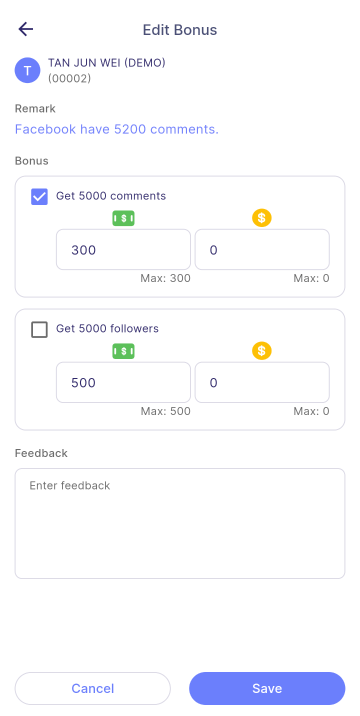

### 2.10 Reward Info
    This info button allows user to view the milestone and bonus rewards in the dialog.

    :::info Info
       The code will matches with the code in the summary table.
    :::

    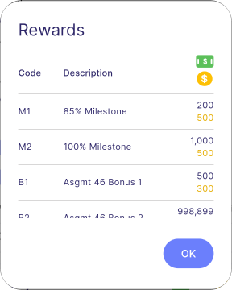

### 2.11 Employee 
    Managers can click the employee's name to view the employee's assignment info.

    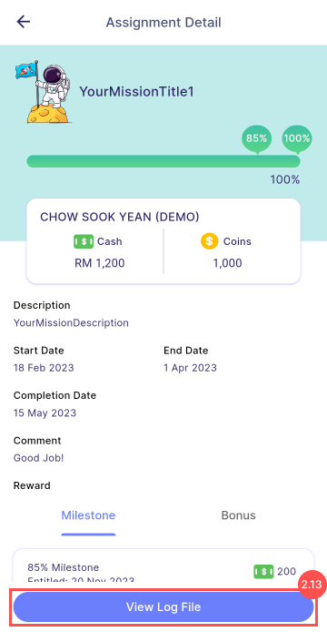

### 2.12 Tooltip Reward
    Managers can click the total cash and coins to view the earned amounts for the corresponding employee in the tooltip.

    :::info Info
       The code will matches with the code in the summary table.
    :::

    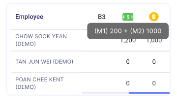

### 2.13 Employee Log File
    This button allows the manager to view all the log file submitted by the employee.

    

### 2.14 Change Log
    This button allows the manager to view the mission's change log, including details of who made edits and what changes were made.

    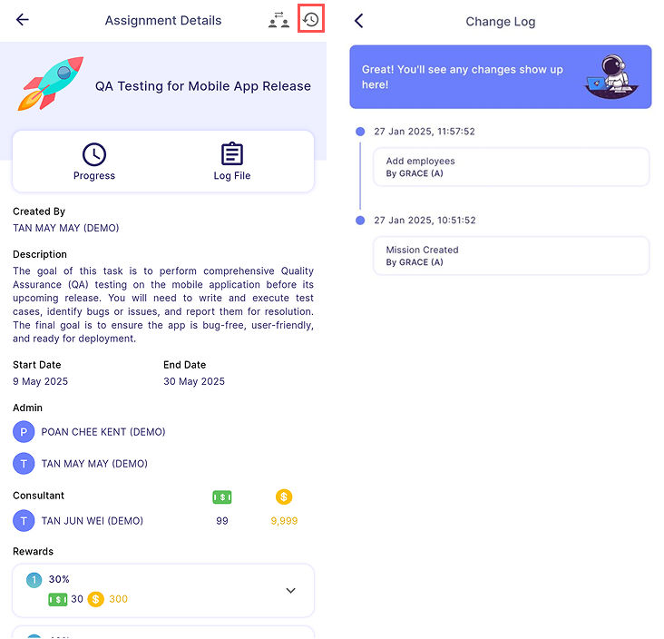

### 3. Quest (Manager)
    Quest detail will be same as the assignment or target details based on whether it's a target or assignment quest.

    For more information, can refer as below:
     - [**Target**](#1-target-manager)
     - [**Assignment**](#2-assignment-manager)

    | Approval Required                                                         | No Approval Required                                           | 
    |---------------------------------------------------------------------------|----------------------------------------------------------------|
    |  | | 

### 3.1 Manage Participant
    - Filter menu on right top allows the manager to filter the employee by branch, department, and HR group.

    | View                                                                      | Filter                                                 | 
    |---------------------------------------------------------------------------|--------------------------------------------------------|
    |         | | 

### 3.2 Delete Request Employee
    This button allows manager to delete the request of employee for joining the quest

### 3.3 Approve Request Employee
    This button allows manager to approve the request of employee for joining the quest