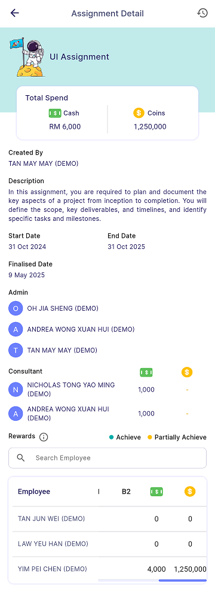
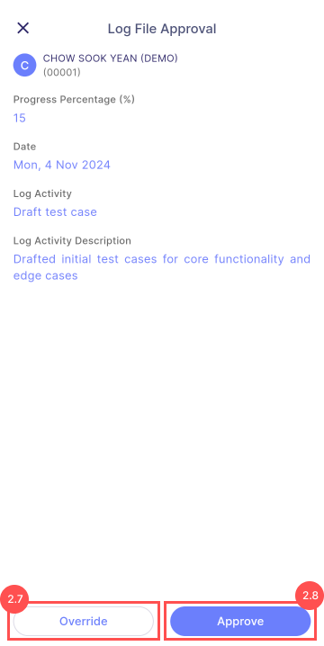

Managers can view the assignment detail that are created such as title, description, start date, end date, consultant, rewards, and bonus criteria.

| Undue/Overdue                                                | Completed                                                | 
|--------------------------------------------------------------|----------------------------------------------------------|
|  | |

## Undue & Overdue 

### Edit Assignment Detail
1. Press **Edit** in assignment detail
    - For more information, please refer [**Edit Task**](task_creation/task-edit)

### Employee Progress
1. Navigate to: **Progress** > **Employee Progress Card** (highlighted in red)

:::info Info

**Progress** tab bar: Display the employee that are still havent reached **100%**.

**Completed** tab bar: Display the employee that reached **100%**.

:::

2. Display employee's assignment detail: 
    - Total cash and coin(s) earned (**Highlighted in red**)
    - Log file submitted 
    - Rewards earned

### Log File Submission
1. Navigate to: **Log File** > **Log File Card** (highlighted in red)
    - Manager can view all unapproved log files submitted by the employees.

2. Manager can view the log file details as shown.
    - Actions: 
        - Override
        - Approve

### Log File Override
Manager can override the log file's progress percentage by clicking **Save** button.

:::info Info
    Manager will not be able to override progress percentage that is **lower** than the previous progress percentage.
:::

### Employee Bonus Review
- After approving the log file, manager can view the bonus request submitted by the employee.

:::note Note

- Bonus Review is only available when the log file submission is **100%**.
- The colored bonus card represents the bonus requested by the employee. (**highlighted in red**)

:::

### Edit Employee Bonus 
1. Press **Edit** in bonus review page
    - Manager can edit the employee's bonus request.
    - Manager can choose the bonus criteria, and edit the amount.

:::note Note

- Edit amount cannot **exceed** the maximum amount as shown.
- Manager can **edit** maximum amount in the [**Edit**](#23-edit) section.

:::

### Change Log
1. Press **History Icon** (highlighted in red)
    - details of who made edits and what changes were made.

### Finalise Assignment
1. Press **Finalise** in assignment detail page
    - To finalise assignment, all log file must be **approved**.
    - After finalising, consultant reward will be entitled.

:::danger Warning

Finalising assignment is an **irreversible** action.

:::

## Completed 

### Reward Info
1. Press **Info Icon** (highlighted in red)

2. User can view the milestone and bonus rewards 

:::info Info
    The code will matches with the code in the summary table.
:::

### Employee Progress
1.  Press **Employee Name** (highlighted in red)

### Employee Log File
1. Navigate to: **Employee Name** (in summary table) > **View Log File** 

### Tooltip Reward
1. Click **Total Cash Amount** / **Total Coin Amount** 
    - can view the earned amounts for the corresponding employee in the tooltip.

