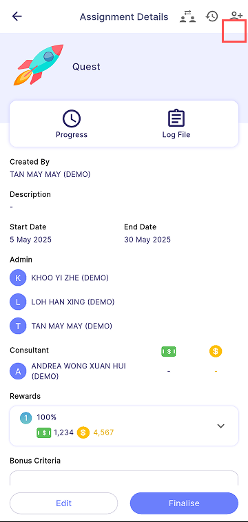

Quest details are the same as the Assignment or Target details, depending on whether the Quest is an *Assignment-type* or *Target-type* mission.

For more information, refer below:

- [**Target**](target.md)
- [**Assignment**](assignment.md)

| Approval Required                                                         | No Approval Required                                           |
|---------------------------------------------------------------------------|----------------------------------------------------------------|
|  | |

### Manage Participant

1. Press **Add People Icon** (highlighted in red)

    

2. Filter menu on right top allows the manager to filter employees by Branch, Department, and HR group.

| View                                                                      | Filter                                                 |
|---------------------------------------------------------------------------|--------------------------------------------------------|
|         | |

### Delete Employee Request

1. Press **Delete**
    - Allows the manager to delete employee requests to join the Quest

### Approve Employee Request

1. Press **Approve**
    - Allows the manager to approve employee requests to join the Quest.
