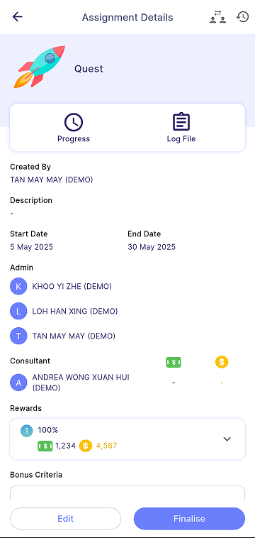

Quest detail will be same as the assignment or target details based on whether it's a target or assignment quest.

For more information, can refer as below:
- [**Target**](target.md)
- [**Assignment**](assignment.md)

| Approval Required                                                         | No Approval Required                                           | 
|---------------------------------------------------------------------------|----------------------------------------------------------------|
|  | | 

### Manage Participant
1. Press **Add People Icon** (highlighted in red)

2. Filter menu on right top allows the manager to filter the employee by branch, department, and HR group. 

| View                                                                      | Filter                                                 | 
|---------------------------------------------------------------------------|--------------------------------------------------------|
|         | | 

### Delete Request Employee
1. Press **Delete** 
    - allows manager to delete the request of employee for joining the quest

### Approve Request Employee
1. Press **Approve** 
    - allows manager to approve the request of employee for joining the quest