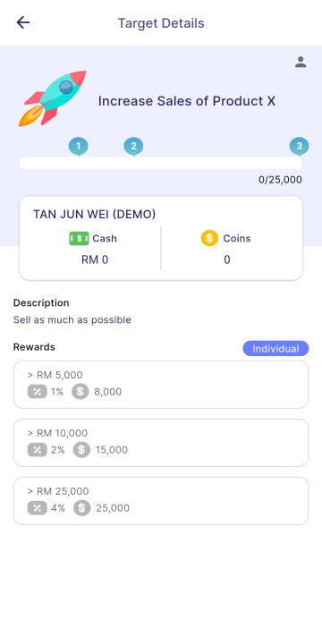
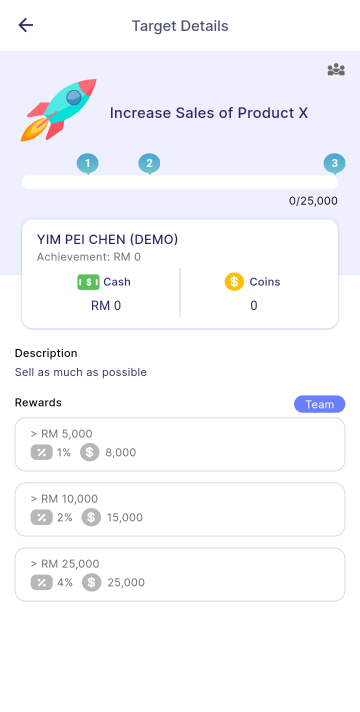
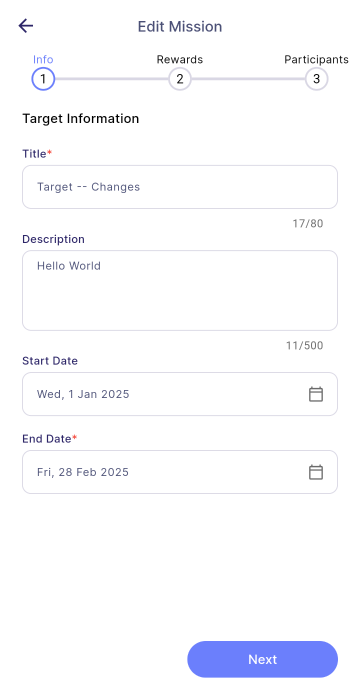

Managers can view the target details that are created such as *title, task creator, description, start date, end date, strategy, admin, rewards, and employee's progress*.

| Individual                                                                               | Team                                                                         |
| ---------------------------------------------------------------------------------------- | ---------------------------------------------------------------------------- |
|  |  |

### Employee Progress

1. Press **Employee Card** (highlighted in red)

| Individual                                                                         | Team                                                                   |
| ---------------------------------------------------------------------------------- | ---------------------------------------------------------------------- |
|  |  |

### Edit

1. Press **Edit**
   - For more information, please refer [**Edit Task**](task_creation/task-edit)

### Transfer Ownership

Please refer [**Transfer Ownership**](assignment/#transfer-ownership)

### Change Log

Please refer [**Change Log**](assignment/#change-log)
