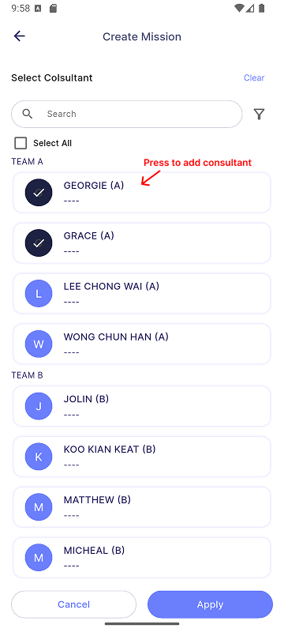

# Create Assignment

Assignment is a qualitative mission (uncountable). *E.g., Marketing Strategy Planning, Company Logo design*

:::info[Note]

This feature is only available to **manager**.

:::

## Step 1 - Assignment Information

| Properties               | Description                                                                        | Note     |
|:-------------------------|:-----------------------------------------------------------------------------------|:--------:|
| **Title**                | The title of the mission.                                                          | Required |
| **Description**          | A detailed description of the mission.                                             | - |
| **[Project/Job/Task](#projectjobtask)** | The category for the mission, indicating whether it relates to a project, job, or specific task. | - |
| **Start Date**           | The date when the mission begins.                                                  | Required |
| **End Date**             | The date when the mission ends. The end date must be later than the start date.    | Required |
| **Clear**                | Clears all content on the current page.                                            | -        |
| **Next**                 | Navigates to the next page.                                                        | -        |

### Project/Job/Task

Select a **Project**, **Job**, and **Task** from the dropdown menus. If any field is left as **(None)**, the **Manager's** corresponding Project, Job, and Task will be applied in SQL Payroll.

## Step 2 - Rewards Information

| Properties                                          | Description                                                           | Note         |
|:----------------------------------------------------|:----------------------------------------------------------------------|:------------:|
| **[Milestone and Rewards](#milestone-and-rewards)** | Section for entering details about milestones and associated rewards. | At least one |
| **[Consultant Rewards](#consultant-rewards)**| Section for selecting consultants and specifying their respective rewards.| -     |
| **[Payment By](#payment-by)**                | Section for selecting the payment method and specifying the payout month. | Required     |
| **[Bonus](#bonus)**                          | Section for entering additional bonus rewards.                            | -            |
| **Clear**                                    | Clears all content on the current page.                                   | -            |
| **Back**                                     | Navigates to the previous page.                                           | -            |
| **Next**                                     | Navigates to the next page.                                               | -            |

### Milestone and Rewards

| Properties          | Description                                                           |
|---------------------|-----------------------------------------------------------------------|
| **Milestone (%)**   | Text field to input the percentage of the milestone *(e.g., 20%)*.      |
| **Description**     | Text field to input the description of the milestone *(e.g., the requirements to achieve the particular milestone)*. |
| **Rewards**         | Text field to enter the rewards available to the achievers of the particular milestone. There are 2 types of rewards:   &nbsp;&nbsp; 1. **Cash (RM):** Commission or allowance provided through the SQL Account on the payout date.   &nbsp;&nbsp; 2. **Coins:** Digital coins that can be used to redeem gifts in SQL Vision via [**Gift**](../../../gift/introduction.md). |
| **Add**             | Adds a new milestone along with its respective rewards.               |
| **Delete**          | Deletes a specific milestone and its associated rewards.              |

### Consultant Rewards

*Consultants* are employees who provide guidance on a mission but do not complete the mission themselves.

To add a consultant, click on  to navigate to the **Select Consultant** page. On the **Select Consultant** page, you can filter consultants by *Branch*, *Department*, or *HR Group*, and sort them by these criteria. After selecting the desired consultants, click *Apply*. The chosen consultants will appear in the **Consultant Rewards** section under the corresponding rewards.

### Payment By

:::info[Note]

This payment method is applicable only for **Cash**. All coins will be paid immediately upon entitlement.

:::

There are two types of payment methods:

1. **Payment Terms:**
   - The payout month, which occurs X months after the entitled month.

      *E.g., If set to 3 months, the reward will be paid 3 months after the employee becomes entitled to it.*

2. **Settlement Month:**
   - Entitled cash will be accumulated until a specific month for payout, which can be either inclusive or exclusive of that month.
   - **Inclusive Setting:** *If January and August are set as inclusive months, rewards entitled from February to August will be paid in August, while rewards entitled from September to January will be paid in January.*
   - **Exclusive Setting:** *If January and August are set as exclusive months, rewards entitled from January to July will be paid in August, and rewards entitled from August to December will be paid in January.*

### Bonus

| Properties    | Description                                                                         |
|---------------|-------------------------------------------------------------------------------------|
| **Description** | Text field to enter a description for the bonus. *(e.g., extra points that you hope the employee can achieve, though it is not mandatory)* |
| **Rewards**   | Text field to enter the rewards available to the achievers of the particular bonus. |
| **Add**       | Adds a new bonus along with its respective rewards.                                 |
| **Delete**    | Deletes a new bonus along with its respective rewards.                                 |

## Step 3 - Participants Information

### Participant Role

#### Admin

- **Admin** is authorized to **manage and edit** the task.
- Admin does not perform the task and therefore **is not entitled to any rewards**.
- By default, the creator will be added as Admin and cannot be removed by anyone. *(Employee with yellow crown, as shown in image below, is the creator.)*

#### Participant

- **Participant** is the employee responsible for performing the mission.
- They are eligible to receive the reward.

#### Consultant

- **Consultant** provide **guidance or advice** on the mission but do not perform the task.
- They are assigned in **[Step 2 - Rewards Information, Consultant Rewards section](#consultant-rewards)**.

### Features

| Properties              | Description                                                              |
|:------------------------|:-------------------------------------------------------------------------|
| **Apply Group**         | Allow you to apply group. See more in [**group**](../../../group#apply-group).     |
| **Clear**               | Clears all content on the current page.                                  |
| **Make Quest**          | Converts your mission into a Quest. See more in [**quest**](quest).      |
| **Add Person Icon**     | Add employees as the participant type.                                   |
| **Delete Icon**         | Delete the particular employee.                                          |
| **Back**                | Navigates to the previous page.                                          |
| **Create**              | Creates the mission.                                                     |

### Steps to add Participants

1. Press on the **Add Person Icon** in the section for the participant role you want to add.
2. Select participants.
3. Press **Apply** to assign the selected employees to the participant role.
4. Press **Cancel** to discard current changes.

#### Side functions

| Properties              | Description                                                              |
|:------------------------|:-------------------------------------------------------------------------|
| **Search**              | Allows you to search for employees by their names.                       |
| **[Filter](assignment#filter)**   | Allow you to filter and sort the employee list.                |
| **Select All**          | Allow you to select all employees at once.                               |

#### Filter

A filter is available in the Employee List when selecting participants. The list can be filtered and sorted by **Branch**, **Department**, and **HR Group**, as shown in the image below.

