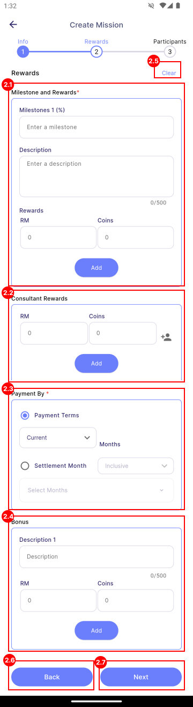
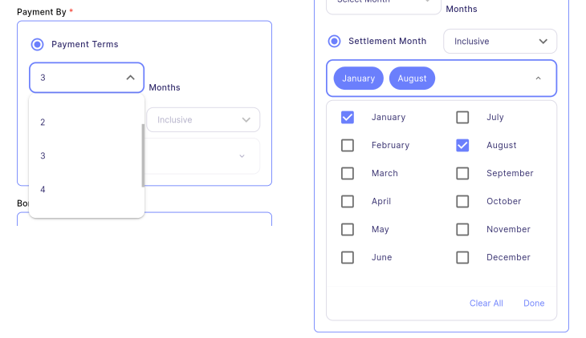

# Create Assignment

Assignment is a qualitative mission (non-countable). E.g. Marketing Strategy Planning, Company Logo design.

:::info[Note]

This feature is only available to **manager**.

:::

## Step 1 - Assignment Information

| Properties               | Description                                                                        | Note     |
|:-------------------------|:-----------------------------------------------------------------------------------|:--------:|
| **Title**                | The title of the mission.                                                          | Required |
| **Description**          | A detailed description of the mission.                                             | Required |
| **[Project/Job/Task](#projectjobtask)** | The category for the mission, indicating whether it relates to a project, job, or specific task. | - |
| **Start Date**           | The date when the mission begins.                                                  | Required |
| **End Date**             | The date when the mission ends. The end date must be later than the start date.    | Required |
| **Clear**                | Clears all content on the current page.                                            | -        |
| **Next**                 | Navigates to the next page.                                                        | -        |

### Project/Job/Task

Select a **Project**, **Job**, and **Task** from the dropdown. If you leave any of these fields set to **(None)**, the Manager's Project, Job, and Task will be used in the SQL Payroll.

## Step 2 - Rewards Information

| Properties                                          | Description                                                           | Note         |
|:----------------------------------------------------|:----------------------------------------------------------------------|:------------:|
| **[Milestone and Rewards](#milestone-and-rewards)** | Section for entering details about milestones and associated rewards. | At least one |
| **[Consultant Rewards](#consultant-rewards)**| Section for selecting consultants and specifying their respective rewards.| Required     |
| **[Payment By](#payment-by)**                | Section for selecting the payment method and specifying the payout month. | Required     |
| **[Bonus](#bonus)**                          | Section for entering additional bonus rewards.                            | -            |
| **Clear**                                    | Clears all content on the current page.                                   | -            |
| **Back**                                     | Navigates to the previous page.                                           | -            |
| **Next**                                     | Navigates to the next page.                                               | -            |

### Milestone and Rewards

| Properties          | Description                                                           |
|---------------------|-----------------------------------------------------------------------|
| **Milestone (%)**   | Text field to input the percentage of the milestone (e.g., 20%).      |
| **Description**     | Text field to input the description of the milestone (e.g., the requirements to achieve the particular milestone). |
| **Rewards**         | Text field to enter the rewards available to the achievers of the particular milestone. There are 2 types of rewards:   &nbsp;&nbsp; 1. **Cash (RM):** Commission or allowance provided through the SQL Account on the payout date.   &nbsp;&nbsp; 2. **Coins:** Digital coins that can be used to redeem gifts in SQL Vision via [**Gift**](../../../gift/introduction.md). |
| **Add**             | Adds a new milestone along with its respective rewards.               |
| **Delete**          | Deletes a specific milestone and its associated rewards.              |

### Consultant Rewards

**Consultants** are employees responsible for providing guidance on a particular mission. They do not complete the mission themselves.

To add a consultant click on  to navigates to the Select Consultant page. The selected consultants will be listed down in the Consultant Rewards section under the associated rewards.

### Payment By

:::info[Note]

The payment method applies only to **Cash**. All coins will be paid immediately upon entitlement.

:::

There are two types of payment methods:

1. **Payment Terms:**
   - The payout month, which will be X months after the entitled month.
   - E.g., if set to 3 months, the reward will be paid after 3 months from when the employee achieved and became entitled to the reward.

2. **Settlement Month:**
   - The entitled cash will be collected until a specific month for payment, either inclusive or exclusive of that month.
   - **Inclusive Setting:** If inclusive with January and August, all rewards entitled from February to August will be paid in August, while rewards entitled from September to January will be paid in January.
   - **Exclusive Setting:** If exclusive with January and August, all rewards entitled from January to July will be paid in August, and rewards entitled from August to December will be paid in January.

### Bonus

| Properties    | Description                                                                         |
|---------------|-------------------------------------------------------------------------------------|
| **Description** | Text field to input a description of the bonus (e.g., extra points that you hope the employee can achieve, though it is not mandatory). |
| **Rewards**   | Text field to enter the rewards available to the achievers of the particular bonus. |
| **Add**       | Adds a new bonus along with its respective rewards.                                 |
| **Delete**    | Adds a new bonus along with its respective rewards.                                 |

## Step 3 - Participants Information

### Participant Role

#### Admin
  - **Admin** is authorized to **manage and edit** the task. 
  - Admin will not perform the task, therefore, admin **will not be entitled to any reward**.
  - By default, creator will be added as Admin and no one can remove him/her. *(Employee with yellow crown as shown in above image is the creator.)* 

#### Participant
  - **Participant** is the employee who performs the mission. 
  - He/her is eligible to entitled the reward.

#### Consultant
  - **Consultant** provide **guidance or advice** on the mission. He/her will not perform the task.
  - He/her will be set at **[Step 2 - Rewards Information, Consultant Rewards section](#consultant-rewards)**.

### Features

| Properties              | Description                                                              | 
|:------------------------|:-------------------------------------------------------------------------|
| **Apply Group**         | Allow you to apply group. See more in [**group**](../../../group#apply-group).     | 
| **Clear**               | Clears all content on the current page.                                  |
| **Make Quest**          | Converts your mission into a Quest. See more in [**quest**](quest).      |
| **Add Person Icon**     | Add employees as the participant type.                                   |
| **Delete Icon**         | Delete the particular employee.                                          |
| **Back**                | Navigates to the previous page.                                          |
| **Create**              | Creates the mission.                                                     |

### Steps to add Participants

1. Press on the **Add Person Icon** for the section of participant role you would like to add.
2. Select participants.
3. Press **Apply** to apply current selected employees as the participant role.
4. Press **Cancel** to cancel current changes.

#### Side functions

| Properties              | Description                                                              | 
|:------------------------|:-------------------------------------------------------------------------|
| **Search**              | Allows you to search for employees by their names.                       | 
| **[Filter](assignment#filter)**   | Allow you to filter and sort the employee list.                | 
| **Select All**          | Allow you to select all employees at once.                               |

#### Filter

Filter is provided in the Employee List during select participants. The employee list can be filtered and sort by **Branch**, **Department** and **Hr Group** and shown in the image.

