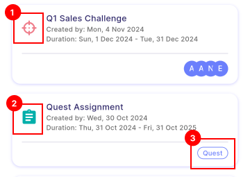
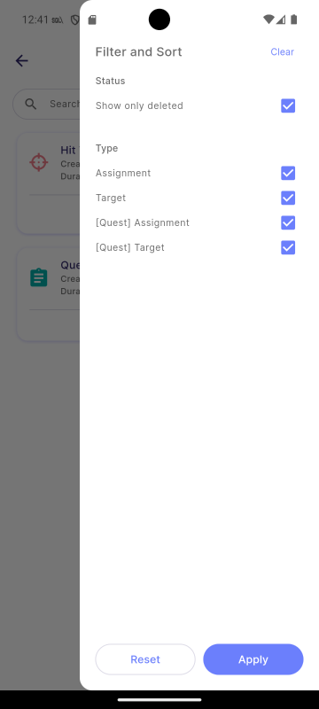

# Duplication

Duplication allows managers to recreate a previously created task without needing to re-enter the mission details manually.

:::info[Note]

This feature is only available to **manager**.

:::

## Mission Card

The mission card displays key details of the mission, including the Title, Created Date, Duration, and Members. Tapping the card allows you to create a new mission with the same details duplicated.

-  representing as **Target**
-  representing as **Assignment**
-  representing as **Quest**

## Filter

The Filter button allows you to filter your recent missions. Duplicated missions can be filtered by **Type**:

**Type:**

- Assignment
- Target
- Quest Assignment
- Quest Target

