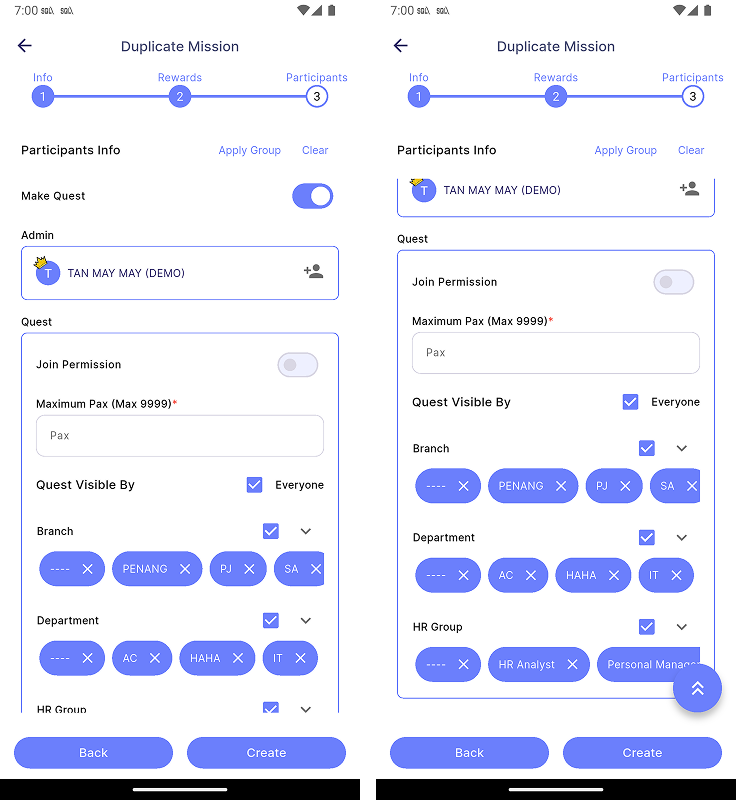

# Create Quest

A Quest is a mission that is visible to employees and open for them to join freely, based on their Branch, Department, and HR Group.To create quest, go to **Create New | Target/Assignment | Step 3 | Make Quest**.

:::info[Note]

This feature is only available to **manager**.

:::

| Properties                | Description                                                                 |
|:--------------------------|:----------------------------------------------------------------------------|
| **Join Permission**     | Sets whether the quest requires manager approval to join.                     |
| **Maximum Pax**         | The maximum number of people allowed to join the quest.                       |
| **Quest Visible By**    | Specifies which Branch, Department, or HR Group can view and join the quest.  |
| **Back**                | Navigates to the previous page.                                               |
| **Create**              | Creates the quest.                                                            |
