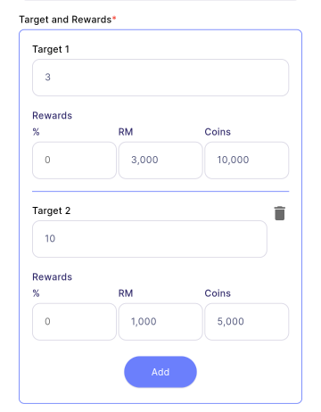

# Create Target

Target is a quantitative mission (countable data). E.g. Sales Target, Total new users.

:::info[Note]

This feature is only available to **manager**.

:::

## Step 1 - Target Details

| Properties                   | Description                                                                        | Note     |
|:-----------------------------|:-----------------------------------------------------------------------------------|:--------:|
| **Title**                | The title of the mission.                                                          | Required |
| **Description**          | A detailed description of the mission.                                             | Required |
| **Start Date**           | The date when the mission begins. The start date must be today or a future date.   | Required |
| **End Date**             | The date when the mission ends. The end date must be later than the start date.    | Required |
| **Clear**                | Clears all content on the current page.                                            | -        |
| **Next**                 | Navigates to the next page.                                                        | -        |

## Step 2 - Target and Rewards

| Properties                          | Description                                                                              | Note         | 
|:------------------------------------|:-----------------------------------------------------------------------------------------|:------------:| 
| **[Grouping Type](#grouping-type)** | Section to select the target grouping type, either *Individual* or *Team*.               | Required     | 
| **[Strategy](#strategy)**           | Section to select the target strategy, with options predefined in Company Configuration. | Required     | 
| **[Condition](#condition)**         | Section to select the target condition (e.g., *Between*, *More than*).                   | Required     | 
| **[Target and Rewards](#target-and-rewards)**| Section to enter details about the targets and their associated rewards.        | At least one | 
| **[Payment By](#payment-by)**       | Section to select the payment method and specify the payout month.                       | Required     | 
| **Clear**                           | Clears all content on the current page.                                                  | -            | 
| **Back**                            | Navigates to the previous page.                                                          | -            | 
| **Next**                            | Navigates to the next page.                                                              | -            | 

### Grouping Type

There are two types of **Grouping Types**:

1. **Individual:**
   - Selecting Individual means that the targets and rewards apply to each normal member added or who joins this target mission.
   - **Example:** if the target is 10,000 and the reward is 1%, all employees will have a target of 10,000 and a reward of 1%.

2. **Team:**

   - Selecting Team means that the targets and rewards apply only to the team leader added to this target mission.
   - **Example:** if the target is RM 50,000 and the reward is 5%, the leader receives the reward only when the total target achieved by members exceeds RM 50,000.

:::info[Note]

Team option is not available for quests.

:::

:::tip Tip to create a Team Target Mission

To set up a team target, create two identical missions: one with the **Individual** setting and the other with the **Team** setting.

1. Add the team leader to the Team target and their team members to both the Team and Individual targets.

2. The team leader’s target will now reflect the collective achievements of the entire team and include a unique reward, while each member will have their own individual targets and rewards!

:::

### Strategy

**Strategy** refers to the formula that helps managers and the application determine which specific target a particular mission belongs to. This formula enables the application to accurately retrieve the target amount from the SQL Account. For more details, see [**Linking to SQL Account | Strategy**](../../../linking-to-account.md#strategy).

:::tip Example Scenario

Suppose you’re managing a Sales Department and want to track Q1 sales targets:

1. For the mission **"Achieve Q1 Sales Target"**, assign the **"Invoice Based Strategy"** strategy.

2. With this setup, managers can update sales progress daily in SQL Vision by using SQL Vision Sync tool by mapping to the right Strategy ID. Managers can view the updated progress daily in SQL Vision.

:::

### Condition

**Condition** specifies the criteria for calculating target rewards.

#### A. Between 

The "Between" condition is designed to allocate rewards based on an employee’s achievement falling within a defined range. Specifically, rewards are granted when an employee's achievement meets the following criteria:

- It is greater than the lower boundary (X amount).
- It is less than or equal to the upper boundary (Y amount).

It is essential to ensure the upper limit (Y) of one target matches the lower limit (X) of the subsequent target to ensure continuity and avoid gaps.

1. If an employee achieves **RM15,000**, the employee will fall in **Target 1** and receive **2%** reward.
2. If an employee achieves **RM25,000**, the employee will fall in **Target 2** and receive **3%** reward.

#### B. More Than

The "More Than" condition is used to grant rewards when an employee surpasses a specified target amount (X). The rewards are granted according to the below criteria:

- Each reward is granted only **once**, regardless of how far the employee's achievement exceeds the target.
- Achieving a higher target **excludes rewards for lower targets**, ensuring that only the highest applicable reward is granted.

1. If an employee achieves **RM15,000**, they will receive **2%** reward because their achievement **exceeds RM10,000 but does not surpass RM20,000**.
2. If an employee achieves **RM25,000**, they will receive **3%** reward because their achievement **exceeds RM20,000**, which excludes the reward for the lower target (2% Reward).

#### C. Less Than

The "Less Than" condition is designed to grant rewards when an employee achieves a result below a specified target amount (X). This condition is typically applied in scenarios where lower values are preferable, such as reducing errors or minimizing return stock. The rewards are granted according to the below criteria:

- Each reward is granted only **once**, based on the smallest qualifying target achieved.
- Achieving a lower target amount **excludes rewards for higher targets**.

1. If an employee have **2 return stock**, they will receive **RM3,000 & 10,000 coins** because their performance is **below 3**, which excludes the second target reward.
2. If an employee have **4 return stock**, they will receive **RM1,000 & 5,000 coins** bacause their performance is **below 10 but above or equal 3**, therfore not qualify with the reward in Target 1.

#### D. More Than and Equal

The "More Than and Equal" condition grants rewards when an employee’s achievement meets or exceeds a specified target amount (X). The rewards are granted according to the below criteria:

- Each reward is granted only **once**, corresponding to the highest applicable target achieved.
- Achieving a higher target automatically **excludes rewards for lower targets**.

1. If an employee achieves **5 new customers**, they will receive **RM1,000 & 5,000 coins** because their achievement is **5 or more customers** but does not meet the next threshold of 10 or more customers.
2. If an employee achieves **12 new customers**, they will receive **RM3,000 and 10,000 coins** because their achievement is **10 or more customers**, which excludes first target rewards.

#### E. Less Than and Equal

The "Less Than and Equal" condition is applied to reward employees who achieve results at or below a specified target amount (X). The rewards are granted according to the below criteria:

- Each reward is granted only **once**, based on the smallest qualifying target achieved.
- Achieving a smaller target automatically **excludes rewards for higher targets**.

1. If an employee has **3** return stock, they will receive **RM3,000 & 10,000 coins** because their performance is **3 or less**, which excludes rewards for any higher targets.
2. If an employee has **4** return stock, they will receive **RM1,000 & 5,000 coins** because their performance is **10 or less but above 3**, making them ineligible for Target 1's reward.

### Target and Rewards

| Properties  | Description                                                                                              |
|-------------|----------------------------------------------------------------------------------------------------------|
| **Target**  | Text field to input the target amount. (Note: Only the **Between** condition will have two text fields.) |
| **Rewards** | Text field to enter the rewards available to the achievers of the particular target. There are 3 types of rewards:   &nbsp;&nbsp; 1. **Percentage (%):** A percentage of the target amount awarded to the members (e.g., 2%).   &nbsp;&nbsp; 2. **Cash (RM):** Commission or allowance provided through the SQL Account on the payout date.   &nbsp;&nbsp; 3. **Coins:** Digital coins that can be used to redeem gifts in SQL Vision via [**Gift**](../../../gift/introduction.md). |
| **Add**     | Adds a new target along with its respective rewards.                                                     |
| **Delete**  | Deletes a specific target and its associated rewards.                                                    |

### Payment By

:::info[Note]

The payment method applies only to **Cash**. All coins will be paid immediately upon entitlement.

:::

There are two types of payment methods:

1. **Payment Terms:**
   - The payout month, which will be X months after the entitled month.
   - E.g., if set to 3 months, the reward will be paid after 3 months from when the employee achieved and became entitled to the reward.

2. **Settlement Month:**
   - The entitled cash will be collected until a specific month for payment, either inclusive or exclusive of that month.
   - **Inclusive Setting:** If inclusive with January and August, all rewards entitled from February to August will be paid in August, while rewards entitled from September to January will be paid in January.
   - **Exclusive Setting:** If exclusive with January and August, all rewards entitled from January to July will be paid in August, and rewards entitled from August to December will be paid in January.

## Step 3 - Add Members

There are 4 combination of members that can be created in Target:

1. **Normal member:**  
  An employee who performs the mission without a specific management or leadership role.

2. **Admin:**  
  An employee authorized to manage the task but does not complete the mission themselves. Admin shall not be entitled to any reward.

3. **Team Leader:**  
  An employee who leads the mission. *This role is visible only when Grouping Type is set to **Team**.*

4. **Team Leader and Admin:**  
  An employee who both leads the mission and manages the task but does not complete the mission themselves. This employee will be entitled to team leader's reward. *This role is visible only when Grouping Type is set to **Team**.*

All 4 combinations can be created in **[Add Members](#step-3---add-members)** in Step 3.

| Properties              | Description                                                              | 
|:------------------------|:-------------------------------------------------------------------------|
| **Search**              | Allows you to search for employees by their names.                       | 
| **[Filter](assignment#filter)**   | Allow you to filter and sort the employee list.                | 
| **Group**               | Allow you to apply group. See more in [**group**](../../../group#apply-group).     | 
| **Select All**          | Allow you to select all employees at once.                               |
| **Make Quest**          | Converts your mission into a Quest. See more in [**quest**](quest).      |
| **Back**                | Navigates to the previous page.                                          |
| **Create**              | Creates the mission.                                                     |