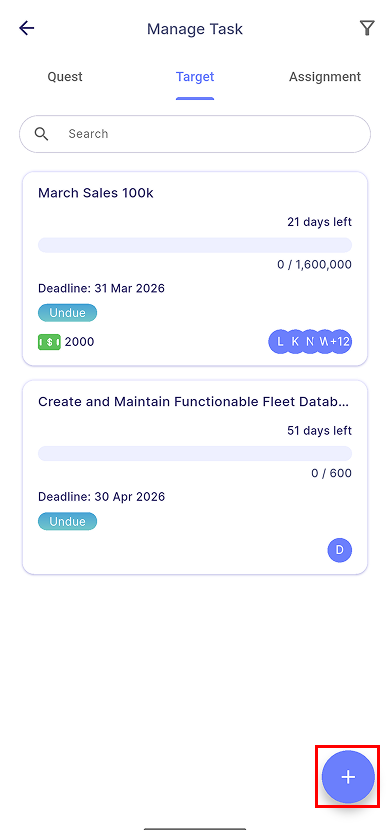
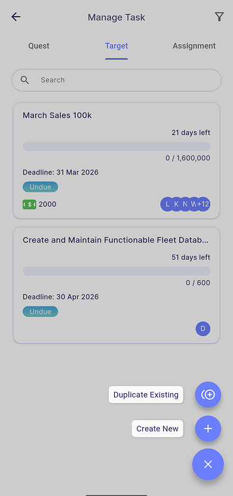
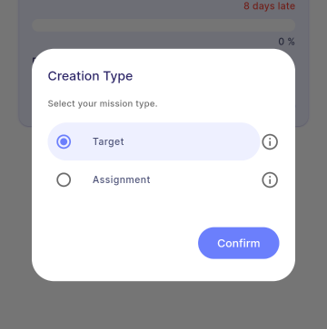

# Create a Mission

:::info[Note]
This feature is only available to **manager**.
:::

To create a new mission, navigate to **Main Dashboard | Manage Task**. Click the **Add Button** located at the bottom right corner of the app.

### Duplicate Existing

In this section, you can view all previously created missions, including those that have been deleted.

- [**Duplication**](duplication)

### Create New

In this section, you can create a new mission from scratch, choosing either Assignment or Target.

- [**Assignment**](assignment)
- [**Target**](target)

