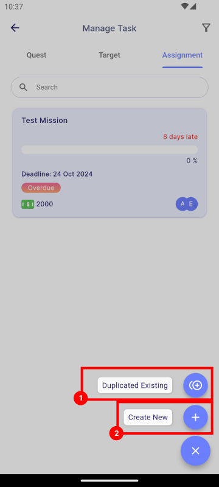

# Create a Mission

:::info[Note]
This feature is only available to **manager**.
:::

To create a new mission, navigate to **Main Dashboard | Manage Task**. Click the **Add Button** located at the bottom right corner of the app.

### Duplicate Existing

This section allows you to view and create a copy of an existing mission.

- [**Duplication**](duplication)

### Create New

This section allows you to create a new mission from scratch, choosing between Assignment and Target types.

- [**Assignment**](assignment)
- [**Target**](target)

