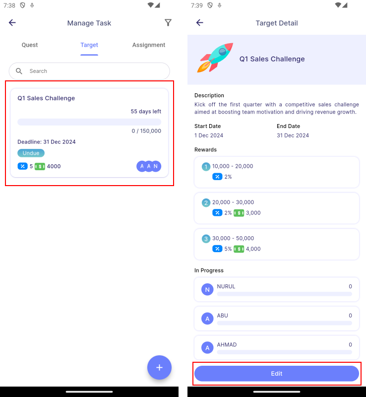
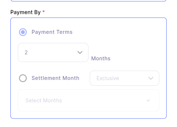

# Edit Task

:::info[Note]

This feature is only available to **manager** and **admin**.

:::

To edit a mission, go to **Main Dashboard | Manage Task | press on a mission card | press Edit Button**. 

## Edit Permission

There are certain conditions for editing a mission, as stated in the table below.

| Field                     | Affected Mission Type | Task Status | Description                                        |
|:--------------------------|:---------------------:|:-----------:|:---------------------------------------------------|
| **Start Date**            | Both                  | Ongoing     | Start Date cannot be changed.                      |
| **Members**               | Both                  | Ongoing     | The members added to the mission cannot be removed or have their roles changed. However, it is possible to add more members, but these additions cannot be modified later once updated. |
| **Milestone and Rewards** | Assignment            | Ongoing     | If any member achieves a particular milestone, that milestone cannot be changed. However, the following milestones can still be edited. |
| **Bonus**                 | Assignment            | Ongoing     | If any member achieves 100% of the milestone, the bonus cannot be changed. However, it is possible to add a new bonus, but it will also be unchangeable once updated.  |
| **Grouping Type, Strategy and Condition**| Target                | Ongoing     | Grouping type, strategy and condition cannot be changed after mission is ongoing. |

#### Non-editable Field

The non-editable fields will be greyed out as shown in the picture below.

