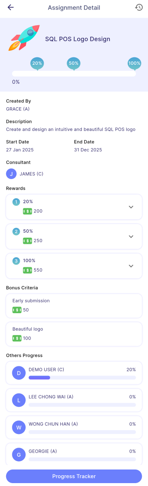
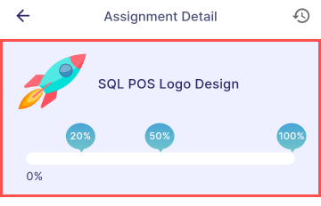
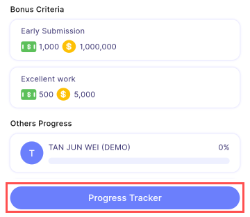
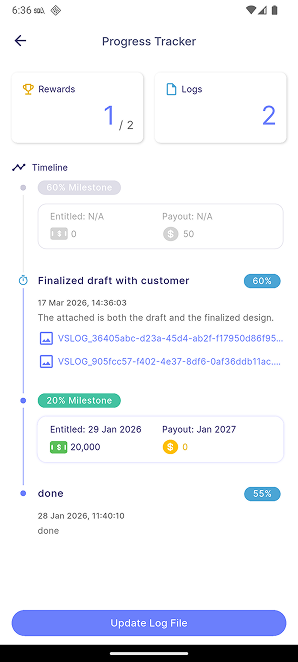
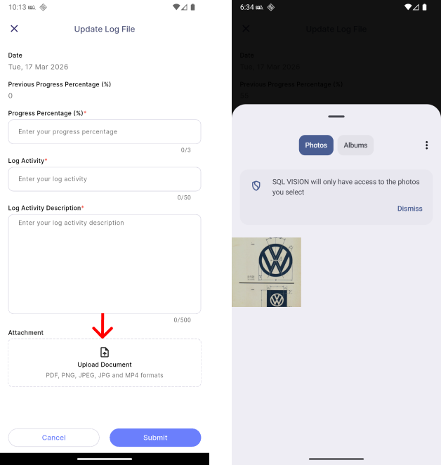
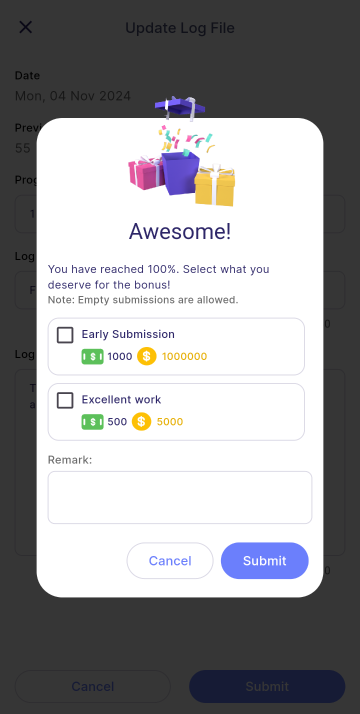

Users can view the assignment detail such as title, description, start date, end date, consultant, rewards, bonus criteria, and other progress. 

:::info Info

**Consultant**: responsible for providing expert guidance to the user in completing the task.

:::

:::note Note

The bonus will only be available when the log file's percentage reaches **100%**.

:::

### Milestone and Reward

Users can view the reward for each milestone and are entitled to it once the task's completion percentage reaches the milestone percentage (after manager **approved** the submitted log file).

:::tip Tips

- The percentage displayed in the chat bubble corresponds to the rewards section. 
- The progress bar displays the user's completion percentage.

:::

### Progress Tracker 
1. Press **Progress Tracker**
    - user can view his/her submitted log file and milestone reward obtained.

Indicates the log file is in **Pending** status

Indicates the log file is in **Approved** status

### Update Log File 
1. Press **Update Log File**
    - Allows user to create a new log file, fill in the details, and submit it by clicking **Submit** button.
    - Users **must** fill in all the details.
    - Submitted log file cannot be **edit**.
    - Users are not be able to **submit** log file **before** manager **approve** the previous one.

### Submission Bonus Request
1. This form is only available when the log file submission is **100%**. 
2. Users are allowed to submit bonus request by choosing the bonus criteria and add on remark.

:::warning Alert

Bonus request can only be submitted once.

:::

