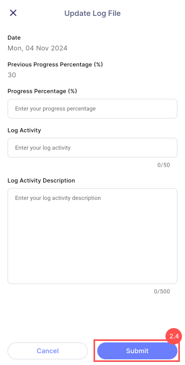

Users can view the assignment's details such as *title, description, start date, end date, consultant, rewards, bonus criteria, and other progress*.

:::info Info

**Consultant**: responsible for providing expert guidance to the user in completing the task.

:::

:::note Note

The bonus will only be available when the log file's percentage reaches **100%**.

:::

### Milestone and Reward

Users can view the reward for each milestone and become entitled to it once the task’s completion percentage reaches the milestone, after the manager **approves** the submitted log file.

:::tip Tips

- The percentage displayed in the chat bubble corresponds to the rewards section.
- The progress bar displays the user's completion percentage.

:::

### Progress Tracker

1. Press **Progress Tracker**
   - Allows users to view their submitted log files along with any milestone rewards earned.

Indicates the log file is in **Pending** status

Indicates the log file is in **Approved** status

### Update Log File

1. Press **Update Log File**
   - Allows user to create a new log file, fill in the details, and submit it by clicking **Submit** button.
   - Users **must** fill in all the details.
   - Submitted log file cannot be **edited**.
   - Users are unable to **submit** log file **before** manager **approves** the previous one.

### Submission Bonus Request

1. This form is only available when the log file submission is **100%**.
2. Users are allowed to submit bonus request by selecting the bonus criteria and add on remark.

:::warning Alert

Bonus request can only be submitted once.

:::

### Change Log

Please refer [**Change Log**](../manager_view/assignment/#change-log)
