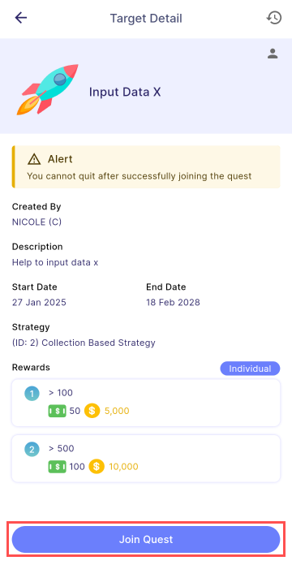
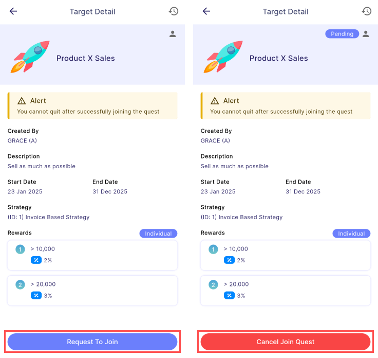

- Open quests are available for all users to join and earn rewards, as they are not restricted to specific employees.
- Quests can be **Target** or **Assignment**.
- After successfully joining, users will be navigate to [**Target**](target.md) or [**Assignment**](assignment.md).

:::warning Alert

After joining, users **cannot** quit the task.

:::

### Direct Join

- Quests that **do not** require join permission from manager.
- Users can join the quests directly by clicking the **Join Quest** button.

  

### Requires Join Permission

- Quests that require manager approval.
- Users can request to join the quest by clicking the **Request To Join** button.
- While awaiting manager approval, the request is placed in **Pending** status, as shown in the image below.
- Users can cancel a pending request by clicking the **Cancel Join Quest**.

