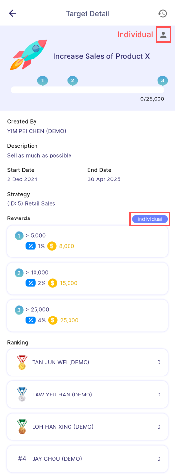

Users can view the target's details such as *title, task creator, description, start date, end date, strategy, rewards, and ranking*.

:::note Note

Team task is only **visible** for team leader.

:::

:::info Info

Progress of the task will be calculated based on the target type.

**Individual**: Progress of the employee himself

**Team**: Total progress of all members (including team leader)

:::

| Individual                                                                            | Team                                                                      |
| ------------------------------------------------------------------------------------- | ------------------------------------------------------------------------- |
|  |  |

### Change Log

Please refer [**Change Log**](../manager_view/assignment/#change-log)
