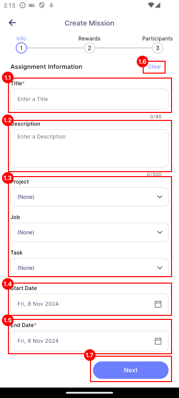
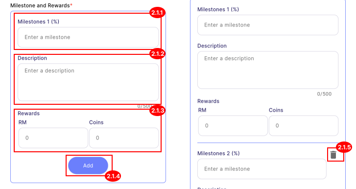
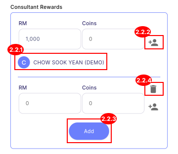
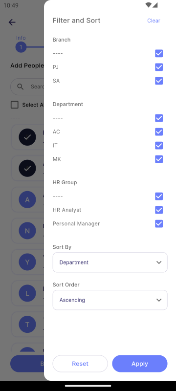

# Assignment

Assignment is a qualitative mission (non-countable). E.g. Idea brainstorm, Clothes design.

:::info[Note]

This feature is only available to **manager**.

:::

## Step 1 - Assignment Details

| Properties                   | Description                                                                        | Note     |
|:-----------------------------|:-----------------------------------------------------------------------------------|:--------:|
| **1.1 Title**                | The title of the mission.                                                          | Required |
| **1.2 Description**          | A detailed description of the mission.                                             | Required |
| **[1.3 Project/Job/Task](#13-projectjobtask)** | The category for the mission, indicating whether it relates to a project, job, or specific task. | - |
| **1.4 Start Date**           | The date when the mission begins. The start date must be today or a future date.   | Required |
| **1.5 End Date**             | The date when the mission ends. The end date must be later than the start date.    | Required |
| **1.6 Clear**                | Clears all content on the current page.                                            | -        |
| **1.7 Next**                 | Navigates to the next page.                                                        | -        |

### 1.3 Project/Job/Task

Select a **Project**, **Job**, and **Task** from the dropdown. If you leave any of these fields set to **(None)**, the Manager's Project, Job, and Task will be used in the SQL Payroll.

## Step 2 - Milestone and Rewards

| Properties                                          | Description                                                               | Note         |
|:----------------------------------------------------|:--------------------------------------------------------------------------|:------------:|
| **[2.1 Milestone and Rewards](#21-milestone-and-rewards)** | Section for entering details about milestones and associated rewards. | At least one |
| **[2.2 Consultant Rewards](#22-consultant-rewards)**| Section for selecting consultants and specifying their respective rewards.| Required     |
| **[2.3 Payment By](#23-payment-by)**                | Section for selecting the payment method and specifying the payout month. | Required     |
| **[2.4 Bonus](#24-bonus)**                          | Section for entering additional bonus rewards.                            | -            |
| **2.5 Clear**                                       | Clears all content on the current page.                                   | -            |
| **2.6 Back**                                        | Navigates to the previous page.                                           | -            |
| **2.7 Next**                                        | Navigates to the next page.                                               | -            |

### 2.1 Milestone and Rewards

#### 2.1.1 Milestones X
   - Text field to input the percentage of the milestone (e.g., 20%, 100%).

#### 2.1.2 Description
   - Text field to input the description of the milestone (e.g., the requirements to achieve the particular milestone).

#### 2.1.3 Rewards
   - Text field to enter the rewards available to the achievers of the particular milestone.
   - There are 2 types of rewards:
      - **Cash (RM):**  
         Commission or allowance provided through the SQL Account on the payout date.
      - **Coins:**  
         Digital coins that can be used to redeem gifts in SQL Vision via [**Gift**](../gift/introduction.md).

#### 2.1.4 Add
   - Adds a new milestone along with its respective rewards.

#### 2.1.5 Delete
   - Deletes a specific milestone and its associated rewards.

### 2.2 Consultant Rewards

**Consultants** are employees responsible for providing guidance on a particular mission. They do not complete the mission themselves.

#### 2.2.1 Consultants
   - A list of consultants associated with the specific rewards.

#### 2.2.2 Add Consultant
   - Button to add a consultant, which navigates to the Select Consultant page.
   
   

   - Press on an employee to designate them as a consultant.
   - To make a consultant an Admin as well, long-press on the employee to view a pop-up menu and select Add Admin.

#### 2.2.3 Add
   - Adds a new consultant reward.

#### 2.2.4 Delete
   - Deletes a specific reward along with its associated consultants.

### 2.3 Payment By

:::info[Note]

The payment method applies only to **Cash**. All coins will be paid immediately upon entitlement.

:::

There are two types of payment methods:

1. **Payment Terms:**
   - The payout month, which will be X months after the entitled month.
   - E.g., if set to 3 months, the reward will be paid after 3 months from when the employee achieved and became entitled to the reward.

2. **Settlement Month:**
   - The entitled cash will be collected until a specific month for payment, either inclusive or exclusive of that month.
   - **Inclusive Setting:** If inclusive with January and August, all rewards entitled from February to August will be paid in August, while rewards entitled from September to January will be paid in January.
   - **Exclusive Setting:** If exclusive with January and August, all rewards entitled from January to July will be paid in August, and rewards entitled from August to December will be paid in January.

### 2.4 Bonus

#### 2.4.1 Description
   - Text field to input a description of the bonus (e.g., extra points that you hope the employee can achieve, though it is not mandatory).

#### 2.4.2 Rewards
   - Text field to enter the rewards available to the achievers of the particular bonus.

#### 2.4.3 Add
   - Adds a new bonus along with its respective rewards.

#### 2.4.4 Delete
   - Deletes a specific bonus and its associated rewards.

## Step 3 - Add Members

There are 4 combination of members that can be created in Assignment:

1. **Normal member:**  
  An employee who performs the mission without a specific management or advisory role.

2. **Admin:**  
  An employee authorized to manage the task but does not complete the mission themselves. Admin shall not be entitled to any reward.

3. **Consultant:**  
  An employee who provides guidance on the mission without directly managing or completing it (e.g., an advisor).

4. **Consultant and Admin:**  
  An employee who both guides the mission and manages the task but does not complete the mission themselves. This employee will be entitled to consultant's reward.

The *Normal Member* and *Admin* can be created in **[Add Members](#step-3---add-members)** in Step 3, on the other hand the *Consultant* and *Consultant and Admin* combination can be created in **[Consultant Reward](#22-consultant-rewards)** in Step 2.

| Properties                  | Description                                                              | 
|:----------------------------|:-------------------------------------------------------------------------|
| **3.1 Search**              | Allows you to search for employees by their names.                       | 
| **[3.2 Filter](#32-filter)**| Allow you to filter and sort the employee list.                          | 
| **3.3 Select All**          | Allow you to select all employees at once.                               |
| **3.4 Make Quest**          | Converts your mission into a Quest. See more in [**quest**](quest.md).      |
| **3.5 Back**                | Navigates to the previous page.                                          |
| **3.6 Create**              | Creates the mission.                                                     |

#### 3.2 Filter

The employee list can be filtered and sort by:

- Branch
- Department
- HR Group
