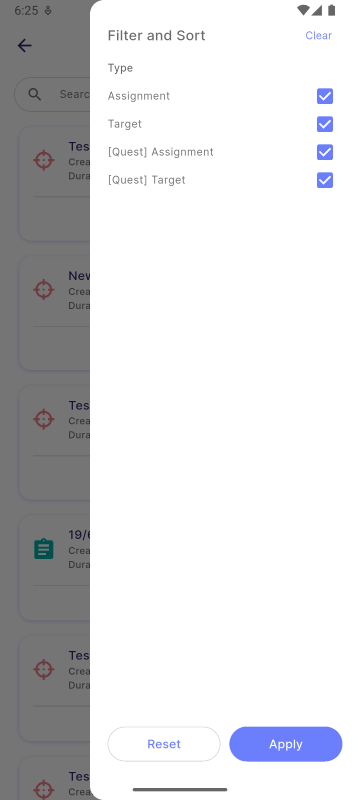

# Duplication

:::info[Note]

This feature is only available to **manager**.

:::

## 1. **Back Button**

This button will direct you back to [**Manage Task**](../task.md) page.

## 2. **Filter**

This button allow you to filter your recent mission. The duplicated mission can be filtered by Status and Type:

**Status:**
- Show only deleted

**Type:**
- Assignment 
- Target  
- Quest Assignment 
- Quest Target  

### 2.1 Show only deleted mission

By default, the duplication page in SQL Vision displays only missions that have not been deleted. If you need to search for deleted missions, you can do so by using the filter function. The filter function allows you to specifically display missions that have been marked as deleted.

## 3. **Search**

The search allow you to search for your desired mission according to the mission title.

## 4. **Mission Card**

The mission card displays key details of the mission, including the Title, Created Date, Duration, and Members. Pressing the card allows you to create a new mission with the same details duplicated.

- `1` Icon representing as **Target**
- `2` Icon representing as **Assignment**
- `3` Badge representing as **Quest**