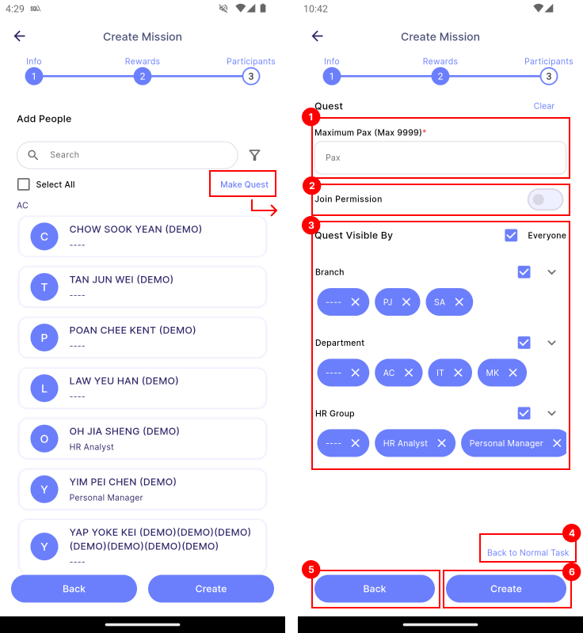

# Quest

Quest is a mission that is visible and open for employees to join freely, based on their Branch, Department, and HR Group. To create quest, go to **Create New > Target/Assignment > Step 3 > Make Quest**.

:::info[Note]

This feature is only available to **manager**.

:::

| Properties                | Description                                                                   | 
|:--------------------------|:------------------------------------------------------------------------------|
| **1 Maximum Pax**         | The maximum number of people allowed to join the quest.                       | 
| **2 Join Permission**     | Sets whether the quest requires manager approval to join.                     | 
| **3 Quest Visible By**    | Specifies which Branch, Department, or HR Group can view and join the quest.  |
| **4 Back to Normal Task** | Converts your mission into normal mission. See more in [**assignment**](assignment) and [**target**](target) |
| **5 Back**                | Navigates to the previous page.                                               |
| **6 Create**              | Creates the quest.                                                            |
