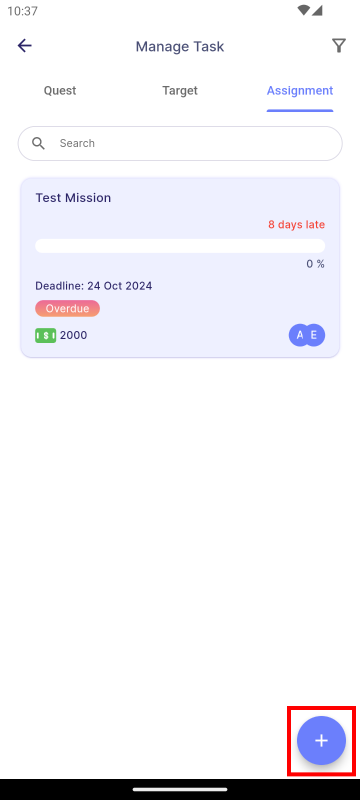

# Introduction

:::info[Note]
This feature is only available to **managers**.
:::

The Task Creation feature allows managers to create new missions for employees. There are two types of missions: **Assignment** and **Target**.

- **Assignment:**  
  An Assignment mission focuses on qualitative outcomes that require creativity and strategic thinking. These missions emphasize the quality of work and the process rather than measurable results. E.g. Idea brainstorm, Clothes design..

- **Target:**  
  A Target mission centers on quantitative outcomes with specific, measurable goals. The focus is on achieving clear, countable results. E.g. Sales Target, Total new users.

- **Quest:**  
  A Quest is used when you’re unsure who to assign a task to or want to invite all employees to participate. 

## Create a Mission

To create a new mission, navigate to **Main Dashboard > Manage Task**. Click the **Add Button** located at the bottom right corner of the app.

### 1. Duplicate Existing Mission

In this section, you can view all previously created missions, including those that have been deleted.

- [**Duplication**](duplication)

### 2. Create New Mission

In this section, you can create a new mission from scratch, choosing either Assignment or Target.

- [**Assignment**](assignment)
- [**Target**](target)

