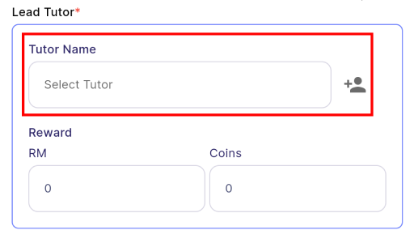
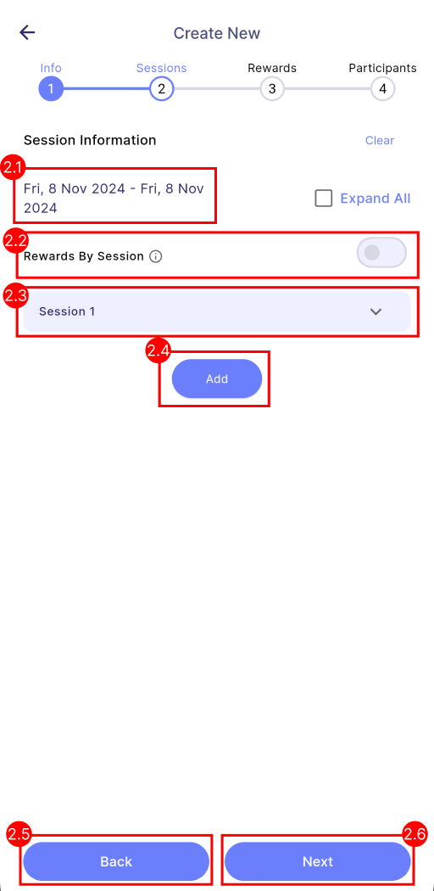
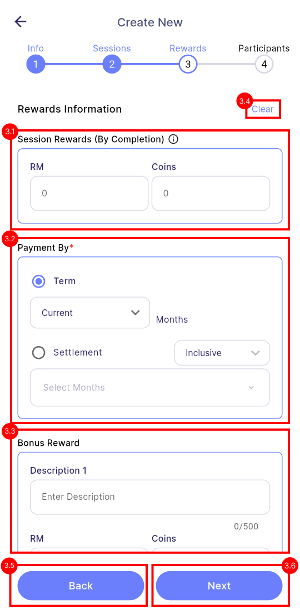
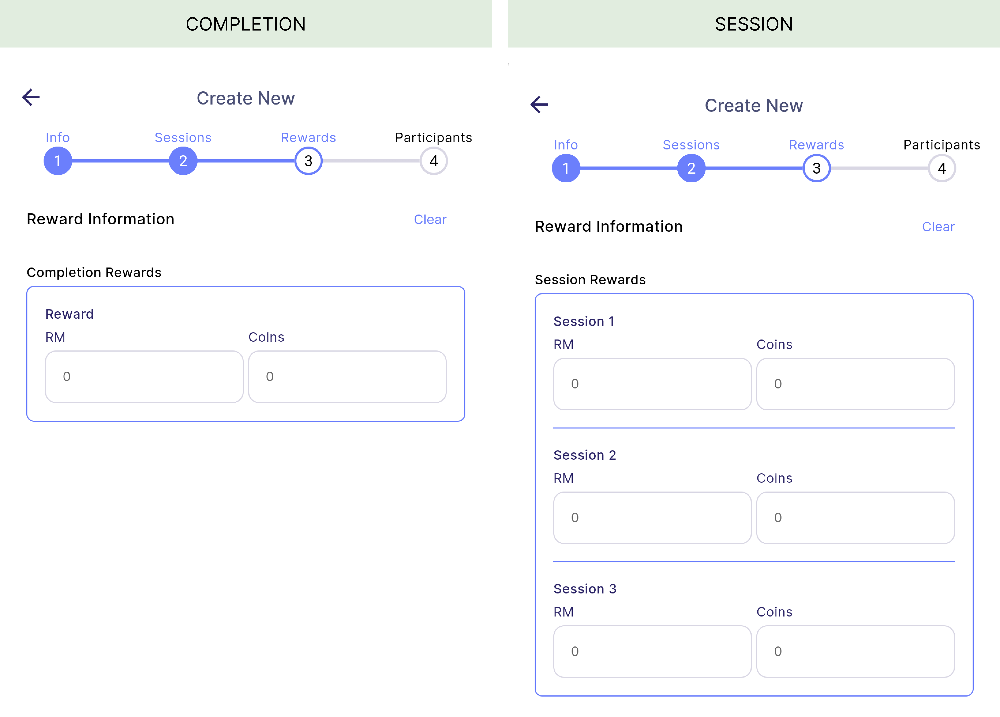
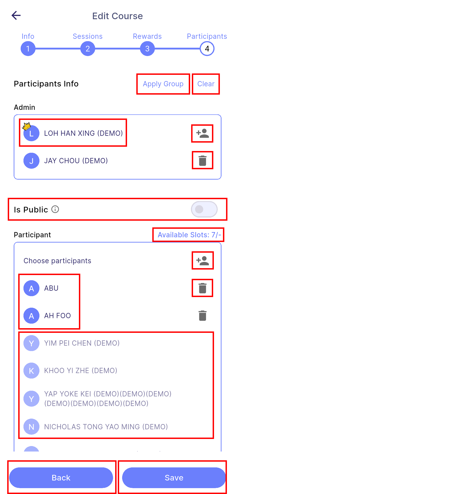
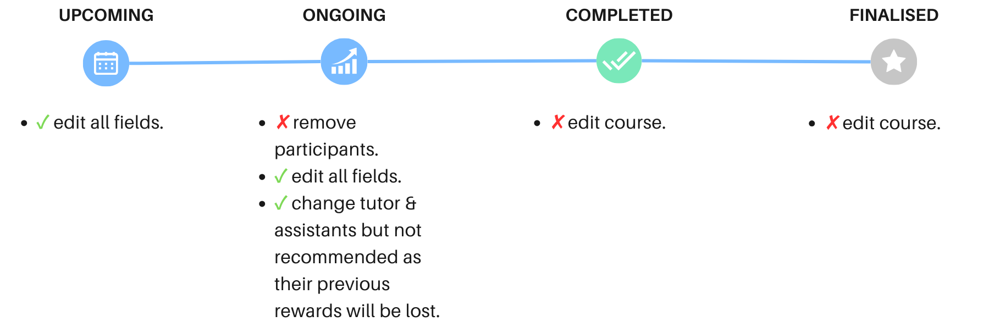
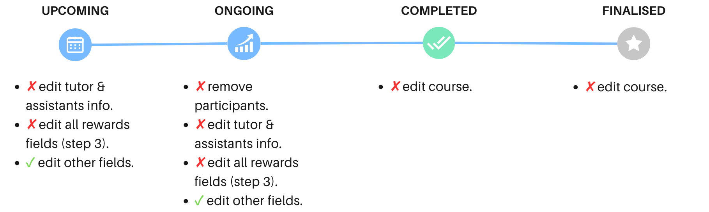

# Upskill Creation
## 1. Creation Steps
### Step 1 - Course Information

| 
Properties
          | 
Description
     | Required | 
Note
 |
|:----------------------------------------------|:------------------------------------------|:--------:|:----|
| **1.1 Title**                                 | The title of the course.                  | ✓        | -   |
| **1.2 Description**                           | A detailed description of the course.     | ✗        | -   |
| **1.3 Tutor**                                 | The main tutor of the course.             | ✓        | -   |
| **1.4 Assistant Tutor**                       | The assistant tutor for the course.       | ✗        | -   |
| **1.5 Clear**                                 | Clears all course information on the current page.   | -        |        **Manager:** Clears all course information.  **Tutor Assistants:** Clears all excepts tutor and assistants information.|
| **1.6 Next**                                  | Navigate to the next page.               | -        | -   |  

 
#### 1.3 Tutor
- **Tutor** is the employee responsible for giving lessons and providing guidance throughout the learning process in the course. 
- There will be only **one** lead tutor in every course. 

 
#### 1.4 Assistant Tutor
- **Assistant Tutor** plays a role in supporting the lead tutor in completing the course smoothly. 
- There can be **multiple** assistant tutors in every course. 

 
### Step 2 - Sessions Information

| 
Properties
 | 
Description
 | 
Note
 |
|:-------------------------------------|:--------------------------------------| :----------------------------- |
| **2.1 Start & End Date**             | Display the start date and end date of the course which is determined by first and last session's date.                                            | - |
| **2.2 Rewards Type**                           | Determine whether the reward is calculated **by session** or **by completion**.   **By Completion**  - Rewards are issued when participants achieve full attendance across all sessions (100% attendance).  **By Session** - Rewards are issued once participants attend any session. | **On:** Rewards calculate by session.  **Off:** Rewards calculate by completion.  To know more about rewards type, [<u>click here</u>](./upskill.md#1-rewards-type)|
| **2.3 Session Details**| The details of each session of the course.                           | - |
| **2.4 Add Session**           | Add more sessions to the course.                                                     | - |
| **2.5 Back**                | Navigate back to the previous page.                                                   | - |
| **2.6 Next**                 | Navigate to the next page.                                                           | - |

 
#### 2.3 Session Details

| 
Properties
 | 
Description
| 
Required
| 
Note
 |
|:--------------------------|:--------------------------------------|:-:|:------------------------------------|
| **2.3.1 Title**           | The title of the session.             | ✓ | - |
| **2.2.2 Description**     | A detailed description of the session.| ✗ | - |
| **2.3.2 Date**            | The date of the session.              | ✓ | - |
| **2.3.4 Start Time**      | The start time of the session.        | ✓ | - |
| **2.3.5 End Time**        | The end time of the session.          | ✓ | Cannot be earlier than start time |
| **2.3.6 Venue**           | The venue of the session.             | ✗ | - |

 
### Step 3 - Rewards Information

| 
Properties
 | 
Description
     | Required | 
Note
 |
|:-------------------------------------|:------------------------------------------|:--------:|:----|
| **3.1 Session Rewards**              | **Completion-based course:** There is only **one** completion reward for the entire course.  **Session-based course:** There are **multiple** session rewards. Each session will have their respective session rewards. | ✗        | Default reward is "0".   |
| **3.2 Payment by**                   | Type of payment method for this course. This payment method only applicable for cash only,  coins will be paid immediately upon entitlement.     | ✓        | Same concept as in task creation's payment by, [<u>click here</u>](task_creation/assignment.md#23-payment-by)   |
| **3.3 Bonus Rewards**                | Extra criterias that employee can achieve to earn more rewards.             | ✗        | Default reward is "0".  If a value is specified in cash or coins, the bonus criteria must be provided.  Same concept as in task creation's bonus, [<u>click here</u>](task_creation/assignment.md#24-bonus)   |
| **3.4 Clear**                        | Clears all rewards on the current page.   | -        |        **Manager:** Clears all rewards.  **Tutor Assistants:** No clear button as they cannot edit rewards.|
| **3.5 Back**                         | Navigate to the previous page.           | -        | -   |  
| **3.6 Next**                         | Navigate to the next page.               | -        | -   |  

 
#### 3.1 Session rewards
- **Completion-based course:** There is only **one** completion reward for the entire course.
- **Session-based course:** There are **multiple** session rewards. Each session will have their respective session rewards. 

 
### Step 4 - Participants Information

| 
Properties
 | 
Description
 | 
Note
 |
|:-----------------------------|:-----------------------------------------------------------------------------------|:---------|
| **4.1 Is Public**     | Determine whether this course is public or private. | **On:** Public course.  **Off:** Private course.  To know more about public and private course, [<u> click here</u>](upskill.md#4-course-privacy).
| **4.2 Filter**        | Filter and sort the employee list.                                             | By branch, department & HR group. |
| **4.3 Select All**    | Select all employees as participants.                                                         | Can press again to deselect all employees. |
| **4.4 Available Slots**        | The available slots left for this course (Number of selected participants / maximum pax).                                                           |As this is **private** course, so there is **no maximum pax**, hence the maximum pax is "-".|
| **4.5 Selected Employees**     | All employees in the companies that **participate** in this course.                            |  Click to **remove** employee from course. |
| **4.6 Unselected Employees**        | All employees in the companies that **does not participate** in this course.                                                                        |Click to **add** employee to course.|
| **4.7 Back**          | Navigate back to the previous page.                                                          | - |
| **4.8 Create or Edit**        | Create or edit the course.                                                                            | - |

 
#### 4.1 Is Public

**Public course**
- A public course is visible to participants in specific branches, departments, or HR groups as set by the manager.  
- It allows eligible **participants to register** on their own.  

**Private course**
- A private course is not open for general registration. 
- Instead, participants are manually **added by the manager**.  
- Only those who are added to the course can view it in the course tab.  

:::info[Note]
If the is public switch is on, the maximum pax, branch, department and HR group fields are required.
:::

:::tip
If a course is public, the manager can manually add participants who do not belong to the specified branches, departments, or HR groups.
:::

## 2. Edit Course
- The diagram below illustrates the **manager's** and **tutor assistants'** edit permissions based on the different course statuses.
- To know more about course status, [<u>click here</u>](./upskill.md#3-course-status).

:::info[Note]
Tutor and assistants cannot edit any rewards-related field.
:::

#### **Manager:**  

#### **Tutor & Assistants:** 

