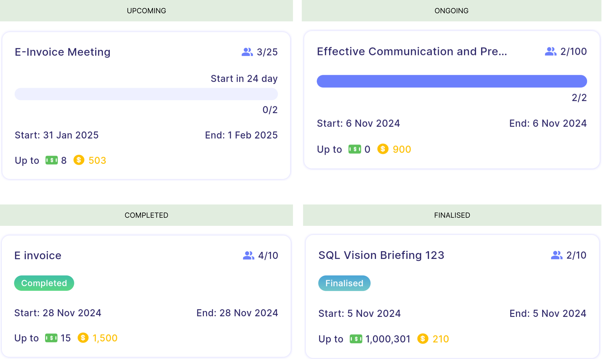
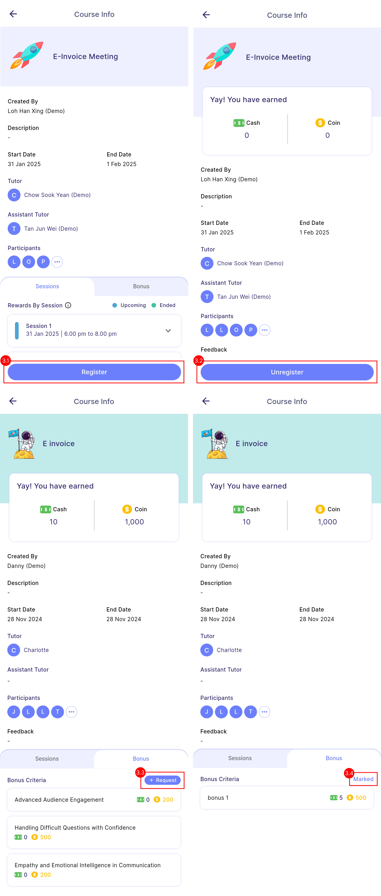
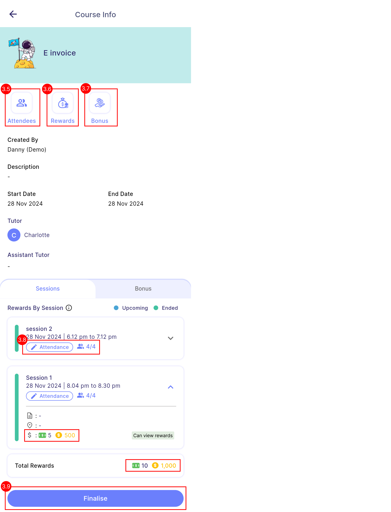
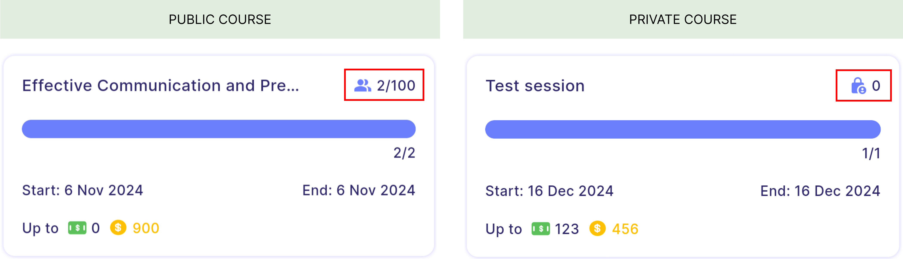

# Upskill

## Concept

### 1. Rewards Type  

#### **Rewards by Completion**
  - Rewards are issued when participants achieve full attendance across all sessions (100% attendance).
  - Participants can view their session reward only after the all sessions has ended, as the reward depends on their overall attendance.

  :::info[Note]
  By default, a course with only one session is considered "reward by completion."
  :::

  :::danger[Warning]
  Participants will not receive any reward if they miss any session in a completion-based course.
  :::

 

#### **Rewards by Session**
  - Rewards are issued once participants attend any session.
  - Participants can view their updated reward immediately after each session ended.

  :::info[Note]
  Session-based course requires at least two sessions.
  :::

  

 
### 2. Course visibility
- The diagram below illustrates how course visibility is set for branches, departments, and HR groups.  

#### **User Visibility**
- Participants can view courses open to their own branch, department, and HR group.
- However, participants can join courses from other branches, departments, or HR groups if a manager manually adds them to the course.

#### **Manager Visibility**
- Managers can only **manage** courses involving the **branch and department that are under their management area** which is set in payroll. 
- For **other branches and departments**, managers can only **view** the course information **without reward details**.  

| 
Properties
 | 
Description
 | 
Note
 |
|:-----------------------------|:-----------------------------------------------------------------------------------|:---------|
| **2.1 Attendees**             | To view **registered employees** of this course, categorized by department, branch, or HR group, with department set as the default filter.| Can click on employee to view their participant profile which includes summary of attendance and rewards earned in this course.  To know more about participant's profile, [<u>click here</u>](#3-participants-profile)
| **2.2 Rewards summary**       | To view the **total cash and coins spent** on this course, distributed among the tutor, assistants, and participants, along with detailed rewards earned by each participant. |  To know more about rewards summary, [<u>click here</u>](#4-reward-summary) |
| **2.3 Bonus requests**        | To view, approve and edit bonus requests. | To know more about bonus requests, [<u>click here</u>](#5-bonus-requests) |
| **2.4 Attendance**            | To view and mark attendance. | To know more about attendance, [<u>click here</u>](#6-attendance)|
| **2.5 Edit course or manage course status**  | To edit, manually complete or finalise course. |  To know more about: - Edit course, [<u>click here</u>](upskill-creation.md#2-edit-course) - Complete course, [<u>click here</u>](#7-complete-course) - Finalise course, [<u>click here</u>](#8-finalise-course)|

 
### 3. Course status
- There are **4 course status** in upskill module:

| Status                               | Description                                | 
|:-------------------------------------|:-------------------------------------------|
| **Upcoming**                         | Course not yet started.                    |
| **Ongoing**                          | The first session has started. The last session may have ended but the course remains ongoing until the manager manually complete it. |
| **Completed**                        | Course is manually completed by manager.  [<u>Complete course</u>](#7-complete-course) |
| **Finalised**                        | Course is manually finalised by manager.  [<u>Finalise course</u>](#8-finalise-course)|

 
- Below shows the **course card** of different course status:

<!--  -->
 
- Both users and managers can **perform different actions** depending on the course status:

#### **User Course Status**

| Actions                              | Upcoming | Ongoing | Completed | Finalised | Cannot perform when|
|:-------------------------------------|:--------:|:-------:|:---------:|:---------:|:--------------------------|
| **3.1 Register**                         | ✓        | ✓       |          |           | Course is **full**. **Last** session has **ended**. |
| **3.2 Unregister**                       | ✓        |         |          |           | Course is **private** as participant is added by manager.
| **3.3 Request bonus**                    |          |         | ✓        |           | **Absent** from **all** sessions.
| **3.4 View bonus request status**        |          |         | ✓        | ✓         | -

 
#### **Manager Course Status**

| Actions                                       | Upcoming | Ongoing | Completed | Finalised | Condition                           |
|:----------------------------------------------|:--------:|:-------:|:---------:|:---------:|:------------------------------------|
| **3.5 View attendees & participant's profile**    | ✓        | ✓       | ✓        | ✓         |                                    |
| **3.6 View rewards summary**                      | ✓        | ✓       | ✓        | ✓         | Summary table only will be shown when the course is finalised.                                   |
| **3.7 Approve bonus requests**                    |          |         | ✓         |           | -                                   |
| **3.8 Mark attendance**                           |          | ✓       | ✓         |           | The session must be started.     |
| **3.9 Edit course**                               | ✓        | ✓       |           |           | -                                   |
| **3.9 Complete course**                           |          | ✓       |           |           | Last session must be ended.         |
| **3.9 Finalise course**                           |          |          | ✓         |           | All bonus requests must be marked. |

 
### 4. Course Privacy 

#### **Public course**  
- A public course is visible to participants in specific branches, departments, or HR groups as set by the manager at [<u>here</u>](#2-course-visibility).
- It allows eligible participants to register on their own.  

#### **Private course**
- A private course is not open for general registration. 
- Instead, participants are manually added by the manager.  
- Only those who are added to the course can view it in the course tab (registered or completed tab). 

 
**Course card** of public and private course:

 

:::info[Note]
When manager creates a **private course**, the course visibility will be the branch and department that manager belongs to.  
The **visibility** of a private course will always be the same as the **creator's branch and department**, **regardless** of which manager **edits** the course.

:::

 
## User View
### 1. Course tab
#### **Courses tab**  
- Course tab **displays joinable courses** that the employee has not yet registered for.
- Employees can register for any course listed in this tab, as long as there are **available slots**.  

#### **Registered tab**  
- Contains two sub-tabs:   
    **Learner tab:** Displays upcoming or ongoing courses the employee has **registered** for.  
    **Tutor tab:** Displays upcoming or ongoing courses where the employee is **assigned as a tutor or assistant**.

#### **Completed tab**  
- Contains two sub-tabs:   
    **Learner tab:** Displays completed or finalised courses the employee has **registered** for.  
    **Tutor tab:** Displays completed or finalised courses where the employee is **assigned as a tutor or assistant**.

:::info[Note]
By default, **finalized courses are hidden**.  
To view finalized courses, open the filter and **tick** the **finalised** option.
:::

 
### 2. Participant list
- User can view participants that has registered to course with the **"..."** button. 
- 11/15 in the diagram belows indicates that there are 11 participants registered into the course with 15 available slots.

:::tip
Private course does not have a maximum participant limit.  
Therefore the registered participants value will be displayed as "11/-".
:::

 
### 3. Bonus request status
- Users must **attend at least one session** to request for bonus.

| Status                               | Description                                | 
|:-------------------------------------|:-------------------------------------------|
| **Request**                         | - User can request for bonus.  - User can only request the bonus once and no further edit can be made.                    |
| **Pending**                          | - The bonus is awaiting for manager approval. - Greyed out indicates that user does not request for the bonus.
| **Marked**                        | - The bonus request is marked by manager.  - Greyed out indicates that user does not entitle the bonus.|
| **Unable to request**                        | User cannot request a bonus due to zero attendance.  |
| **No request**                        | - This status only will be shown once the course has finalised. - Indicates that user does not request for any bonus.
  |

:::warning
User can only request the bonus once and no further edit can be made.
:::
:::info[Note]
- The **request button** will **remain available** until the user **submits a bonus request** or the **course is finalised**, as long as the bonus has not yet been requested.
- Once the course is finalised, unrequested bonuses will no longer appear greyed out but will display a **"No request"** tag instead.
:::

## Manager View
### 1. Course tab

#### **Manage Upskill**
- **Upcoming tab**: Courses that not not yet started.
- **Ongoing tab**: Courses start has started.
- **Completed tab**: Courses that is completed or finalised.

:::info[Note]
- Manager can press the switch view button at the app bar to toggle between **manage upskill** (can manage) and **other branch & department** (view only).
- To know more about visibility, [<u>click here</u>](#2-course-visibility).
:::

#### **Other Branch & Department**
- Manager is not allowed to view the rewards can be earned for each course.
- Manager can access the course detail by clicking on the course card, but the rewards will remain hidden. 

:::info[Note]
By default, finalized courses are hidden.  
To view finalized courses, open the filter and **tick** the **finalised** option.
:::

<!-- :::tip
- Manager can delete a course by **swiping** the course to the **left** and click the **dustbin** button.
- Manager can only delete course in "Manage Upskill" but not "Other Branch & Dept".

::: -->

 
### 2. Participant List
- The manager can view participant list by clicking on the **"Attendees"** button. 

:::info[Note]
- The attendees can be sorted by branch, department or HR group using the filter function. 
- By default, the attendees is sorted by department.
:::

 
### 3. Participant's profile
- Participant's profile is the summary of attendance and reward (session and bonus reward) obtained by participants.

- **2 ways** to access participant's profile: Attendees & Rewards

- Sample of participant's profile of **session-based** & **completion-based** course:

:::info[Note]
- A greyed-out reward means the participant did not entitle the reward.
- However, as long as the course has not been finalised, any changes made by the manager to a participant’s attendance or bonus reward will be reflected in their profile.
- The bonus request status is exactly the same as the course info page, [<u>click here</u>](#3-bonus-request-status) to know more.
:::

 
### 4. Reward Summary
- The manager can view summary of reward by clicking on the **"Rewards"** button. 

| 
Properties
 | 
Description
 | 
Note
 |
|:-----------------------------|:-----------------------------------------------------------------------------------|:---------|
| **3.1 Total Spend**             | To view the total expenses of the company for this course, including rewards allocated to tutors, assistants, and participants. | -
| **3.2 Expected Payout Date**       | To view the expected payout date for this course. | The expected payout date is set in the creation, [<u>click here</u>](upskill-creation.md#step-3---rewards-information) to know more. |
| **3.3 Tutor & assistant rewards**        | To view the rewards of tutor and assistants. | - |
| **3.4 Session reward**            | To view the session reward entitled by participants.  **Completion-based reward** - Represented by "C". - For completion-based courses, there is always a single reward for session rewards, referred to as "C1".  **Session-based reward** - Represented by "S". - In this case, there are two sessions: "S1" represents the first session and "S2" represents the second session. | To know more about rewards type, [<u>click here</u>](#1-rewards-type)|
| **3.5 Bonus reward**  | To view the bonus reward entitled by participants. | - |
| **3.6 Total reward**  | To view the total rewards entitled by participants (session rewards + bonus rewards). | - |
| **3.7 Fully Achieve**  | Indicates that participants entitled full amount of the original reward. | Tap on the indicator to view the amount of cash and coins earned. |
| **3.8 Partially Achieve**  | Indicates that participants entitled partial amount of the original reward. | Tap on the indicator to view the amount of cash and coins earned.  |

:::tip
- **Reward summary table** will only be shown after the course is **finalised**.
- Manager can also click on the participants' name to access to their participant's profile
- To know more about participant's profile, [<u>click here</u>](#2-participants-profile).
:::

 
### 5. Bonus requests
#### **View Bonus Requests** 
- The manager can view bonus requested by the participants by clicking on the **"Bonus"** button. 
- There are two statuses for bonus requests:
    - **Pending**: The request has not been approved by the manager and is awaiting approval.. 
    - **Marked**: The request has been approved by the manager but can still be edited.
- The total amount for pending requests is 2 because the request has not yet been approved.
- **Remark** is the comment entered by participants to detail what they achieved in order to meet the bonus criteria.
- **Feedback** is the comments provided by the manager or tutor for the participants.

:::info[Note]
The **amount** of bonus requested by participant may be **different** but will not **exceed** the original amount.
:::

#### **Enter Edit Mode** 
- To approve or edit the bonus request, the manager needs to click on the **"Edit"** button.
- Once in edit mode, the **expand all** will automatically ticked and all bonus requests will be expanded.
- Manager will be able to view and edit the bonus request details of each participant.

#### **Approve or Edit Bonus Requests** 
- **Tick & Untick**: The manager can tick or untick the bonus criteria by tapping on the bonus criteria card or checkbox.
- **Edit value**: The manager can edit the value, but it **cannot exceed the original bonus amount** shown at the bottom right corner of the edit field.
- **Give feedback**: The manager can also leave feedback to evaluate the participants' performance.
- **Approve**: The manager must press the approve button for each participant to confirm the edit.

:::warning
- If a participant's bonus request is edited but not yet approved, a confirmation window will appear to remind the manager to approve the edited request.
    - **Yes**: Discard the unapproved request and save only the approved request.
    - **Cancel**: Continue editing the request.

:::

 
### 6. Attendance 
- The attendance must be marked manually.  
 
#### **View Attendance**
- The manager or tutor can view attendance summary from the session card.
- Once the **session has started**, a **pen icon** will **appear** beside the attendance which indicates the attendance is **editable**.
- If **session not yet started**, there is **no pen icon** which indicates attendance is not editable and is for **viewing** only.
- "0/3" indicates that 0 participants are present out of a total of 3 participants.
- The manager or tutor can click on the attendance to view details or mark attendance.

#### **Mark Attendance**
- A manager or tutor can only mark attendance once the session has started.
:::info[Note]
- Manager can edit the attendance anytime before finalising the course.
:::
:::tip
- If the majority participants are present, the manager can select all participants in the "Absent" tab and check them in.
- Then, in the "Checked-In" tab, manager can search for the absent participants and mark them as absent.
:::

 
### 7. Complete Course
- When all sessions of course has ended, the complete button will appear in the bottom bar of course info page for manager to manually complete the course.
- Manager can also choose to edit course and add more sessions.

:::warning
Once the course is completed, the course details cannot be edited anymore.
:::

:::tip
- Participants can only start to request bonus after course is completed.
- Bonus can only be approved after the course is completed.
- To view more actions a manager can perform in "Completed" course, [<u>click here</u>](#manager-course-status)
:::

 
### 8. Finalise Course
- Finalising a course marks an end to the course.

:::info[Note]
- All course rewards, including those for tutors, assistants, and participants, will be distributed once the course is finalised.
- Coins are awarded immediately, while cash rewards are given based on the expected payout date.
:::

:::tip
- Before finalising a course, the manager must mark all bonus requests.
- A reminder will be issued if any participants have not yet requested a bonus.
:::

:::warning
Once the course is finalised, the bonus request cannot be edited anymore.
:::
