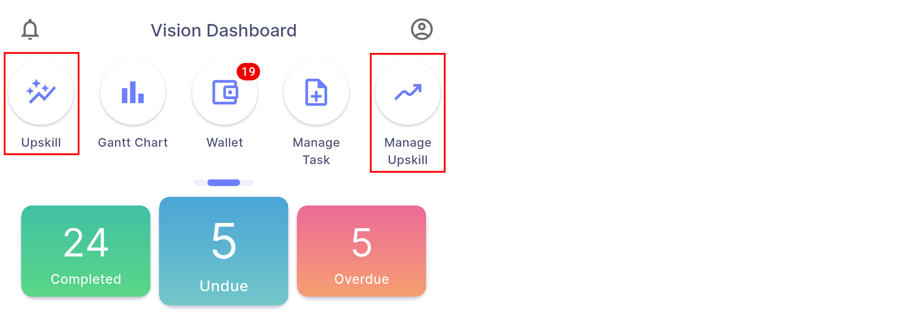
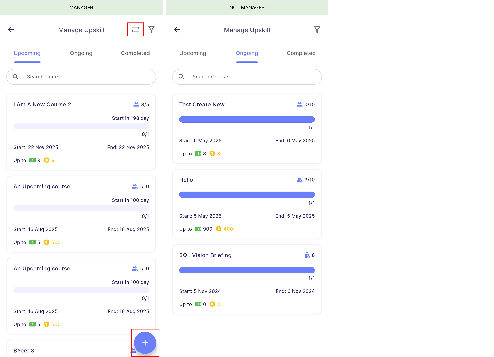

# Introduction

Upskill is a module that allows employees to learn new skills by joining courses. Managers can create courses, set rewards, edit course details, mark attendance, approve bonus requests, and finalise the course. Employees can view available courses, register for a course, request bonuses, and view the rewards they have earned throughout the course.

### Rewards Type

#### **Rewards by Completion**

- Rewards are issued when participants **achieve full attendance** across all sessions (100% attendance).
- Participants can view their session reward only after the all sessions has ended, as the reward depends on their overall attendance.

:::info[Note]
By default, a course with only one session is considered "reward by completion."
:::

:::danger[Warning]
Participants will not receive any session reward if they miss any session in a completion-based course.
:::

 

#### **Rewards by Session**

- Rewards are issued once participants **attend any session**.
- Participants can view their updated reward immediately after each session ended.

:::info[Note]
Session-based course requires at least two sessions.
:::

### Course Role

#### **Admin**

- The **course creator** is automatically assigned as the first admin and cannot be removed.
- Admin holds the **highest** level of **privileges** in the course.
- They can perform all actions including editing course details, managing participants, marking attendance, and approving bonus requests.

#### **Tutor**

- The **lead instructor** of the course.
- Each course can have only **one** tutor.
- Tutors hold the second-highest level of privileges, after admins.
- **Except for reward-related details** — such as tutor and assistant assignments, step 3 reward settings, and admin roles, tutors can perform **same action as admin**.

:::info[Note]
Tutors cannot edit reward-related course details and assignment of tutor, assistant tutors and admin.
:::

#### **Assistant**

- There can be **multiple** assistants in a course.
- Assistants hold the **same level of privileges as tutor**.
- Multiple assistant tiers can be created, each with different reward allocations.

#### **Participant**

- Employees who have registered for the course.
- Participants can view their attendance records, request bonuses, and track rewards earned.

 
### Course Visibility

- The dashboard contains two buttons: upskill and manage upskill.  
  **Upskill**: Displays courses where the employee is a **participant, tutor, or assistant**.  
  **Manage Upskill**: Displays courses where the employee is assigned as **admin**.
  

:::info[Note]

- If an employee is **not a company manager**, they cannot **view other branch and department** and **create course**.

:::

#### **User Visibility**

- Participants can view courses open to exactly their own branch, department, and HR group.
- However, participants still can join courses from other branches, departments, or HR groups if a manager manually adds them to the course.
- The diagram below illustrates how course visibility is set for branches, departments, and HR groups.

#### **Manager Visibility**

- Employees can only manage courses where they are assigned as admin. To understand more about admin, [<u>click here</u>](#course-role)
- Courses where they are not admins will appear under the **other branches and departments view** where managers can only **view** the course information **without reward details**.

| 
Properties
 | 
Description
                                                                                                                                         | 
Note
                                                                                                                                                                                                                                          |
| :----------------------------------- | :---------------------------------------------------------------------------------------------------------------------------------------------------------------------------- | :---------------------------------------------------------------------------------------------------------------------------------------------------------------------------------------------------------------------------------------------------------------------- |
| **Attendees**                        | To view **registered employees** of this course, categorized by department, branch, or HR group, with department set as the default filter.                                   | Can click on employee to view their participant profile which includes summary of attendance and rewards earned in this course.  To know more about participant's profile, [<u>click here</u>](manager_view/upskill#participants-profile)                       |
| **Rewards**                          | To view the **total cash and coins spent** on this course, distributed among the tutor, assistants, and participants, along with detailed rewards earned by each participant. | To know more about rewards summary, [<u>click here</u>](manager_view/upskill#reward-summary)                                                                                                                                                                            |
| **Bonus**                            | To view, approve and edit bonus requests from participants.                                                                                                                   | To know more about bonus requests, [<u>click here</u>](manager_view/upskill#bonus-requests)                                                                                                                                                                             |
| **Attendance**                       | To view and mark attendance.                                                                                                                                                  | To know more about attendance, [<u>click here</u>](manager_view/upskill#attendance)                                                                                                                                                                                     |
| **Edit/Complete/Finalise Button**    | To edit, manually complete or finalise course (depending on course status).                                                                                                   | To know more about: - Edit course, [<u>click here</u>](manager_view/upskill-creation#edit-course) - Complete course, [<u>click here</u>](manager_view/upskill#complete-course) - Finalise course, [<u>click here</u>](manager_view/upskill#finalise-course) |

 
### Course Status
- There are **4 course status** in upskill module:

| Status        | Description                                                                                                                               |
| :------------ | :---------------------------------------------------------------------------------------------------------------------------------------- |
| **Upcoming**  | Course not yet started.                                                                                                                   |
| **Ongoing**   | The first session has started. The last session may have ended but the course remains ongoing until the manager manually complete it. |
| **Completed** | Course is manually completed by manager.  [<u>Complete course</u>](manager_view/upskill#complete-course)                              |
| **Finalised** | Course is manually finalised by manager.  [<u>Finalise course</u>](manager_view/upskill#finalise-course)                              |

 
- Below shows the **course card** of different course status:

<!--  -->
 
- Both users and managers can **perform different actions** depending on the course status:

#### **User Course Status**

| Actions                       | Upcoming | Ongoing | Completed | Finalised | Cannot perform when                                       |
| :---------------------------- | :------: | :-----: | :-------: | :-------: | :-------------------------------------------------------- |
| **Register**                  |    ✓     |    ✓    |           |           | Course is **full**. **Last** session has **ended**.   |
| **Unregister**                |    ✓     |         |           |           | Course is **private** as participant is added by manager. |
| **Request Bonus (+ Request)** |          |         |     ✓     |           | **Absent** from **all** sessions.                         |
| **View Request Status**       |          |         |     ✓     |     ✓     | -                                                         |

 
#### **Manager Course Status**

| Actions                                                | Upcoming | Ongoing | Completed | Finalised | Condition                                                      |
| :----------------------------------------------------- | :------: | :-----: | :-------: | :-------: | :------------------------------------------------------------- |
| **Attendees** - view attendees & participant's profile |    ✓     |    ✓    |     ✓     |     ✓     |                                                                |
| **Rewards** - view rewards summary                     |    ✓     |    ✓    |     ✓     |     ✓     | Summary table only will be shown when the course is finalised. |
| **Bonus** - approve bonus requests                     |          |         |     ✓     |           | -                                                              |
| **Attendance** - mark attendance                       |          |    ✓    |     ✓     |           | The session must be started.                                   |
| **Edit** - edit course                                 |    ✓     |    ✓    |           |           | -                                                              |
| **Complete** - complete course                         |          |    ✓    |           |           | Last session must be ended.                                    |
| **Finalise** - finalise course                         |          |         |     ✓     |           | All bonus requests must be marked.                             |

 
### Course Privacy

#### **Public course**

- A public course is visible to participants in specific branches, departments, or HR groups as set by the manager at [<u>here</u>](#course-visibility).
- It allows eligible participants to register on their own.

#### **Private course**

- A private course is not open for general registration.
- Instead, participants are manually added by the manager.
- Only those who are added to the course can view it in the course tab (registered or completed tab).

 
**Course card** of public and private course:

 
