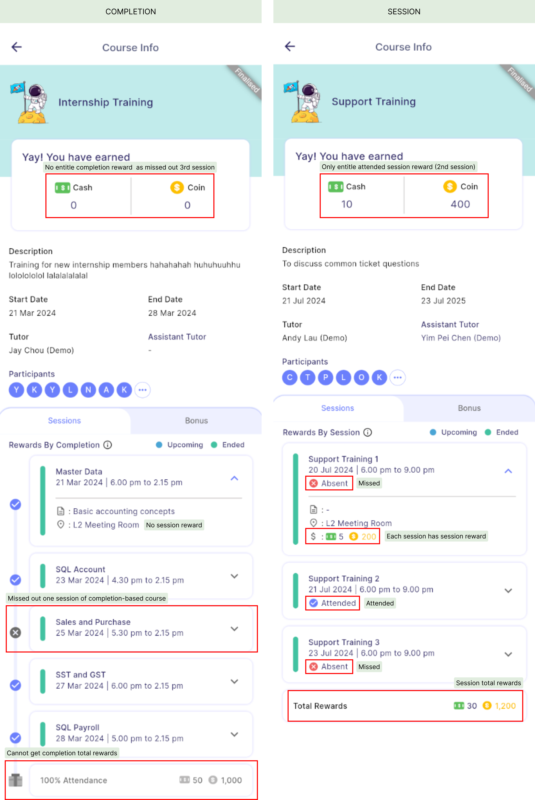
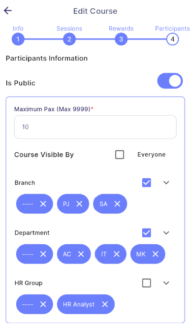
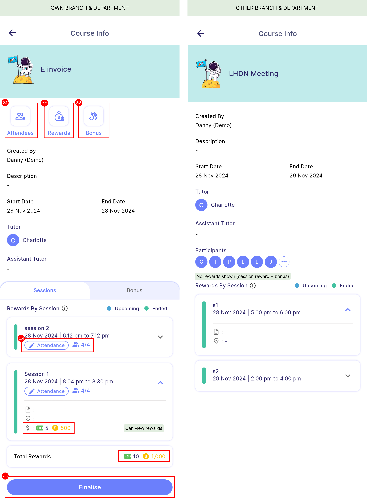
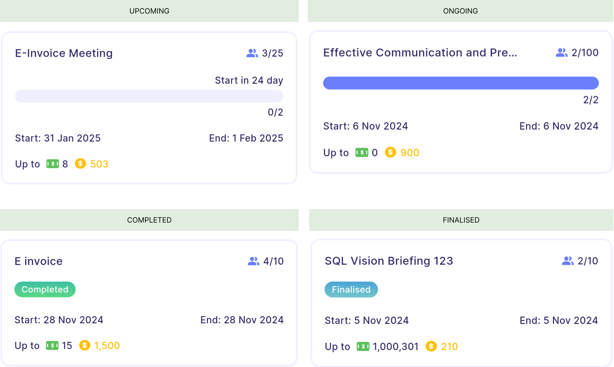
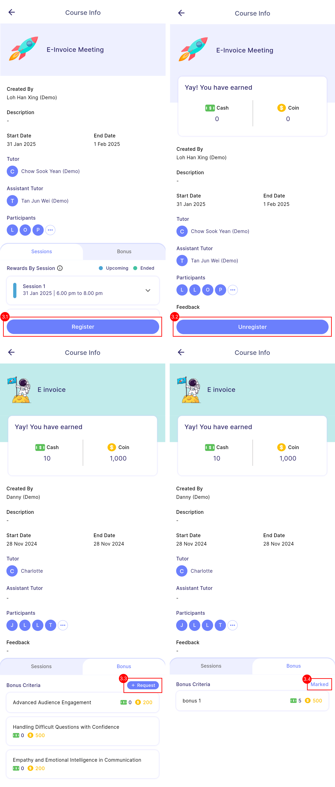
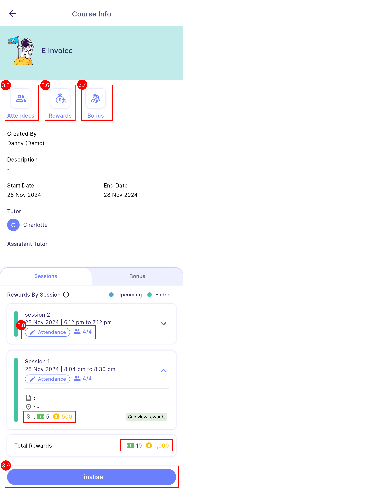
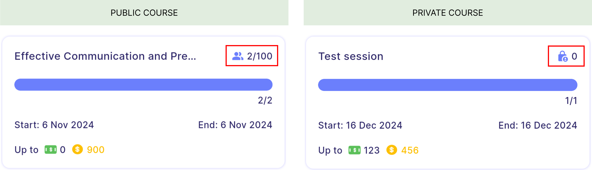
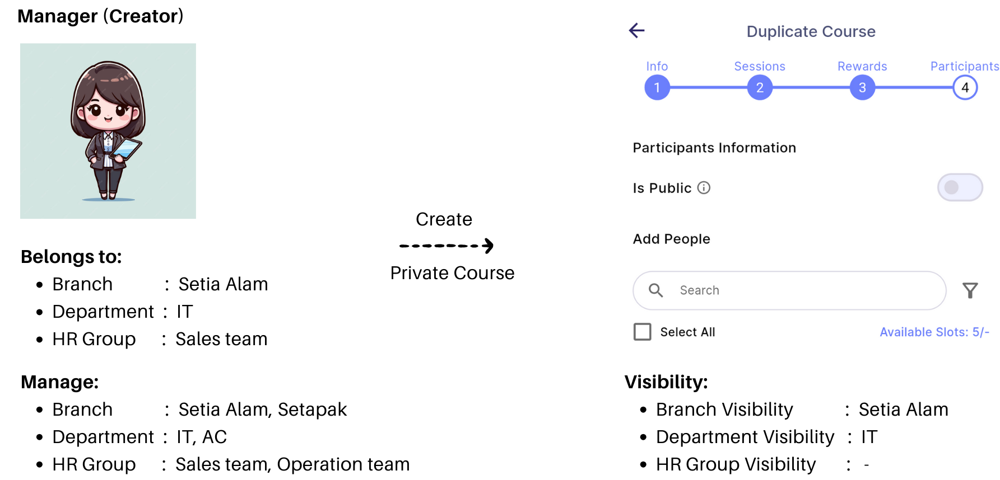

# Introduction

### Rewards Type  

#### **Rewards by Completion**
  - Rewards are issued when participants achieve full attendance across all sessions (100% attendance).
  - Participants can view their session reward only after the all sessions has ended, as the reward depends on their overall attendance.

  :::info[Note]
  By default, a course with only one session is considered "reward by completion."
  :::

  :::danger[Warning]
  Participants will not receive any reward if they miss any session in a completion-based course.
  :::

 

#### **Rewards by Session**
  - Rewards are issued once participants attend any session.
  - Participants can view their updated reward immediately after each session ended.

  :::info[Note]
  Session-based course requires at least two sessions.
  :::

  

 
### Course visibility
- The diagram below illustrates how course visibility is set for branches, departments, and HR groups.  

#### **User Visibility**
- Participants can view courses open to their own branch, department, and HR group.
- However, participants can join courses from other branches, departments, or HR groups if a manager manually adds them to the course.

#### **Manager Visibility**
- Managers can only **manage** courses involving the **branch and department that are under their management area** which is set in payroll. 
- For **other branches and departments**, managers can only **view** the course information **without reward details**.  

| 
Properties
 | 
Description
 | 
Note
 |
|:-----------------------------|:-----------------------------------------------------------------------------------|:---------|
| **Attendees**             | To view **registered employees** of this course, categorized by department, branch, or HR group, with department set as the default filter.| Can click on employee to view their participant profile which includes summary of attendance and rewards earned in this course.  To know more about participant's profile, [<u>click here</u>](manager_view/upskill#participants-profile)
| **Rewards**       | To view the **total cash and coins spent** on this course, distributed among the tutor, assistants, and participants, along with detailed rewards earned by each participant. |  To know more about rewards summary, [<u>click here</u>](manager_view/upskill#reward-summary) |
| **Bonus**        | To view, approve and edit bonus requests. | To know more about bonus requests, [<u>click here</u>](manager_view/upskill#bonus-requests) |
| **Attendance**            | To view and mark attendance. | To know more about attendance, [<u>click here</u>](manager_view/upskill#attendance)|
| **Finalise/Edit**  | To edit, manually complete or finalise course. |  To know more about: - Edit course, [<u>click here</u>](manager_view/upskill-creation#edit-course) - Complete course, [<u>click here</u>](manager_view/upskill#complete-course) - Finalise course, [<u>click here</u>](manager_view/upskill#finalise-course)|

 
### Course status
- There are **4 course status** in upskill module:

| Status                               | Description                                | 
|:-------------------------------------|:-------------------------------------------|
| **Upcoming**                         | Course not yet started.                    |
| **Ongoing**                          | The first session has started. The last session may have ended but the course remains ongoing until the manager manually complete it. |
| **Completed**                        | Course is manually completed by manager.  [<u>Complete course</u>](manager_view/upskill#complete-course) |
| **Finalised**                        | Course is manually finalised by manager.  [<u>Finalise course</u>](manager_view/upskill#finalise-course)|

 
- Below shows the **course card** of different course status:

<!--  -->
 
- Both users and managers can **perform different actions** depending on the course status:

#### **User Course Status**

| Actions                              | Upcoming | Ongoing | Completed | Finalised | Cannot perform when|
|:-------------------------------------|:--------:|:-------:|:---------:|:---------:|:--------------------------|
| **Register**                         | ✓        | ✓       |          |           | Course is **full**. **Last** session has **ended**. |
| **Unregister**                       | ✓        |         |          |           | Course is **private** as participant is added by manager.
| **+ Request**                    |          |         | ✓        |           | **Absent** from **all** sessions.
| **Request status**        |          |         | ✓        | ✓         | -

 
#### **Manager Course Status**

| Actions                                       | Upcoming | Ongoing | Completed | Finalised | Condition                           |
|:----------------------------------------------|:--------:|:-------:|:---------:|:---------:|:------------------------------------|
| **Attendees** - view attendees & participant's profile    | ✓        | ✓       | ✓        | ✓         |                                    |
| **Rewards** - view rewards summary                   | ✓        | ✓       | ✓        | ✓         | Summary table only will be shown when the course is finalised.                                   |
| **Bonus** - approve bonus requests                   |          |         | ✓         |           | -                                   |
| **Attendance** - mark attendance                       |          | ✓       | ✓         |           | The session must be started.     |
| **Edit** - edit course                              | ✓        | ✓       |           |           | -                                   |
| **Complete** - complete course                           |          | ✓       |           |           | Last session must be ended.         |
| **Finalise** - finalise course                          |          |          | ✓         |           | All bonus requests must be marked. |

 
### Course Privacy 

#### **Public course**  
- A public course is visible to participants in specific branches, departments, or HR groups as set by the manager at [<u>here</u>](#course-visibility).
- It allows eligible participants to register on their own.  

#### **Private course**
- A private course is not open for general registration. 
- Instead, participants are manually added by the manager.  
- Only those who are added to the course can view it in the course tab (registered or completed tab). 

 
**Course card** of public and private course:

 

:::info[Note]
When manager creates a **private course**, the course visibility will be the branch and department that manager belongs to.  
The **visibility** of a private course will always be the same as the **creator's branch and department**, **regardless** of which manager **edits** the course.

:::
