# Upskill Creation
## Creation Steps
### Step 1 - Course Information
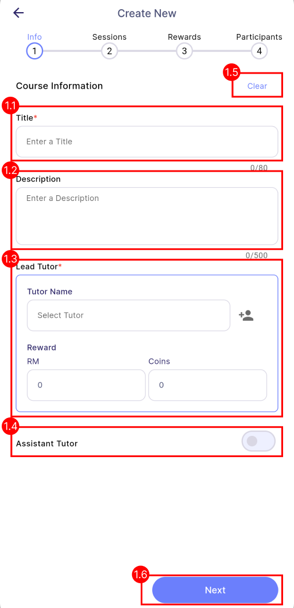

| 
Properties
          | 
Description
     | Required | 
Note
 |
|:----------------------------------------------|:------------------------------------------|:--------:|:----|
| **Title**                                 | The title of the course.                  | ✓        | -   |
| **Description**                           | A detailed description of the course.     | ✗        | -   |
| **Tutor**                                 | The main tutor of the course.             | ✓        | -   |
| **Assistant Tutor**                       | The assistant tutor for the course.       | ✗        | -   |
| **Clear**                                 | Clears all course information on the current page.   | -        |        **Manager:** Clears all course information.  **Tutor Assistants:** Clears all excepts tutor and assistants information.|
| **Next**                                  | Navigate to the next page.               | -        | -   |  

 
#### Tutor
- **Tutor** is the employee responsible for giving lessons and providing guidance throughout the learning process in the course. 
- There will be only **one** lead tutor in every course. 

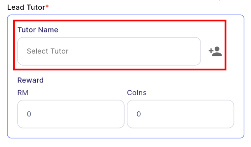
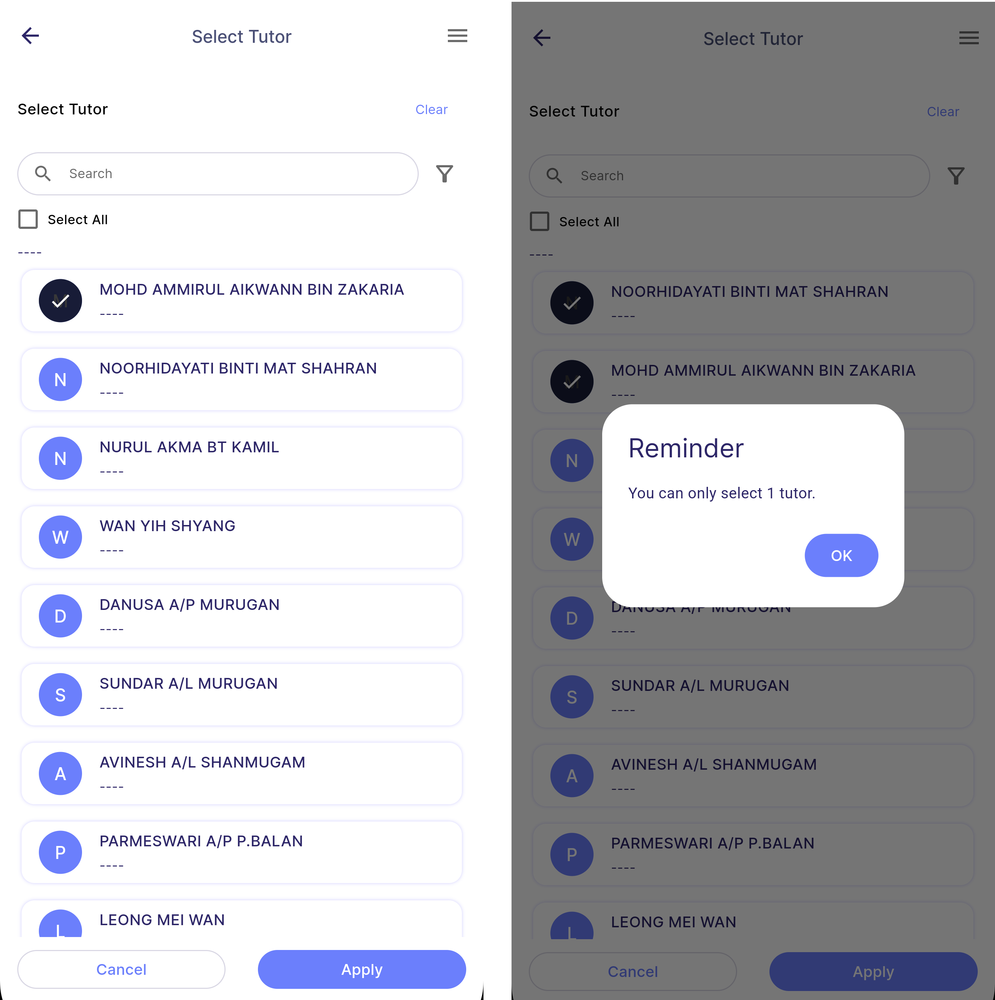

 
####  Assistant Tutor
- **Assistant Tutor** plays a role in supporting the lead tutor in completing the course smoothly. 
- There can be **multiple** assistant tutors in every course. 

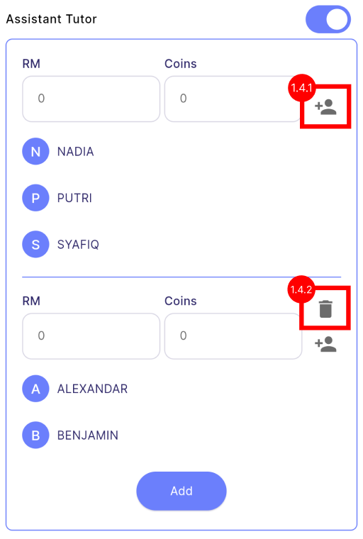

 
### Step 2 - Sessions Information
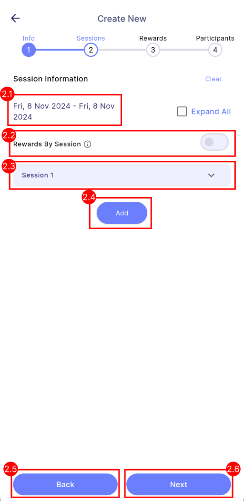
| 
Properties
 | 
Description
 | 
Note
 |
|:-------------------------------------|:--------------------------------------| :----------------------------- |
| **Date Range**             | Display the start date and end date of the course which is determined by first and last session's date.                                           | -
| **Rewards By Session / Completion**                           | Determine whether the reward is calculated **by session** or **by completion**.   **By Completion**  - Rewards are issued when participants achieve full attendance across all sessions (100% attendance).  **By Session** - Rewards are issued once participants attend any session. | **On:** Rewards calculate by session.  **Off:** Rewards calculate by completion.  To know more about rewards type, [<u>click here</u>](../introduction#rewards-type)|
| **Session (Dropdown)**| The details of each session of the course.                           | - |
| **Add**           | Add more sessions to the course.                                                     | - |
| **Back**                | Navigate back to the previous page.                                                   | - |
| **Next**                 | Navigate to the next page.                                                           | - |

 
#### Session Details
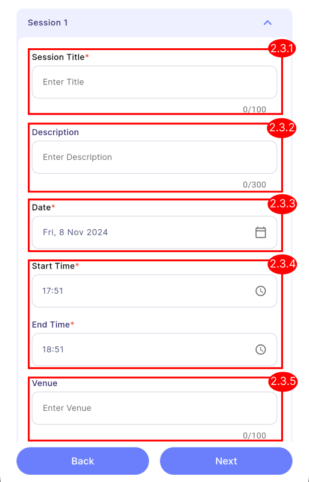
| 
Properties
 | 
Description
| 
Required
| 
Note
 |
|:--------------------------|:--------------------------------------|:-:|:------------------------------------|
| **Title**           | The title of the session.             | ✓ | - |
| **Description**     | A detailed description of the session.| ✗ | - |
| **Date**            | The date of the session.              | ✓ | - |
| **Start Time**      | The start time of the session.        | ✓ | - |
| **End Time**        | The end time of the session.          | ✓ | Cannot be earlier than start time |
| **Venue**           | The venue of the session.             | ✗ | - |

 
### Step 3 - Rewards Information

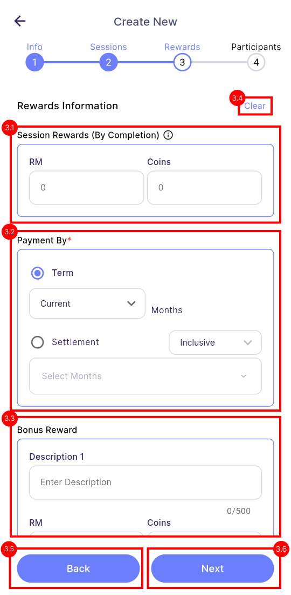

| 
Properties
 | 
Description
     | Required | 
Note
 |
|:-------------------------------------|:------------------------------------------|:--------:|:----|
| **Session Rewards**              | **Completion-based course:** There is only **one** completion reward for the entire course.  **Session-based course:** There are **multiple** session rewards. Each session will have their respective session rewards. | ✗        | Default reward is "0".   |
| **Payment by**                   | Type of payment method for this course. This payment method only applicable for cash only,  coins will be paid immediately upon entitlement.     | ✓        | Same concept as in task creation's payment by, [<u>click here</u>](../../task/manager_view/task_creation/assignment#payment-by)   |
| **Bonus Rewards**                | Extra criterias that employee can achieve to earn more rewards.             | ✗        | Default reward is "0".  If a value is specified in cash or coins, the bonus criteria must be provided.  Same concept as in task creation's bonus, [<u>click here</u>](../../task/manager_view/task_creation/assignment#bonus)   |
| **Clear**                        | Clears all rewards on the current page.   | -        |        **Manager:** Clears all rewards.  **Tutor Assistants:** No clear button as they cannot edit rewards.|
| **Back**                         | Navigate to the previous page.           | -        | -   |  
| **Next**                         | Navigate to the next page.               | -        | -   |  

 
#### Session rewards
- **Completion-based course:** There is only **one** completion reward for the entire course.
- **Session-based course:** There are **multiple** session rewards. Each session will have their respective session rewards. 

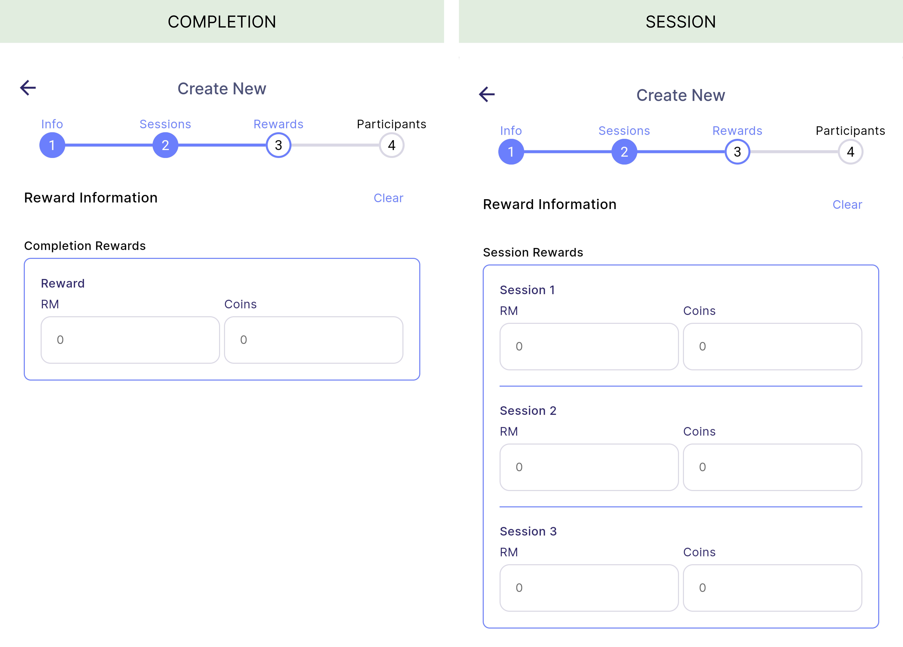

 
### Step 4 - Participants Information
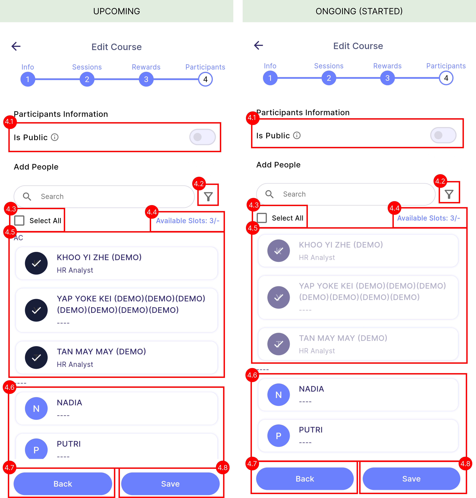
| 
Properties
 | 
Description
 | 
Note
 |
|:-----------------------------|:-----------------------------------------------------------------------------------|:---------|
| **Apply Group**     | Apply groups with preset roles for both admin and participant. | To know more about group, [<u>click here</u>](../../Group/#apply-group).
| **Clear**     | Clears all admin and participants on the current page. | Uneditable participants will not be cleared.
| **Creator**     | Creator of course will be the first admin and cannot be removed. | - |
| **Add Admin**     | Lead you to the select admin page. | To know more about admin, [<u> click here</u>](../introduction#course-role).
| **Remove Admin**     | Remove selected admin. | The first admin (creator) cannot be removed.
| **Is Public**     | Determine whether this course is public or private. | **On:** Public course.  **Off:** Private course.  To know more about public and private course, [<u> click here</u>](../introduction#course-privacy).
| **Available Slots**        | The available slots left for this course (number of selected participants / maximum pax).                                                           |As this is **private** course, so there is **no maximum pax**, hence the maximum pax is "-".|
| **Add Participants**     | Lead you to the select participants page. | To know more about participants, [<u> click here</u>](../introduction#course-role).
| **Editable Employees**     | Currently selected employees that **participate** in this course.                            | - |
| **Remove Participant**     | Remove selected participant. | - |
| **Uneditable Employees**        | Previously selected participants that cannot be removed. | Only will have this section once the course has started (ongoing).   Once the course has started, only newly added employees will be editable.|
| **Back**          | Navigate back to the previous page.                                                          | - |
| **Create or Edit**        | Create or edit the course.                                                                            | - |

## Edit Course
- The diagram below illustrates the **manager's** and **tutor assistants'** edit permissions based on the different course statuses.
- To know more about course status, [<u>click here</u>](../introduction#course-status).

:::info[Note]
Tutor and assistants cannot edit any rewards-related field.
:::

#### **Manager:**  

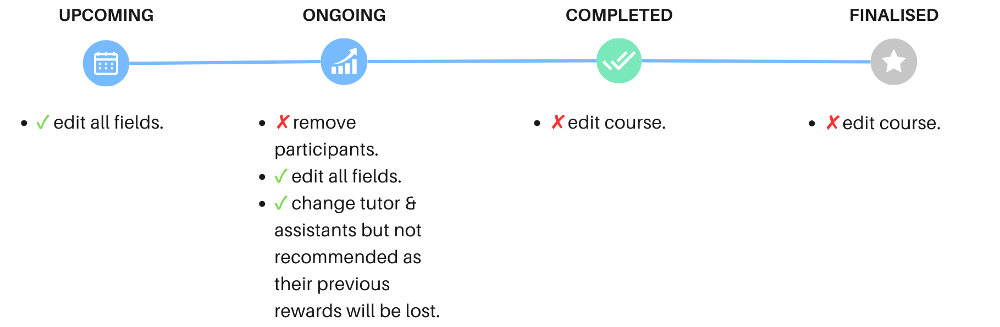

#### **Tutor & Assistants:** 

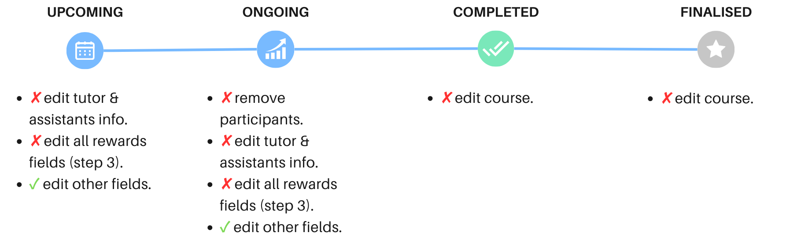

