# Upskill Details

### Course tab

#### **Manage Upskill**
- **Upcoming tab**: Courses that not not yet started.
- **Ongoing tab**: Courses start has started.
- **Completed tab**: Courses that is completed or finalised.

:::info[Note]
- Manager can press the switch view button at the app bar to toggle between **manage upskill** (can manage) and **other branch & department** (view only).
- To know more about visibility, [<u>click here</u>](../introduction#course-visibility).
:::

#### **Other Branch & Department**
- Manager is not allowed to view the rewards can be earned for each course.
- Manager can access the course detail by clicking on the course card, but the rewards will remain hidden. 
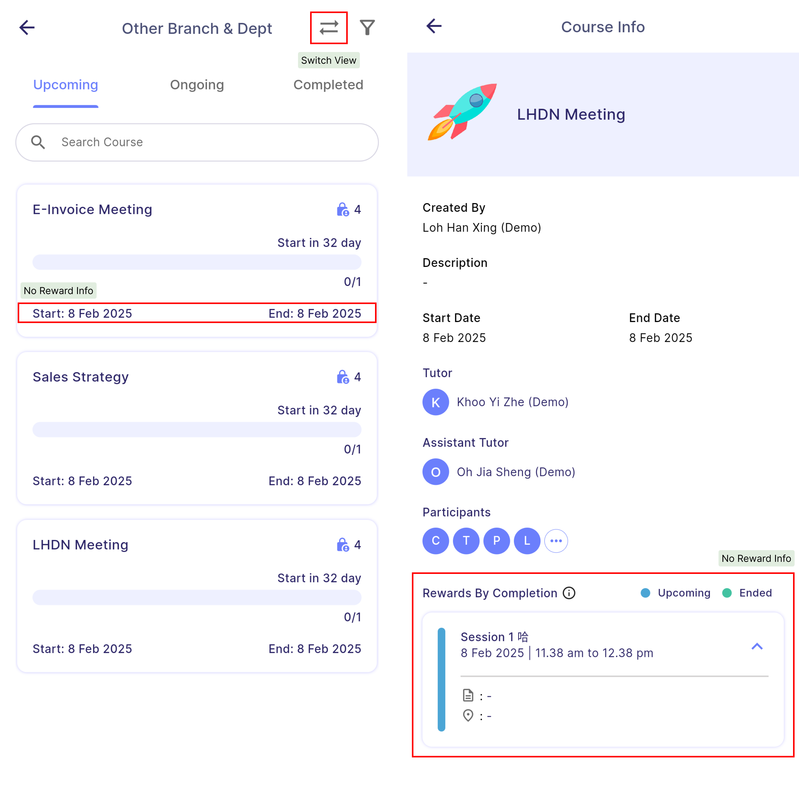

:::info[Note]
By default, finalized courses are hidden.  
To view finalized courses, open the filter and **tick** the **finalised** option.
:::

<!-- :::tip
- Manager can delete a course by **swiping** the course to the **left** and click the **dustbin** button.
- Manager can only delete course in "Manage Upskill" but not "Other Branch & Dept".

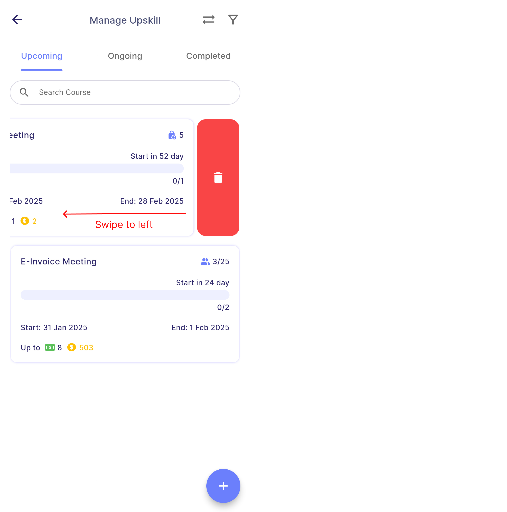
::: -->

 
### Participant List
- The manager can view participant list by clicking on the **"Attendees"** button. 

:::info[Note]
- The attendees can be sorted by branch, department or HR group using the filter function. 
- By default, the attendees is sorted by department.
:::

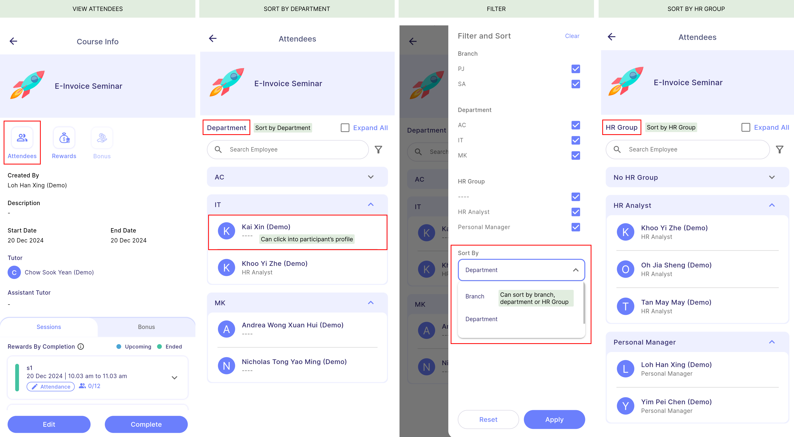

 
### Participant's profile
- Participant's profile is the summary of attendance and reward (session and bonus reward) obtained by participants.

- **2 ways** to access participant's profile: Attendees & Rewards

- Sample of participant's profile of **session-based** & **completion-based** course:

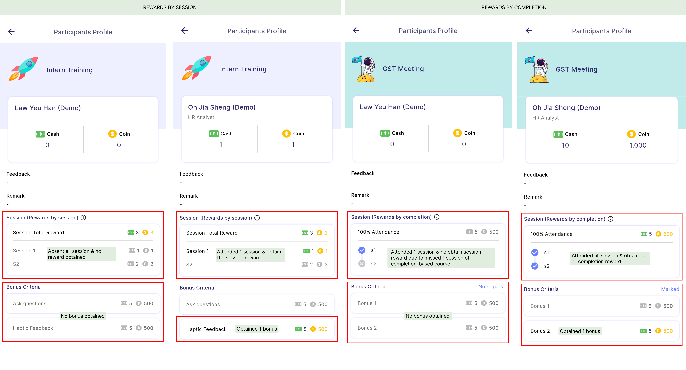

:::info[Note]
- A greyed-out reward means the participant did not entitle the reward.
- However, as long as the course has not been finalised, any changes made by the manager to a participant’s attendance or bonus reward will be reflected in their profile.
- The bonus request status is exactly the same as the course info page, [<u>click here</u>](../user-view#bonus-request-status) to know more.
:::

 
### Reward Summary
- The manager can view summary of reward by clicking on the **"Rewards"** button. 

| 
Properties
 | 
Description
 | 
Note
 |
|:-----------------------------|:-----------------------------------------------------------------------------------|:---------|
| **Total Spend**             | To view the total expenses of the company for this course, including rewards allocated to tutors, assistants, and participants. | -
| **Expected Payout Date**       | To view the expected payout date for this course. | The expected payout date is set in the creation, [<u>click here</u>](upskill-creation#step-3---rewards-information) to know more. |
| **Tutor & assistant rewards**        | To view the rewards of tutor and assistants. | - |
| **Session / Completion reward**            | To view the session reward entitled by participants.  **Completion-based reward** - Represented by "C". - For completion-based courses, there is always a single reward for session rewards, referred to as "C1".  **Session-based reward** - Represented by "S". - In this case, there are two sessions: "S1" represents the first session and "S2" represents the second session. | To know more about rewards type, [<u>click here</u>](../introduction#rewards-type)|
| **Bonus reward**  | To view the bonus reward entitled by participants. | - |
| **Total reward**  | To view the total rewards entitled by participants (session rewards + bonus rewards). | - |
| **Fully Achieve** (Green dot)  | Indicates that participants entitled full amount of the original reward. | Tap on the indicator to view the amount of cash and coins earned. 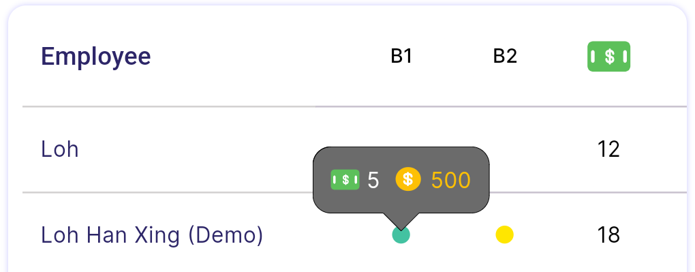|
| **Partially Achieve** (Yellow dot) | Indicates that participants entitled partial amount of the original reward. | Tap on the indicator to view the amount of cash and coins earned. 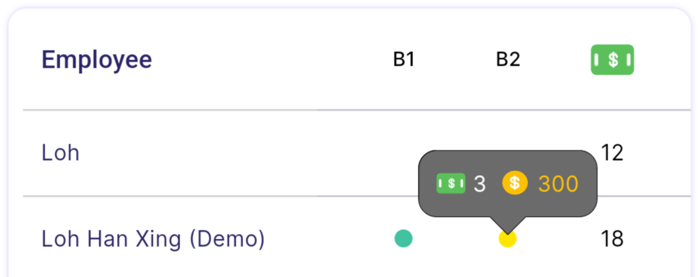 |

:::tip
- **Reward summary table** will only be shown after the course is **finalised**.
- Manager can also click on the participants' name to access to their participant's profile
- To know more about participant's profile, [<u>click here</u>](#participants-profile).
:::

 
### Bonus requests
#### **View Bonus Requests** 
- The manager can view bonus requested by the participants by clicking on the **"Bonus"** button. 
- There are two statuses for bonus requests:
    - **Pending**: The request has not been approved by the manager and is awaiting approval.. 
    - **Marked**: The request has been approved by the manager but can still be edited.
- The total amount for pending requests is 2 because the request has not yet been approved.
- **Remark** is the comment entered by participants to detail what they achieved in order to meet the bonus criteria.
- **Feedback** is the comments provided by the manager or tutor for the participants.

:::info[Note]
The **amount** of bonus requested by participant may be **different** but will not **exceed** the original amount.
:::
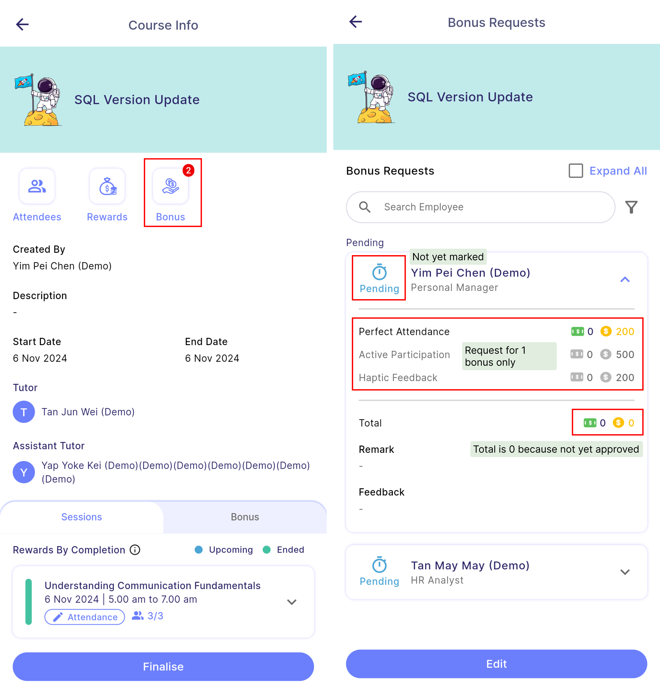

#### **Enter Edit Mode** 
- To approve or edit the bonus request, the manager needs to click on the **"Edit"** button.
- Once in edit mode, the **expand all** will automatically ticked and all bonus requests will be expanded.
- Manager will be able to view and edit the bonus request details of each participant.

#### **Approve or Edit Bonus Requests** 
- **Tick & Untick**: The manager can tick or untick the bonus criteria by tapping on the bonus criteria card or checkbox.
- **Edit value**: The manager can edit the value, but it **cannot exceed the original bonus amount** shown at the bottom right corner of the edit field.
- **Give feedback**: The manager can also leave feedback to evaluate the participants' performance.
- **Approve**: The manager must press the approve button for each participant to confirm the edit.

:::warning
- If a participant's bonus request is edited but not yet approved, a confirmation window will appear to remind the manager to approve the edited request.
    - **Yes**: Discard the unapproved request and save only the approved request.
    - **Cancel**: Continue editing the request.

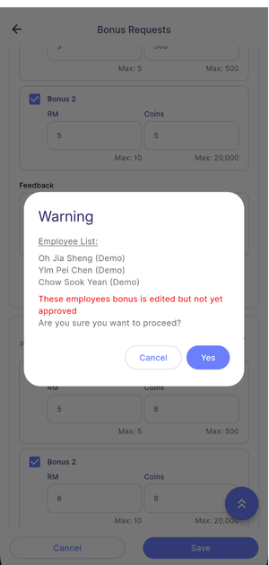
:::

 
### Attendance 
- The attendance must be marked manually.  
 
#### **View Attendance**
- The manager or tutor can view attendance summary from the session card.
- Once the **session has started**, a **pen icon** will **appear** beside the attendance which indicates the attendance is **editable**.
- If **session not yet started**, there is **no pen icon** which indicates attendance is not editable and is for **viewing** only.
- "0/3" indicates that 0 participants are present out of a total of 3 participants.
- The manager or tutor can click on the attendance to view details or mark attendance.

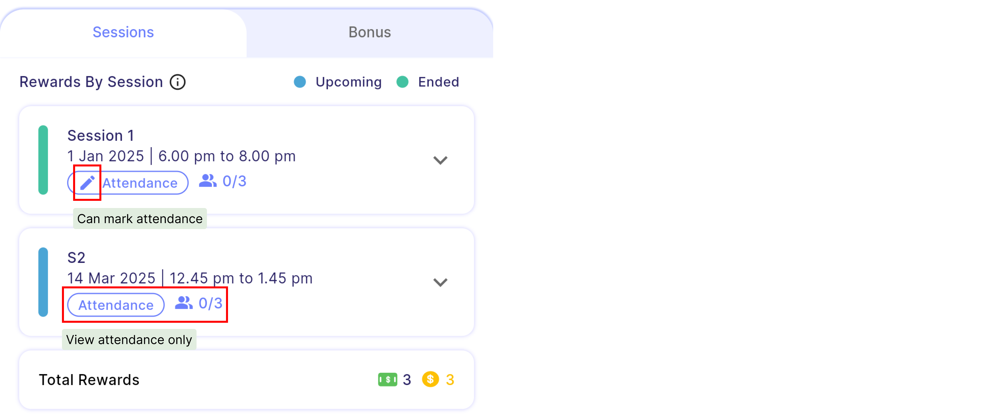

#### **Mark Attendance**
- A manager or tutor can only mark attendance once the session has started.
:::info[Note]
- Manager can edit the attendance anytime before finalising the course.
:::
:::tip
- If the majority participants are present, the manager can select all participants in the "Absent" tab and check them in.
- Then, in the "Checked-In" tab, manager can search for the absent participants and mark them as absent.
:::

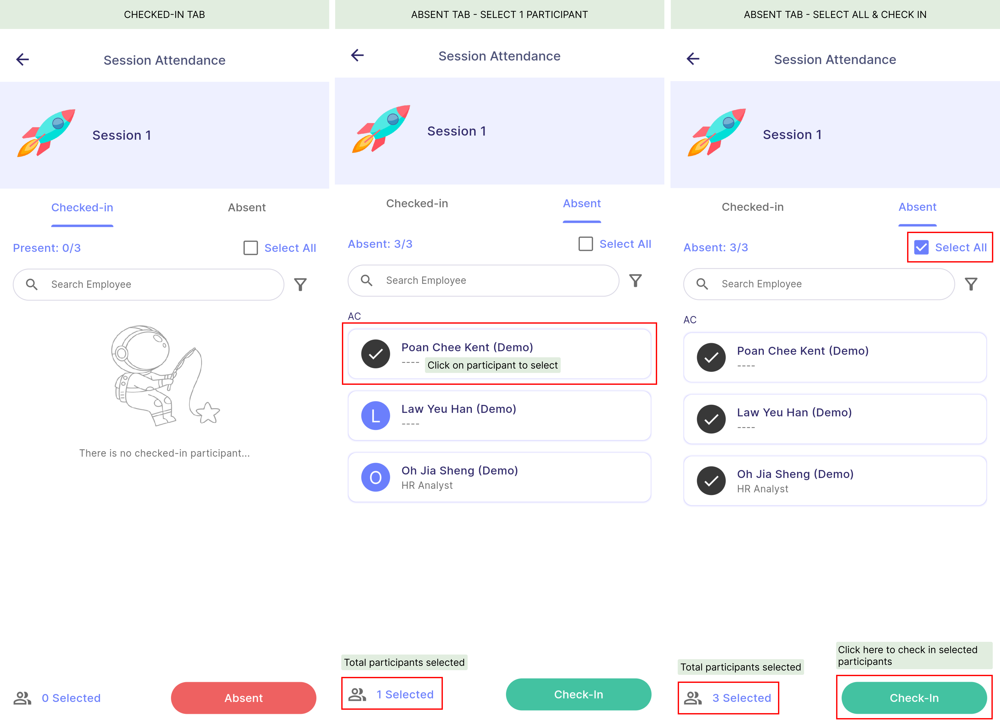

 
### Complete Course
- When all sessions of course has ended, the complete button will appear in the bottom bar of course info page for manager to manually complete the course.
- Manager can also choose to edit course and add more sessions.

:::warning
Once the course is completed, the course details cannot be edited anymore.
:::

:::tip
- Participants can only start to request bonus after course is completed.
- Bonus can only be approved after the course is completed.
- To view more actions a manager can perform in "Completed" course, [<u>click here</u>](../introduction#manager-course-status)
:::
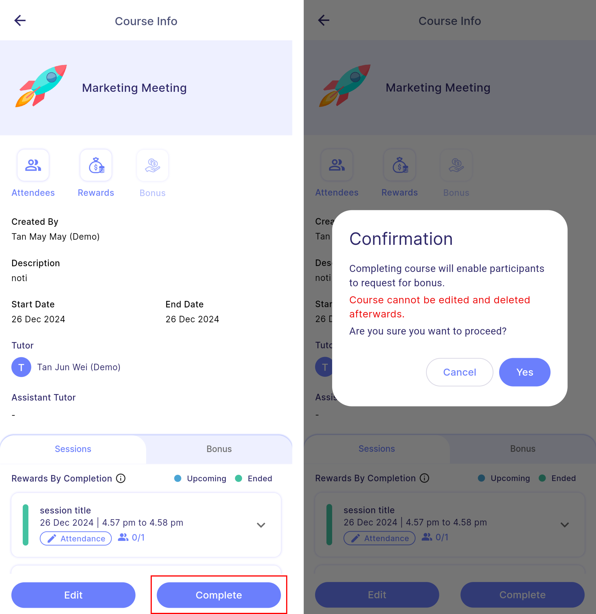

 
### Finalise Course
- Finalising a course marks an end to the course.

:::info[Note]
- All course rewards, including those for tutors, assistants, and participants, will be distributed once the course is finalised.
- Coins are awarded immediately, while cash rewards are given based on the expected payout date.
:::

:::tip
- Before finalising a course, the manager must mark all bonus requests.
- A reminder will be issued if any participants have not yet requested a bonus.
:::

:::warning
Once the course is finalised, the bonus request cannot be edited anymore.
:::
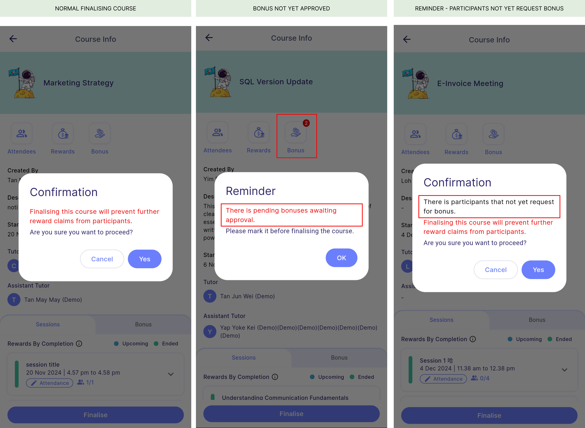