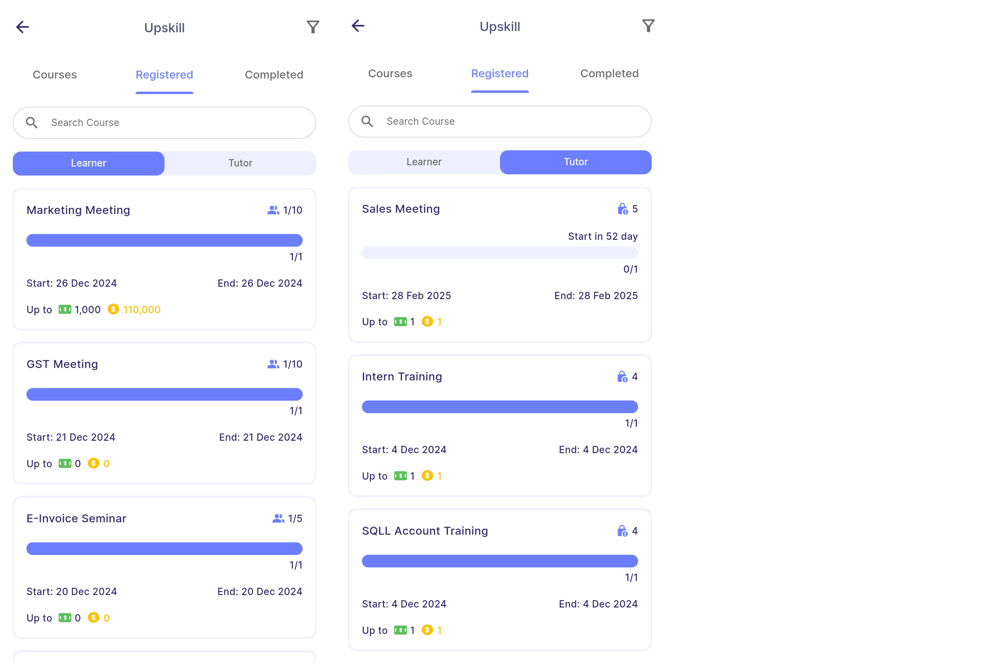
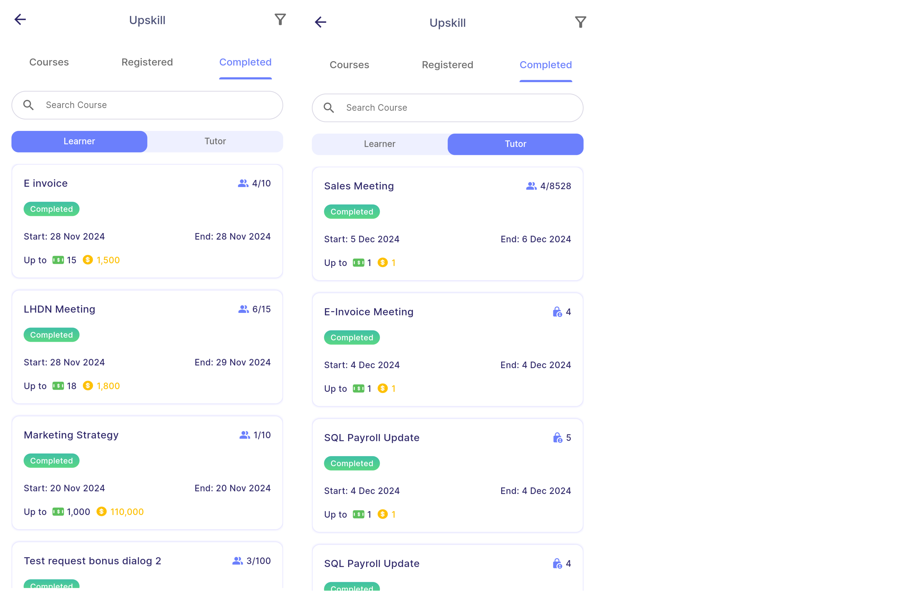
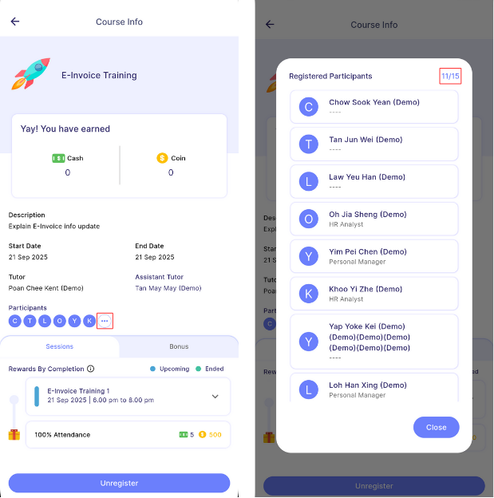
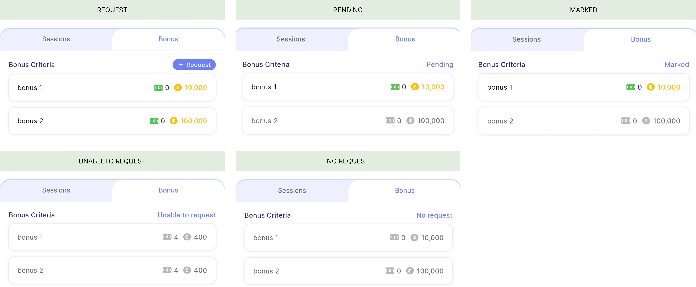

# User View

### Course tab
#### **Courses tab**  
- Course tab **displays joinable courses** that the employee has not yet registered for.
- Employees can register for any course listed in this tab, as long as there are **available slots**.  

#### **Registered tab**  
- Contains two sub-tabs:   
    **Learner tab:** Displays upcoming or ongoing courses the employee has **registered** for.  
    **Tutor tab:** Displays upcoming or ongoing courses where the employee is **assigned as a tutor or assistant**.

#### **Completed tab**  
- Contains two sub-tabs:   
    **Learner tab:** Displays completed or finalised courses the employee has **registered** for.  
    **Tutor tab:** Displays completed or finalised courses where the employee is **assigned as a tutor or assistant**.

:::info[Note]
By default, **finalized courses are hidden**.  
To view finalized courses, open the filter and **tick** the **finalised** option.
:::

 
### Participant list
- User can view participants that has registered to course with the **"..."** button. 
- 11/15 in the diagram belows indicates that there are 11 participants registered into the course with 15 available slots.

:::tip
Private course does not have a maximum participant limit.  
Therefore the registered participants value will be displayed as "11/-".
:::

 
### Bonus request status
- Users must **attend at least one session** to request for bonus.

| Status                               | Description                                | 
|:-------------------------------------|:-------------------------------------------|
| **Request**                         | - User can request for bonus.  - User can only request the bonus once and no further edit can be made.                    |
| **Pending**                          | - The bonus is awaiting for manager approval. - Greyed out indicates that user does not request for the bonus.
| **Marked**                        | - The bonus request is marked by manager.  - Greyed out indicates that user does not entitle the bonus.|
| **Unable to request**                        | User cannot request a bonus due to zero attendance.  |
| **No request**                        | - This status only will be shown once the course has finalised. - Indicates that user does not request for any bonus.
  |

:::warning
User can only request the bonus once and no further edit can be made.
:::
:::info[Note]
- The **request button** will **remain available** until the user **submits a bonus request** or the **course is finalised**, as long as the bonus has not yet been requested.
- Once the course is finalised, unrequested bonuses will no longer appear greyed out but will display a **"No request"** tag instead.
:::
