# Wallet
## User
### 1 - Wallet home page

- contains a card showing the amount of upcoming payout
- a leaderboard displaying the top earning employee
- a quest list for employees to join
- menu buttons contains 4 modules:\
 -- payout\
 -- entitlement\
 -- coin transactions\
 -- gifts
#### swiping left will show similar UI to above, displaying information in relation to coins
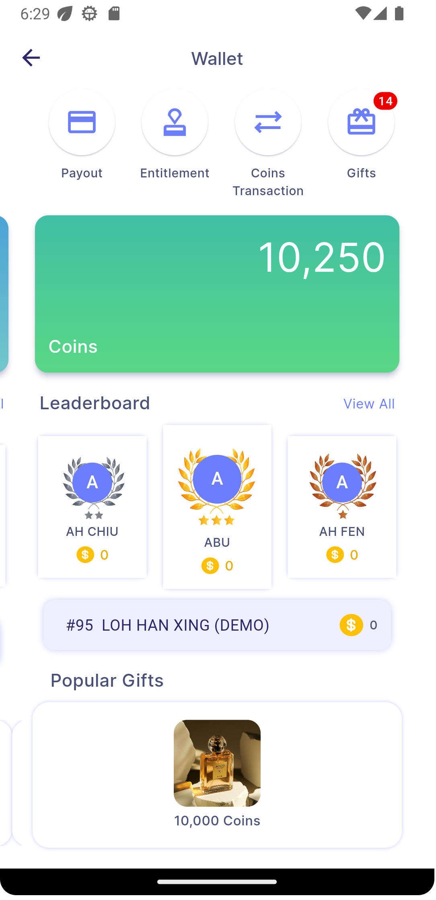

#### tap on "view all" button to see full list of the leaderboard
| 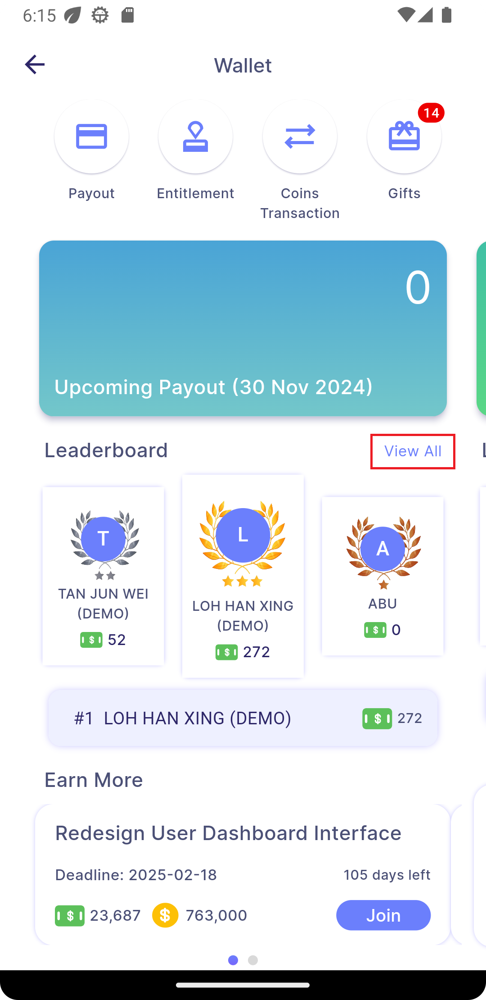 | ➜ |  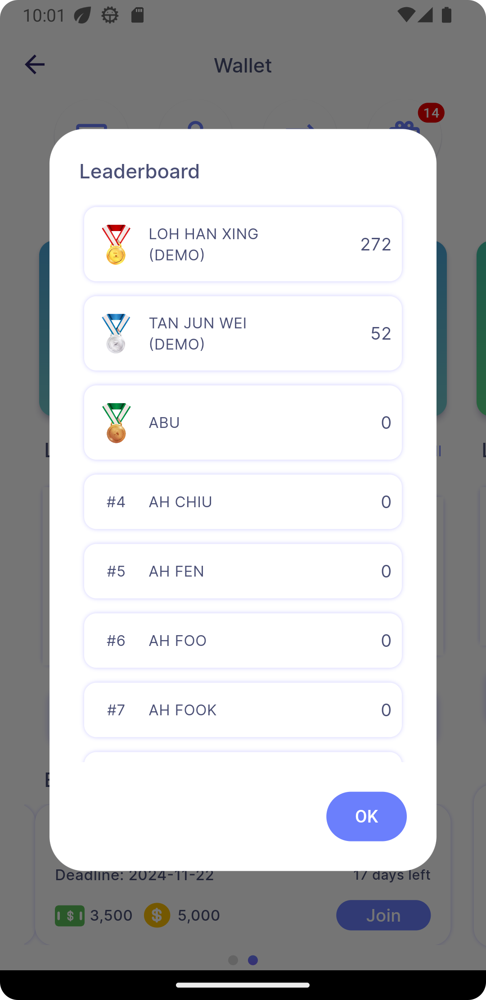 |
|:---:|---|:---:|

### 2 - Payout (based on payment date)
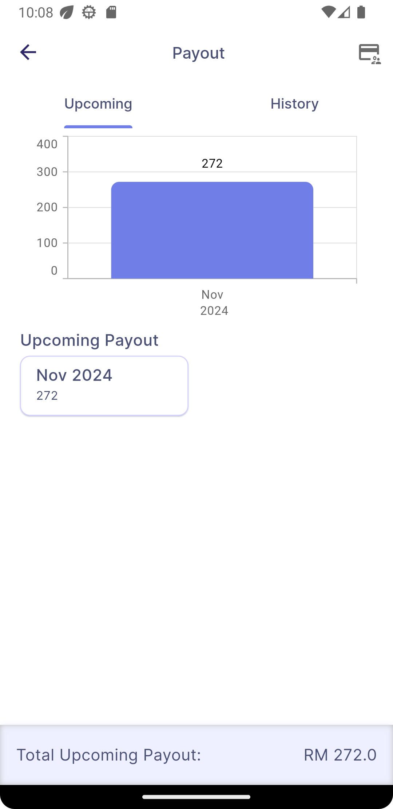 &nbsp;&nbsp;&nbsp;&nbsp;&nbsp;&nbsp;&nbsp; 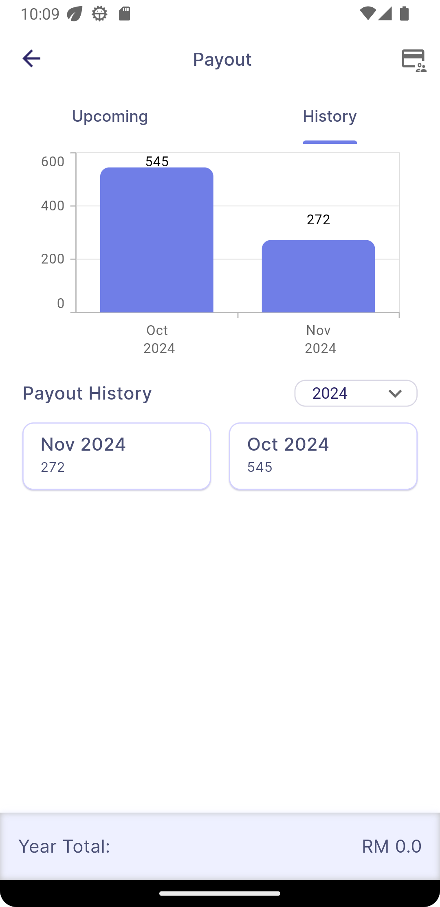
- filter data by upcoming or history by switching tabs
- barchart to visualise earnings
- grid showing payout per month, able to tap into it for details pop up\

 | 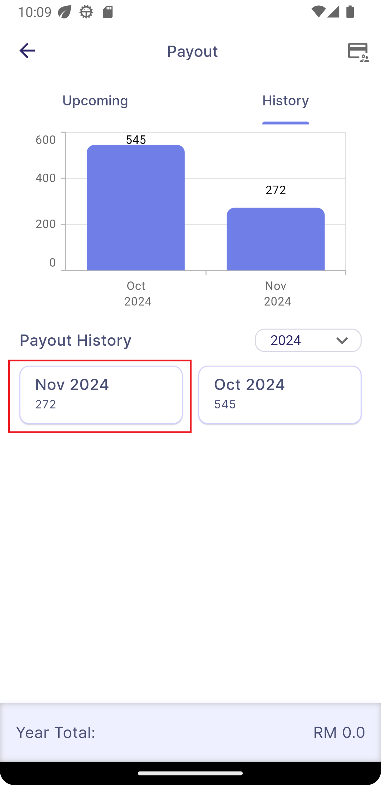 | ➜ | 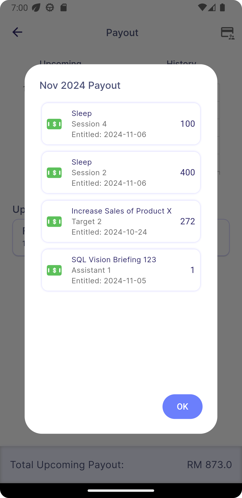 |
 |:---:|---|:---:|

### 3 - Entitlement (based on achieved date)
- barchart to visualise earnings
- grid showing entitlement per month, able to tap into it for details pop up

 |  | ➜ | 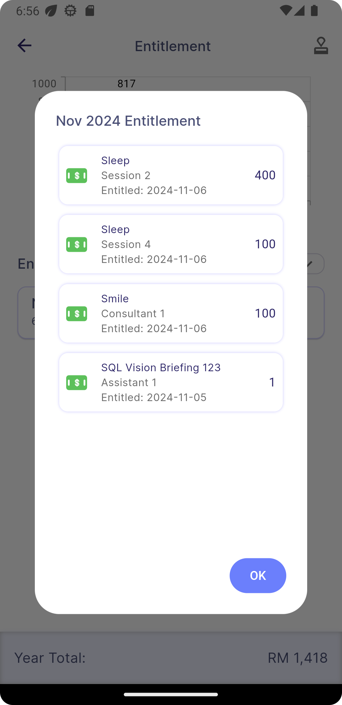 |
 |:---:|---|:---:|

### 4 - Coin Transactions
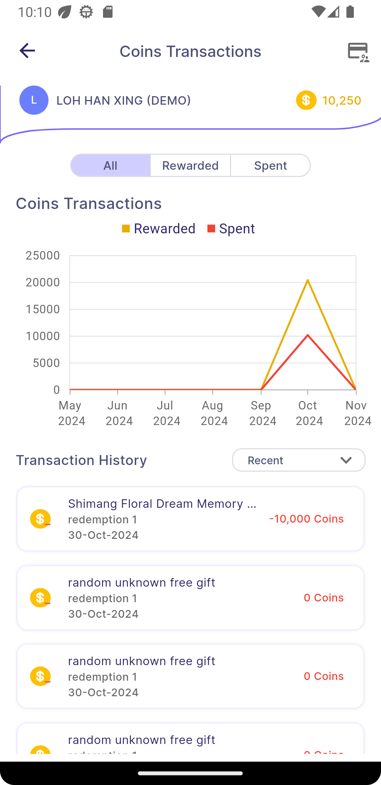
- graph to visualise coin earnings and spendings
- list view to show logs of coin transactions
- press on segmented buttons to filter data displayed

| 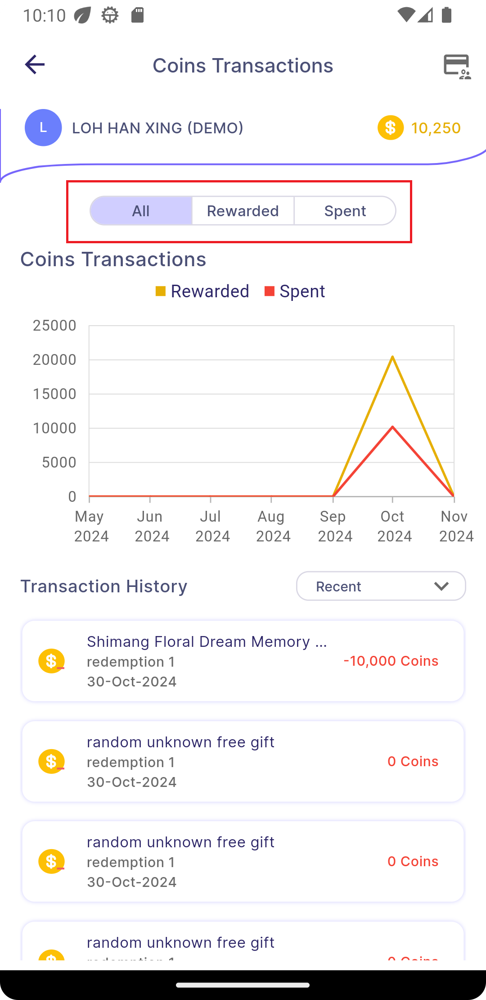 | ➜ |  |
|:---:|---|:---:|

- use the dropdown button to sort the list\
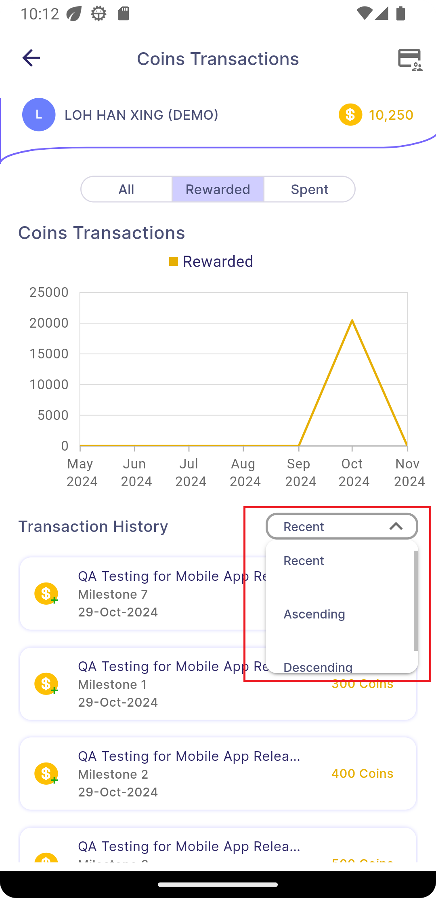

## Manager
### 1 - Manage payout/entitlement page
both payout and entitlement view have similar layout and function

 - press on icon to go to manage payout, which shows the company total payout/entitlement
 
 | 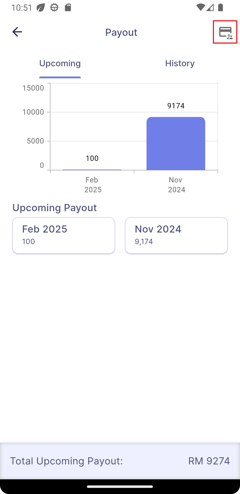 | ➜ |  |
 |:---:|---|:---:|

 - tapping the grid will now show a list of employee instead\
 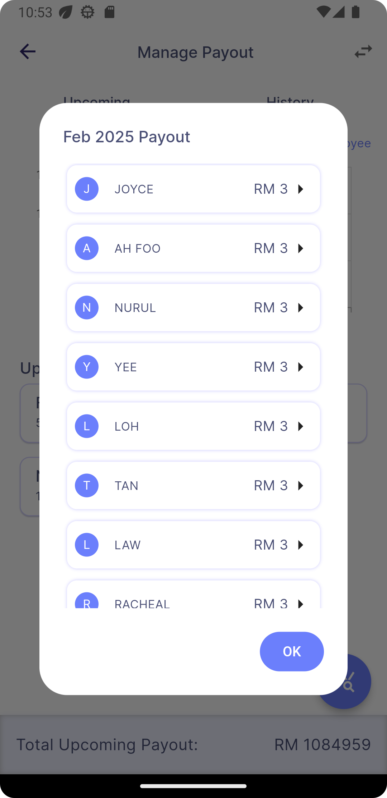

 - tapping on a name will show payout/entitlement details of that employee\
 (**this view will differ when you are in payout history/entitlement view compared to upcoming payout view**)
    - **a) payout history/entitlement** \
 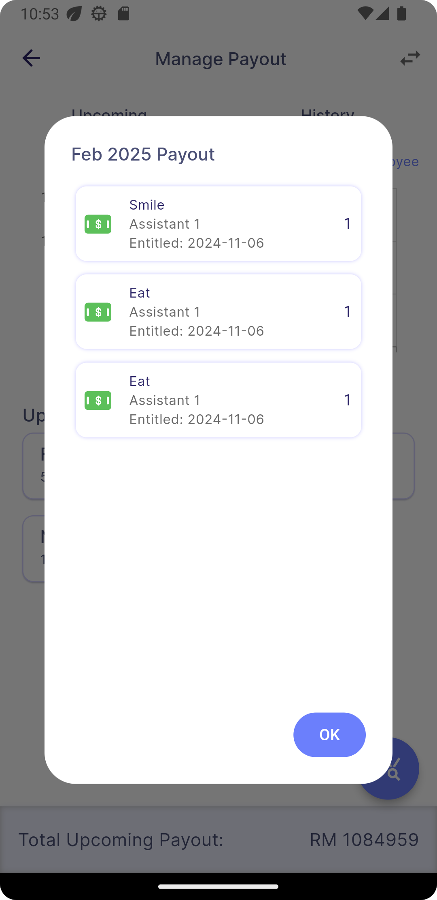

    - **b) upcoming payout** \
      as upcoming payout are not yet paid out, their payout date can be editited, so \
      there is an arrow button on the card which would open edit view

    | 1) tap on arrow button to open edit view | | 2) tap on the date to open date picker | | 3) use the date picker to choose a date |
    |:---:|---|:---:|---|:---:|
    |  | ➜ |  | ➜ | |
    | 4) after selecting, submit to save changes |||||
    | 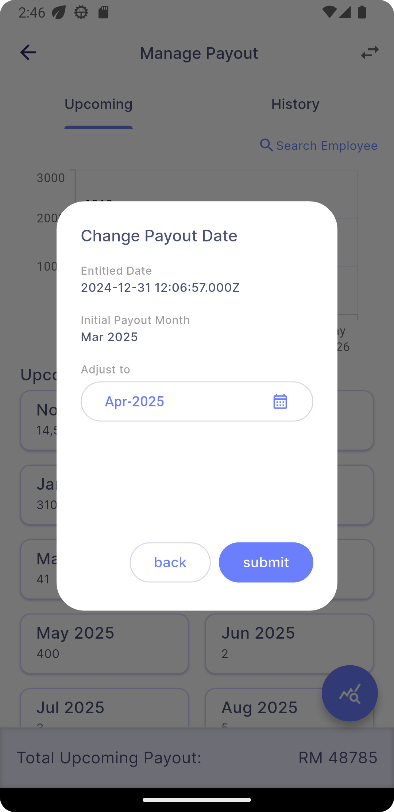 |||||

 - you can search payout/entitlement info of a specific employee using "search employee button"

 |  | ➜ |  | ➜ | 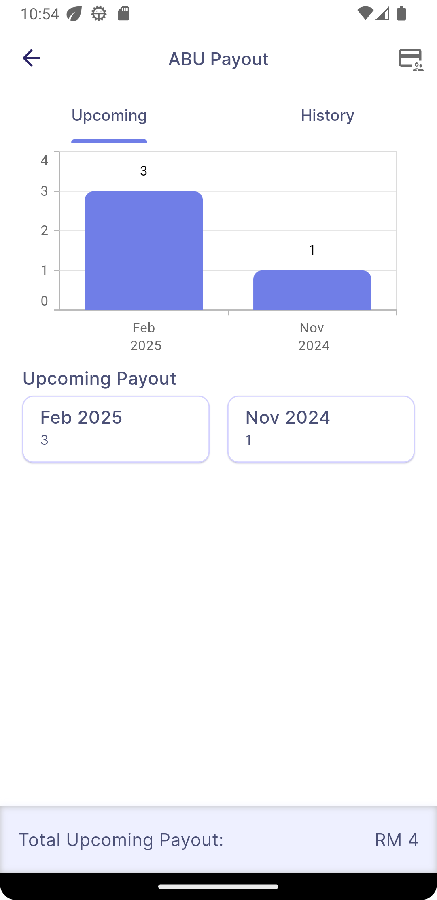|
|:---:|---|:---:|---|:---:|

  - use the stat icon to compare the payout/entitlement history of up to 3 employees 

| 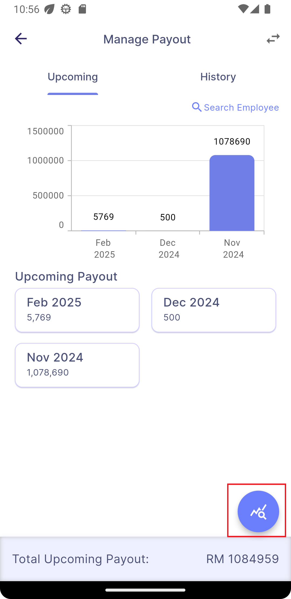 | ➜ |  | ➜ | |
|:---:|---|:---:|---|:---:|

  ### 2 - Manage coin transactions page

  
   - tap the top right icon and then select an employee from the list, then the coin transactions of that employee will be shown 

   |  | ➜ |  | ➜ | 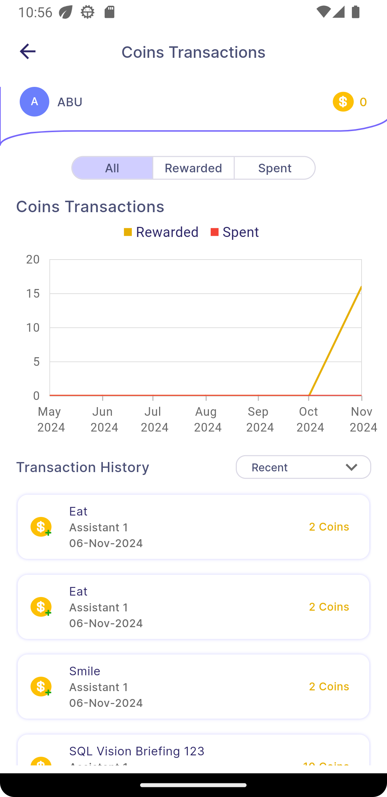|
|:---:|---|:---:|---|:---:|

