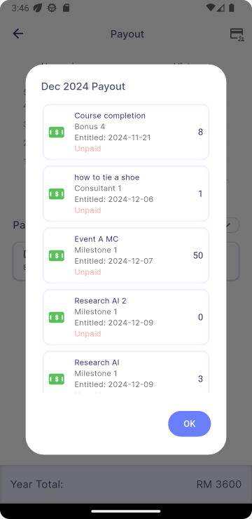
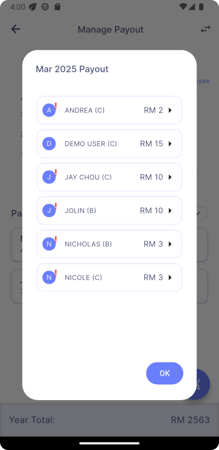

# Wallet

## User View

### Wallet Home Page

- Displays a card showing the amount of the upcoming payout.
- Shows a leaderboard highlighting the top-earning employee.
- Provides a quest list for employees to join.
- Includes menu buttons with four modules:
  - Payout
  - Entitlement
  - Coin Transaction
  - Gifts

- Swiping left shows a similar interface, but displaying information related to coins.\

- Tap on the **"View All"** button to see the full list of the leaderboard.

|  | ➜ |   |
|:---:|---|:---:|

### Payout (Based on Expected Payout Date)

- Switch between Upcoming and History tabs to filter data.
- View a bar chart visualising earnings.
- See a monthly payout grid, with each month tappable to display a detailed pop-up.
- In the History tab, an exclamation mark will appear for any unpaid payouts.

 &nbsp;&nbsp;&nbsp;&nbsp;&nbsp;&nbsp;&nbsp;

- If a payout has been officially paid, the **payment date** will be shown instead of the **entitled date**.
- For payouts past the expected payout date, a **Paid** or **Unpaid** status will indicate whether the payment has been made.

|  | ➜ |  |
|:---:|---|:-------------------------------------------------------------------------------:|

### Entitlement (Based On Achieved Date)

- View a bar chart visualising earnings.
- See a monthly entitlement grid, with each month tappable to display a detailed pop-up.

|  | ➜ |  |
|:---:|---|:---:|

### Coin Transactions

- View a line chart visualising coin earnings and spendings.
- Browse a list of coin transaction logs.
- Use segmented buttons to filter the displayed data.

|  | ➜ |  |
|:---:|---|:---:|

- Use the dropdown button to sort the transaction list\

## Manager View

### Manage Payout/Entitlement

Both **Payout** and **Entitlement** views share a similar layout and functionality.

- Tap the icon (highlighted in red) to navigate to **Manage Payout**, which displays the company’s total payout or entitlement.

 |  | ➜ |  |
 |:---:|---|:---:|

- Tapping an **Upcoming Payout card** in the grid will now display a list of employees.
- In the **History Payout** tab, a red exclamation mark will appear next to an employee’s avatar if their payout remains unpaid past the expected payout date.\
 

- Tapping an employee’s name will display their payout or entitlement details.\
 (*This view will differ depending on whether you are in the Payout History or Entitlement view, compared to the Upcoming Payout view.*)\
    **A. Payout History/Entitlement** \
 
- If a payout has been officially paid, the **payment date** will be shown instead of the **entitled date**.
- For payouts past the expected payout date, a **Paid** or **Unpaid** status will indicate whether the payment has been made.

    **B. Upcoming Payout**
      - Since upcoming payouts have not yet been paid, their payout date can be edited. An arrow button on the card opens the edit view.

    | 1) Tap on arrow button to open edit view | | 2) Tap on the date to open the calendar | | 3) Use the calendar to select a new date |
    |:---:|---|:---:|---|:---:|
    |  | ➜ |  | ➜ | |
    | **4) After selecting, tap on submit to save changes** |||||
    |  |||||

- Use the **Search Employee** button to find the payout or entitlement information of a specific employee.

 |  | ➜ |  | ➜ | |
|:---:|---|:---:|---|:---:|

- Use the **Stats icon** to compare the payout or entitlement history of up to three employees.

|  | ➜ |  | ➜ | |
|:---:|---|:---:|---|:---:|

### Manage Coin Transactions

- Tap the **top-right icon**, select an employee from the list, and view that employee’s coin transactions.

   |  | ➜ |  | ➜ | |
|:---:|---|:---:|---|:---:|
