## Steps and Instructions

### 1. Make sure in Leave Type brought forward (BF) is ticked

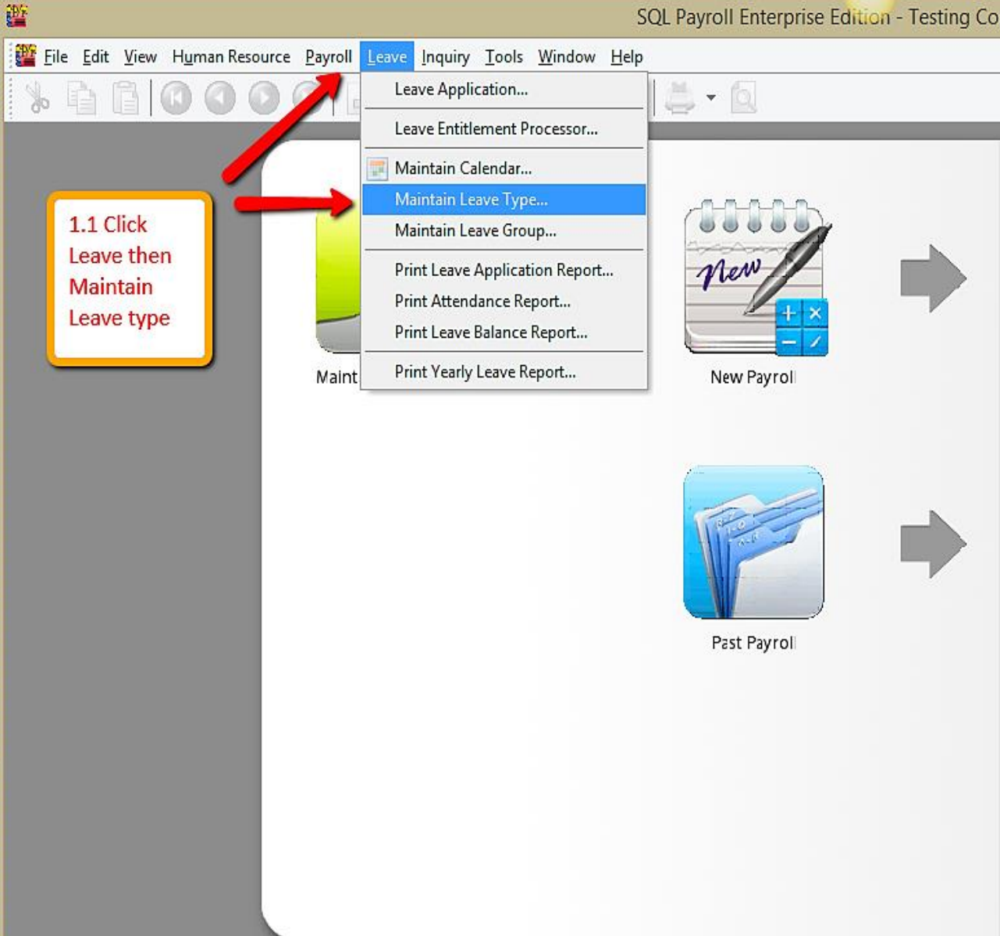

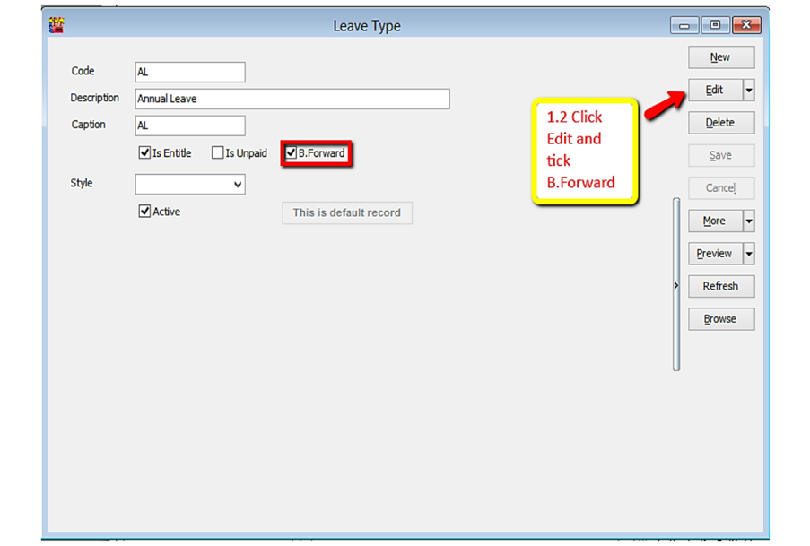

### 2. Make sure there is calculation for amount of leave brought forward (BF)

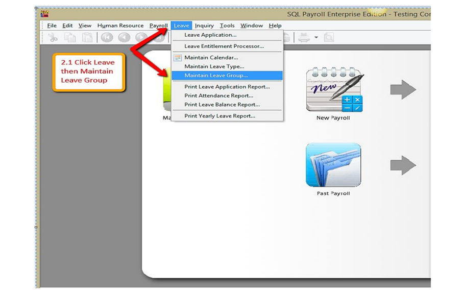

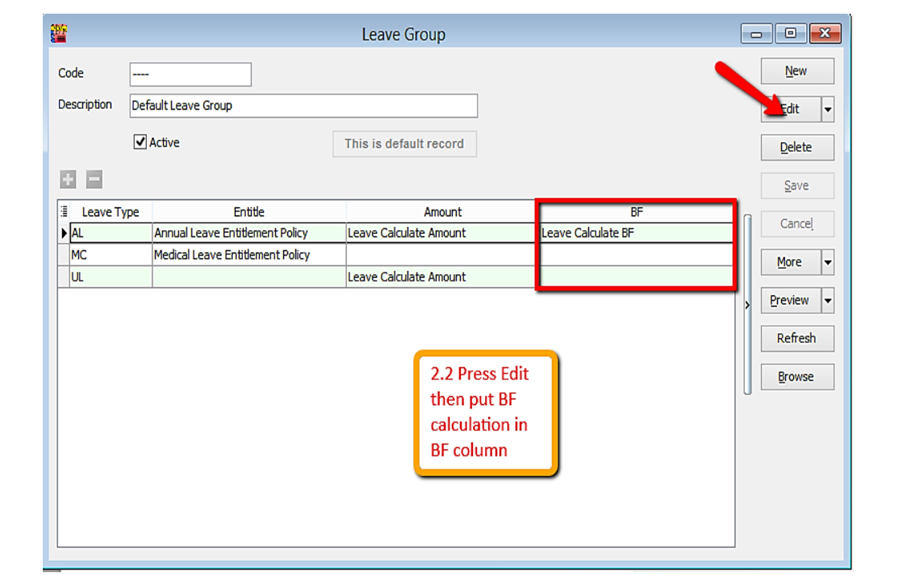

### 3. Key in leave entitlement ( may refer leave setting guide)

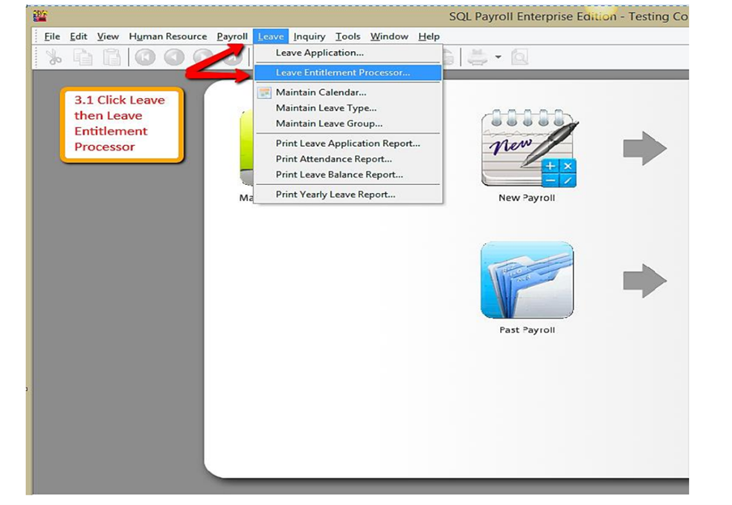

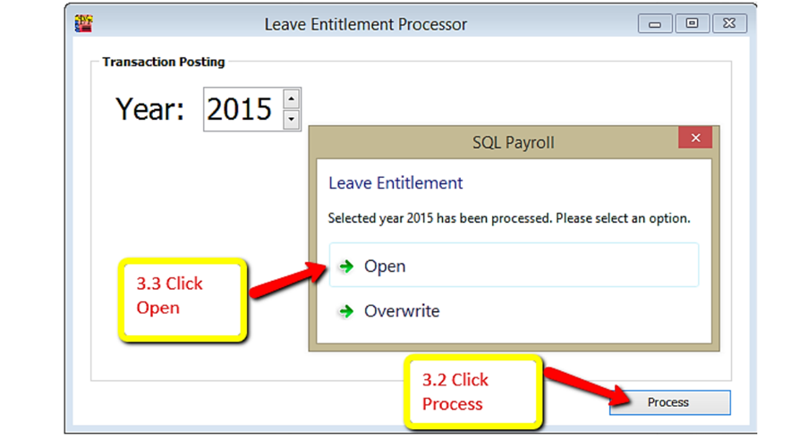

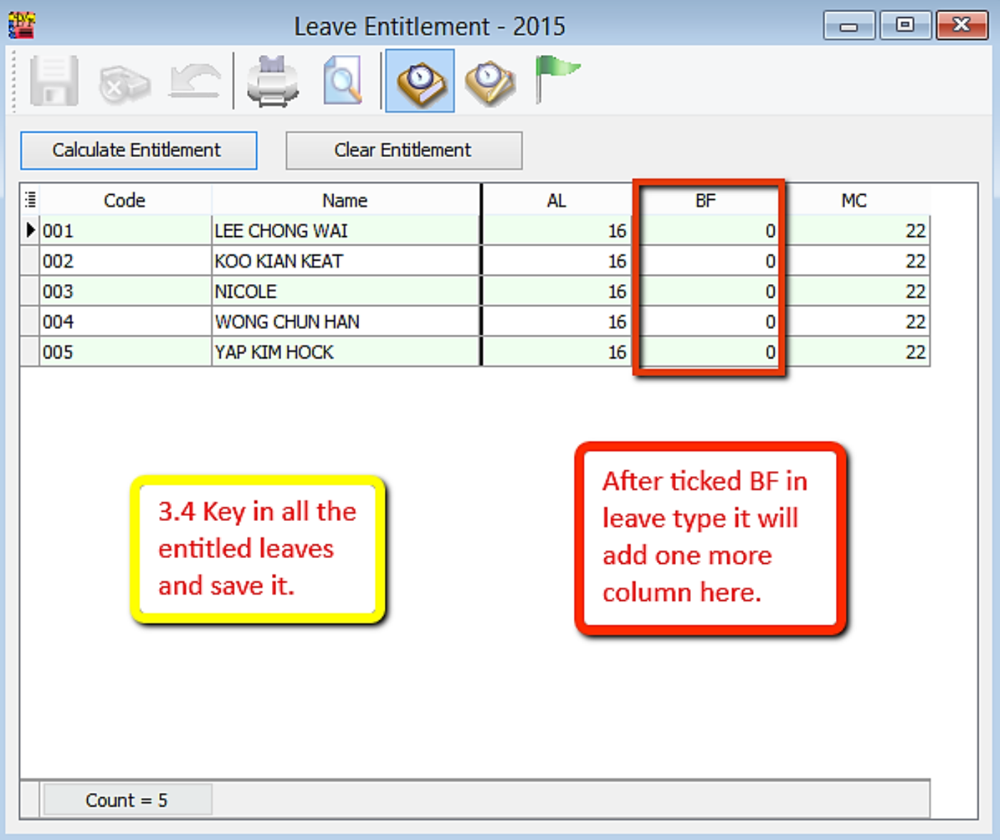

### 4. Apply leave for employees.(may refer leave setting for more details.)

- Leave/Leave Application/Double click Current Leave

 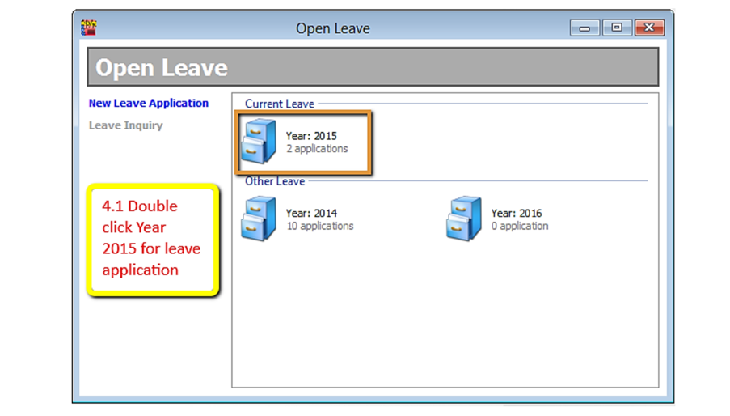

 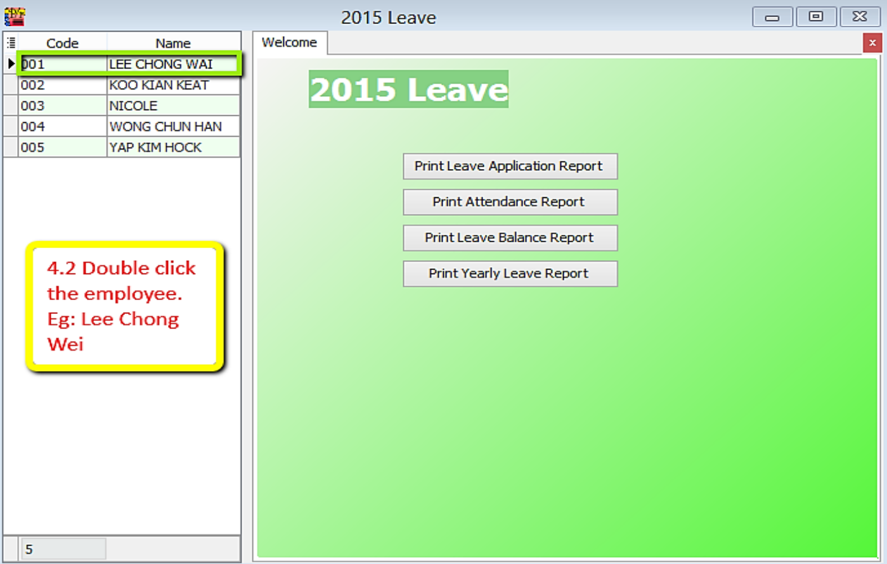

 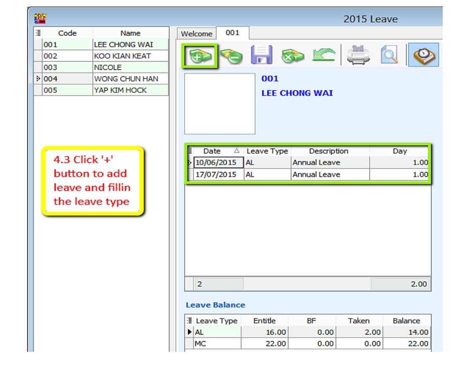

### 5. Preview Leave Balance Report

- Leave/Print Leave Balance Report

### 6. Open Leave Entitlement for 2016 (Repeat step 2)

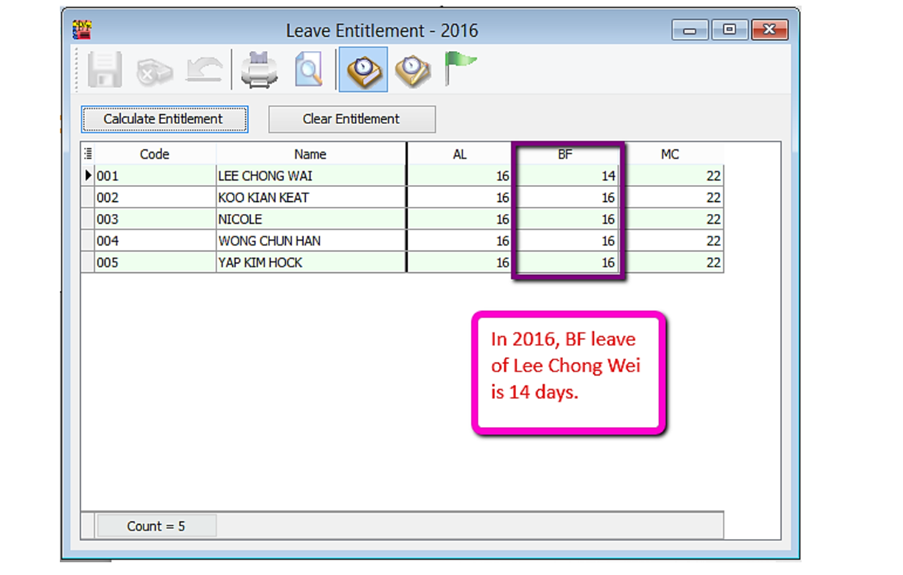
