## Overview

Starting from **October 2025**, employers are required to ensure that all non-Malaysian citizen employees with valid work passes are registered and contribute to the EPF in accordance with Malaysian law.

This guide will walk you through the setup process and requirements for EPF contributions for foreign workers.

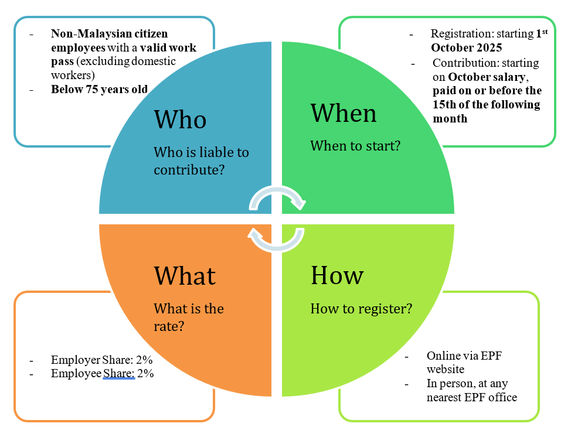

---

## EPF Settings in SQL Payroll

Setting up the new EPF policy in SQL Payroll is straightforward. You need to ensure the correct settings are configured to comply with the new EPF rates for non-Malaysian citizen employees.

There are **2 scenarios** for EPF contribution for foreign workers:

1. **Non-Malaysian citizen employees without Permanent Residential Status** - 2% contribution rate
2. **Non-Malaysian citizen employees with Permanent Residential Status** - Standard Malaysian rates

:::tip How SQL Payroll Detects EPF Rates
SQL Payroll automatically determines the appropriate EPF rates based on the employee's nationality, permanent resident status, and age. Refer to the chart below for details.
:::

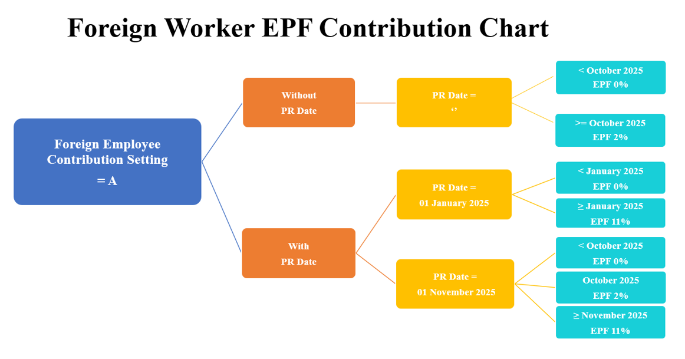

### Non-Malaysian Citizen Employees Without Permanent Residential Status (2%)

Non-Malaysian individuals who have been granted legal work rights in Malaysia but do not hold Permanent Resident status are required to contribute to EPF starting **October 2025**.

**EPF contribution rates:**

||< 60 years old| >= 60 years old and < 75 years old |
|---|---|---|
|EM| 2%| 2%|
|EP| 2%| 2%|

*\* EM – Employer Share, EP – Employee Share*

#### Step 1: Configure Employee Profile (Non-PR)

1. Navigate to **Human Resource** → **Maintain Employee**
    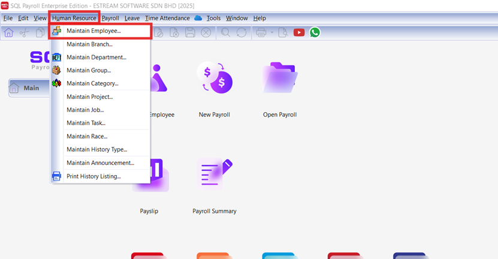

2. Under **Grouping**, select the correct **Nationality** for the employee
    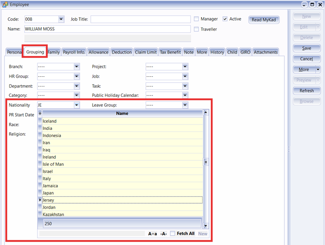

3. Ensure the **PR Date** field is left **empty** (this indicates non-PR status)
    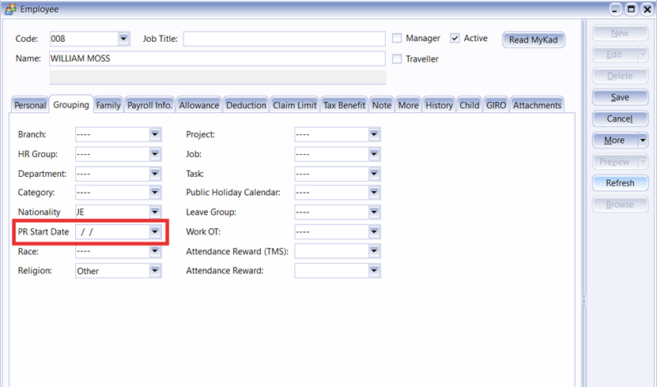

4. Click **Save** to apply changes
    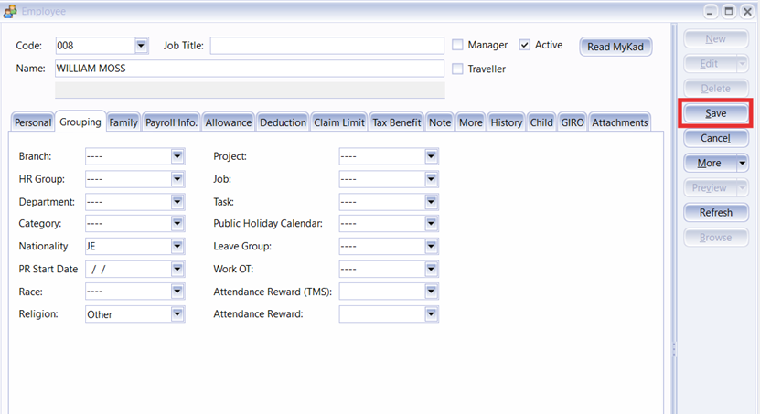

#### Step 2: Contribution Setting (Non-PR)

At this stage, you need to set the EPF contribution rate to “A”.

1. Go to *Maintain Employee* → *Payroll Info*, check the current *Contribution* type of this employee, e.g. **FW**
    

2. Go to **Payroll** → **Maintenance** → **Maintain Contribution**
    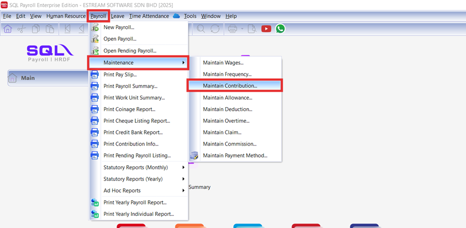

3. Select the contribution type from Step 1 (e.g., **FW**)
    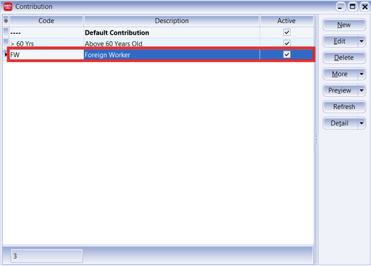

4. Click **Edit** and update both **Employee EPF Rate** and **Employer EPF Rate** from `0%` to `A` (Auto EPF Rate)
    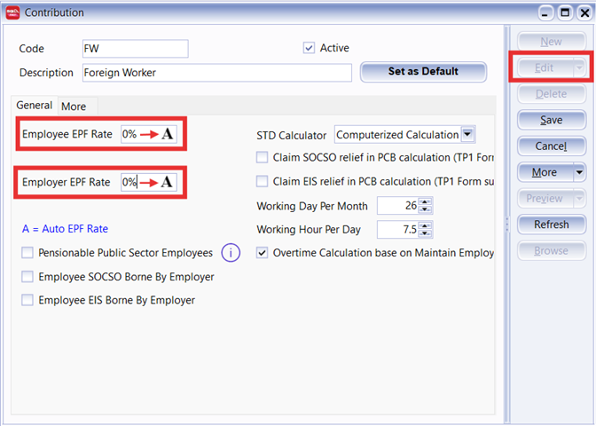

    :::info Auto EPF Rate
    The "A" setting enables automatic EPF rate calculation based on employee status and effective dates. Hover over the ⓘ icon for more details.
    :::

5. Click **Save** to apply the changes

    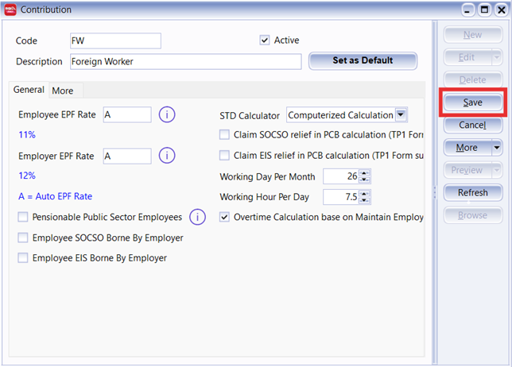

#### Step 3: Configure Wages Settings (Non-PR)

1. Navigate to **Maintain Employee** → **Payroll Info** and note the **Wages type** (e.g., **FW**)
    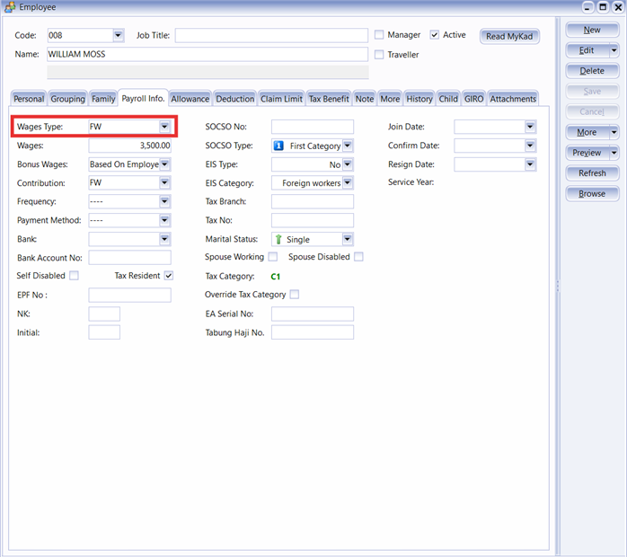

2. Go to **Payroll** → **Maintenance** → **Maintain Wages**
    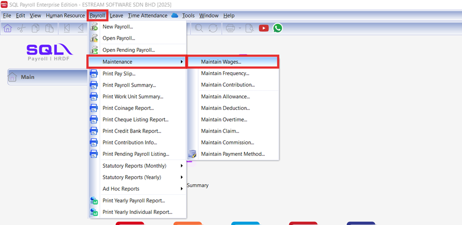

3. Select the wages type from Step 1 (e.g., **FW**) and click **Edit**
    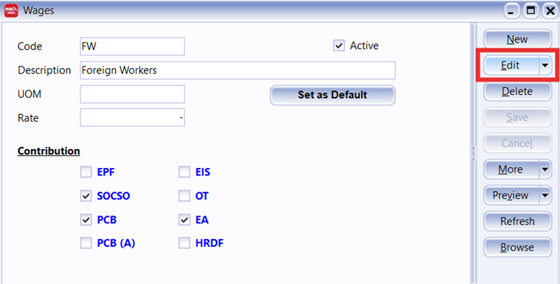

4. **Enable EPF contribution** by ticking the **EPF** checkbox to include wages in EPF calculations
    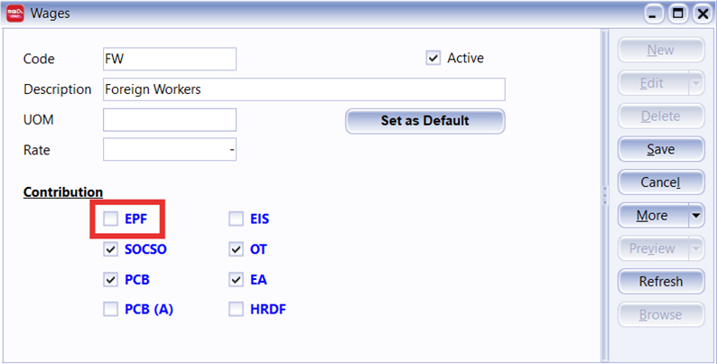

    :::info Other Contributions
    Other contributions such as SOCSO, PCB, EA, and OT settings are for reference purposes and can be configured as needed.
    :::

5. Click **Save** to apply the changes
   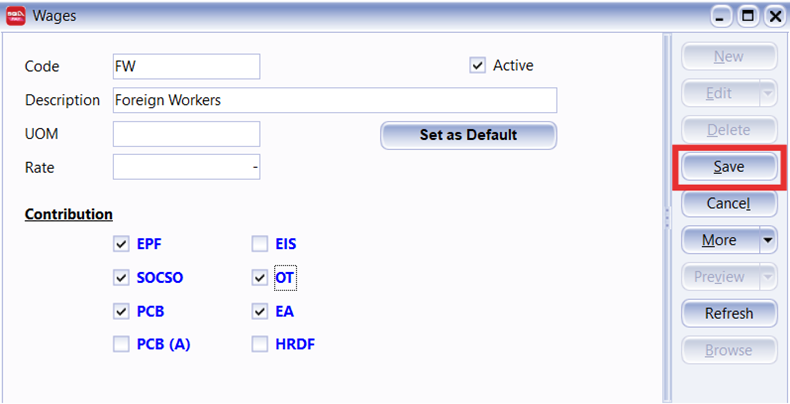

#### Step 4: Verify Results (Non-PR)

1. Navigate to **Payroll** → **New Payroll**
    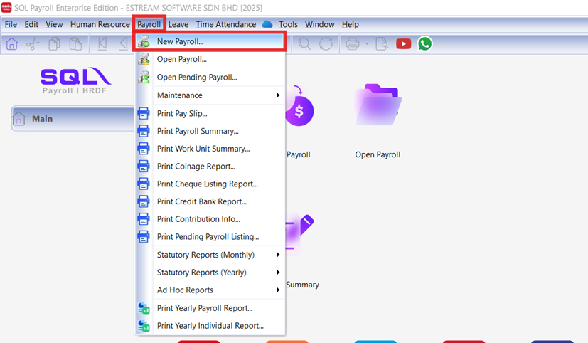

2. Select **Final**, choose **September (9)** and click **Process** to generate Month End, then repeat for **October (10)**
    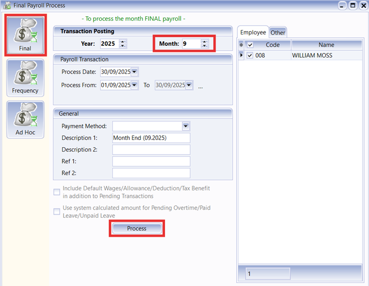

3. **Compare the results** between September and October 2025 to observe the EPF contribution rate changes:

   - **Before October 2025**: System automatically sets both Employee and Employer EPF rates to `0%`
   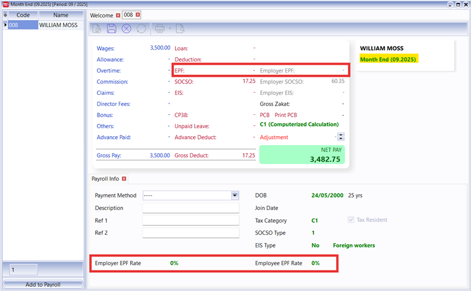

   - **October 2025 onwards**: System calculates both Employee and Employer EPF rates as `2%`
   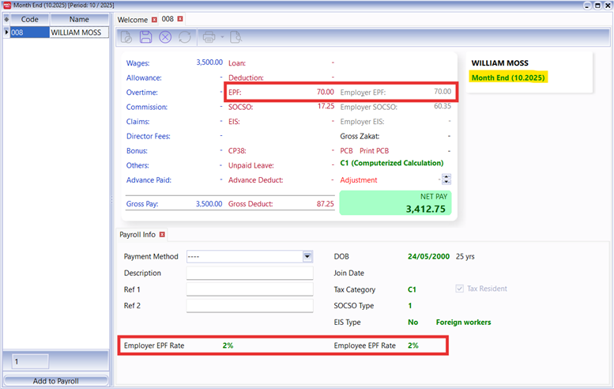

---

### Non-Malaysian Citizen Employees With Permanent Residential Status

Non-Malaysian individuals who have been granted **Permanent Resident status** by the government are treated the same as Malaysian citizens for EPF purposes.

**EPF contribution rates:**

||< 60 years old| >= 60 years old and < 75 years old |
|---|---|---|
|EM| 13% or 12%| 6.5% or 6%|
|EP| 11%| 5.5%|

*\* EM – Employer Share, EP – Employee Share*

#### Step 1: Configure Employee Profile with PR Status

1. Navigate to **Human Resource** → **Maintain Employee**
    

2. Under **Grouping**, select the correct **Nationality** for the employee
    

3. **Enter the PR Start Date** to indicate Permanent Resident status
    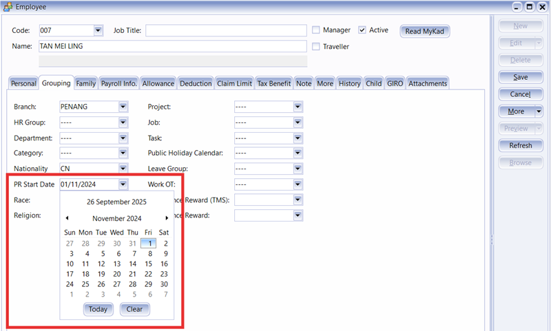

4. Click **Save** to apply the changes
    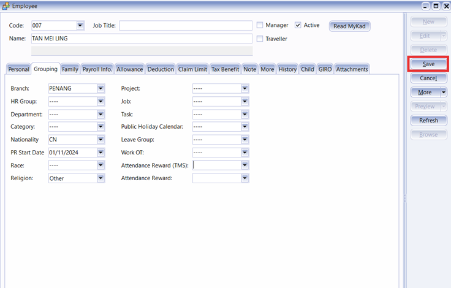

#### Step 2: Contribution Setting (PR)

At this stage, you need to set the EPF contribution rate to “A”.

1. Go to *Maintain Employee* → *Payroll Info*, check the current *Contribution* type of this employee, e.g. **FW-PR**
    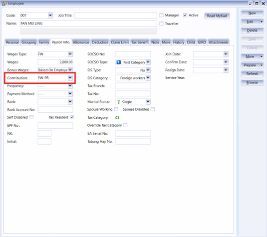

2. Go to **Payroll** → **Maintenance** → **Maintain Contribution**
    

3. Select the contribution type from Step 1 (e.g., **FW-PR**)
    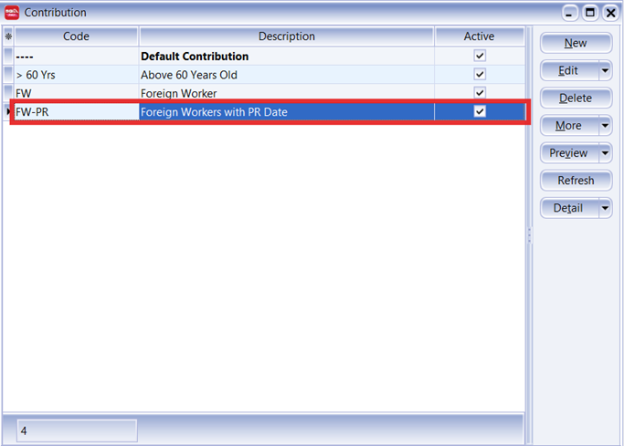

4. Click **Edit** and update both **Employee EPF Rate** and **Employer EPF Rate** to `A` (Auto EPF Rate)
    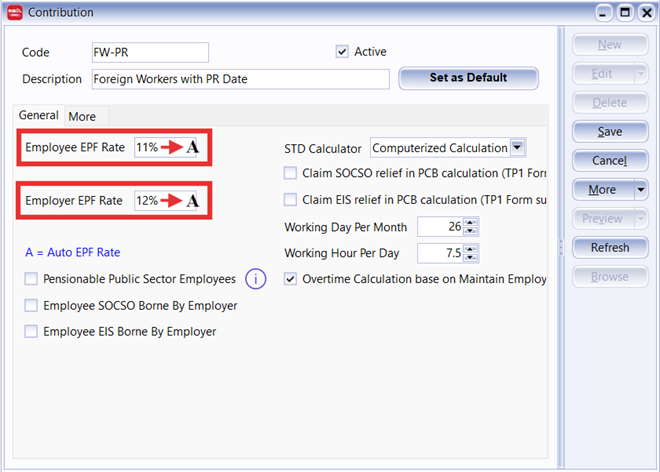

    :::info Auto EPF Rate
    The "A" setting enables automatic EPF rate calculation based on employee status and effective dates. Hover over the ⓘ icon for more details.
    :::

5. Click **Save** to apply the changes

#### Step 3: Configure Wages Settings (PR)

1. Navigate to **Maintain Employee** → **Payroll Info** and note the **Wages type** (e.g., **FW**)
    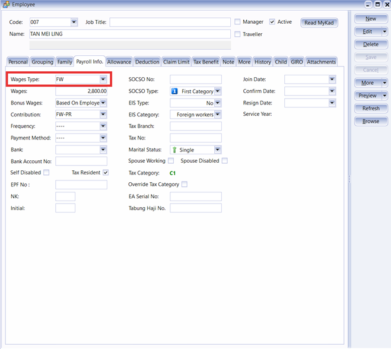

2. Go to **Payroll** → **Maintenance** → **Maintain Wages**
    

3. Select the wages type from Step 1 (e.g., **FW**) and click **Edit**
    

4. **Enable EPF contribution** by ticking the **EPF** checkbox to include wages in EPF calculations
    

    :::info Other Contributions
    For PR employees, it's recommended to enable other contributions such as SOCSO, PCB, EA, and OT as shown, since they follow the same rules as Malaysian citizens.
    :::

5. Click **Save** to apply the changes
   

#### Step 4: Verify Results (PR)

1. Navigate to **Payroll** → **New Payroll**
    

2. Select **Final**, choose **October (10)** and click **Process** to generate Month End
    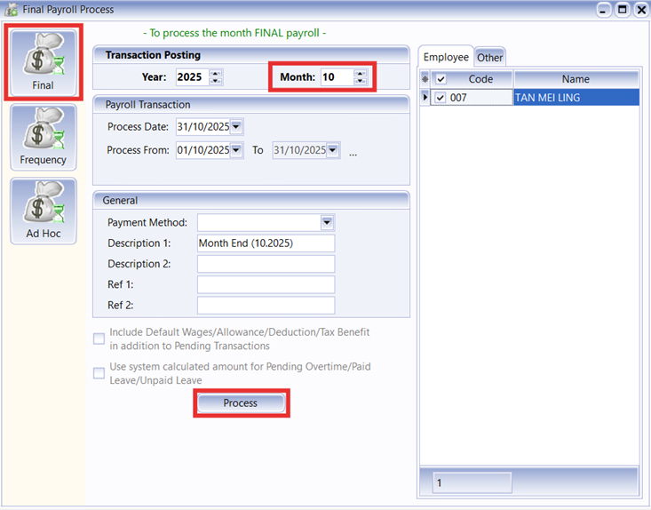

3. **Review the EPF calculation**: The system will calculate EPF rates for foreign workers with PR status at **Employee EPF rate 11%** and **Employer EPF rate 13%** (for employees with wages less than RM 5,000)
    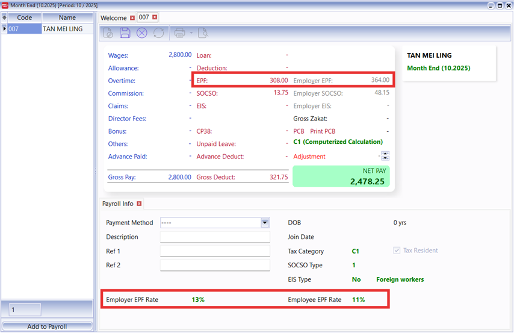

---

## Generate EPF Submission File from SQL Payroll

In SQL Payroll, you can directly generate the EPF submission text file to upload at KWSP portal.

### Step 1: Fill In Employer EPF Number

1. Navigate to **File** → **Company Profile**

    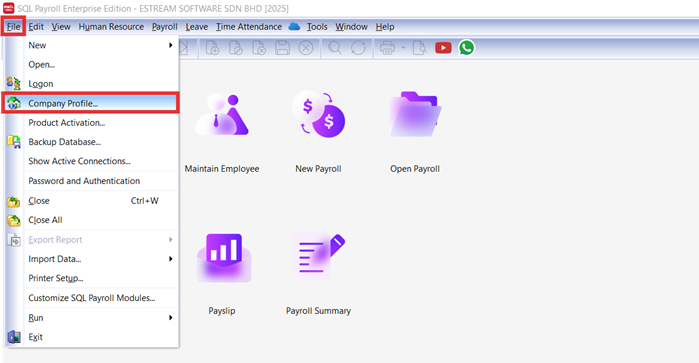

2. Under EPF tab, the system is updated with new extra field EPF Employer No. 2 to update Foreign worker employer EPF No.

    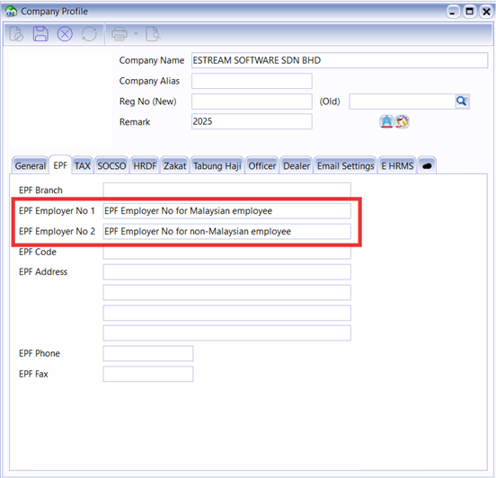

    *\*EPF Employer No 1 = Malaysian Employee*

    *\*EPF Employer No 2 = Non-Malaysian Employee (Optional)*

3. Ensure that the EPF Employer Number is filled in accurately.
    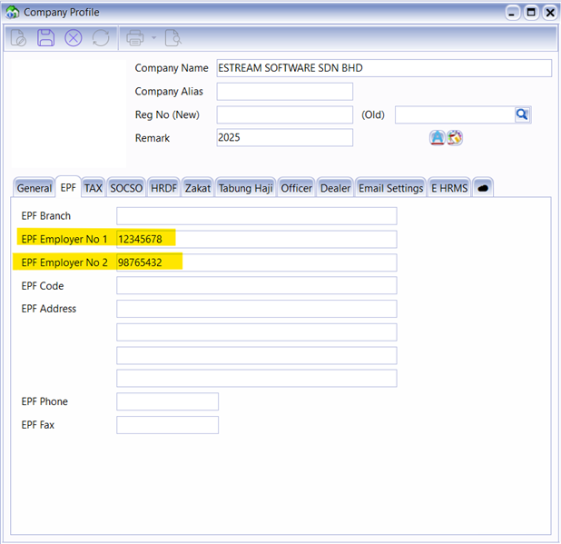

4. Click **Save** to apply changes.

    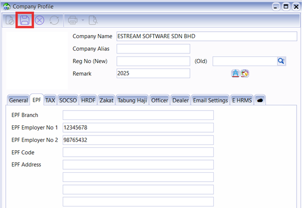

### Step 2 : Batch Edit Employee EPF Number

SQL includes a Batch Edit function that allows you to update employees’ EPF information all at once.

1. Go to **Human Resource** → **Maintain Employee**
    

2. Select the foreign employees by highlighting the employees using *Ctrl* button
    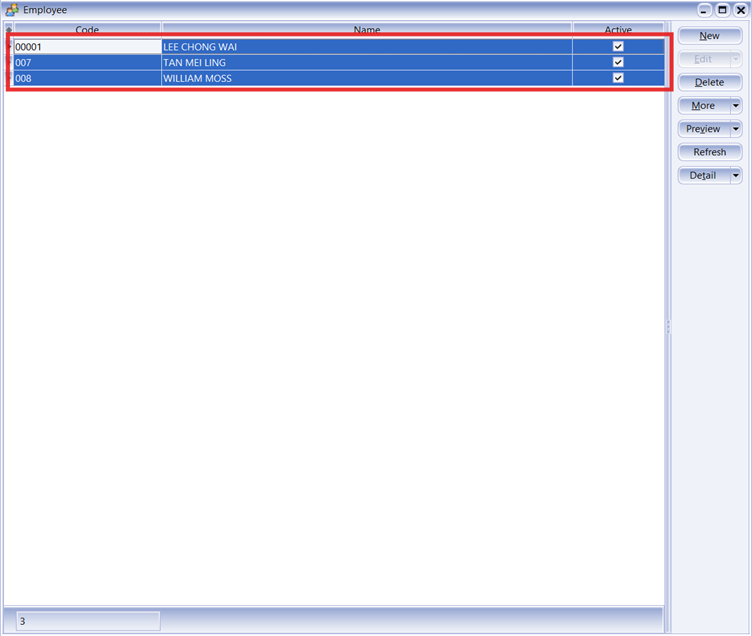

3. Click on the **More** option, and select **Batch Edit**
    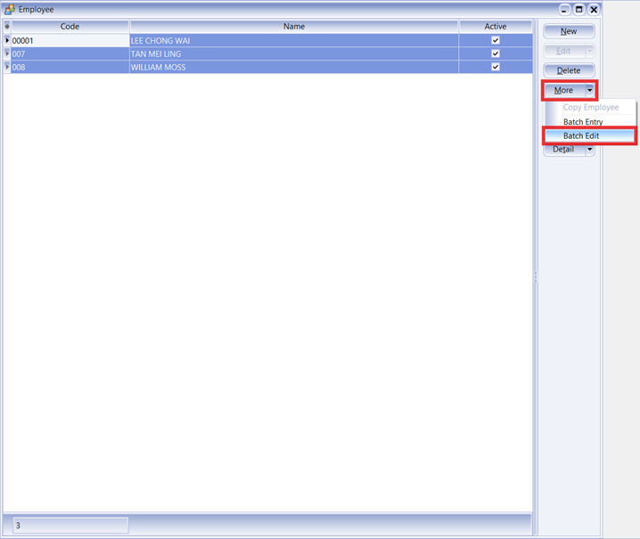

4. Select the field chooser (* icon on top left of the table), then select the EPF No. to display it in table (hidden by default).
    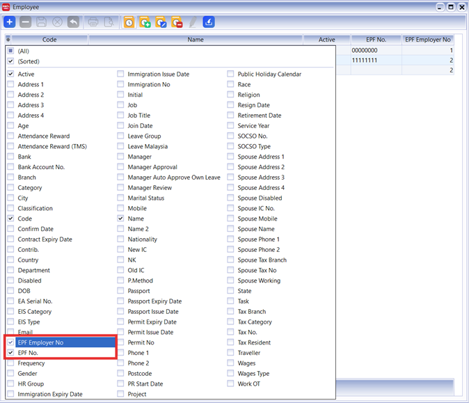

5. Now, you may update the *EPF No.* for each employee
    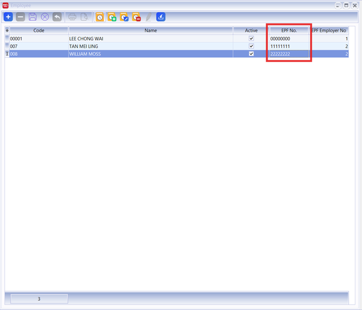

6. Click **Save** to apply changes.
    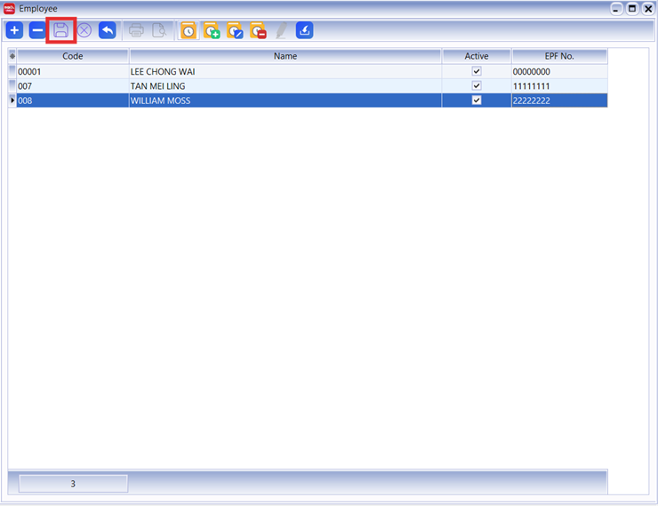

7. Verify that you have successfully updated the *EPF No.* for all employees
    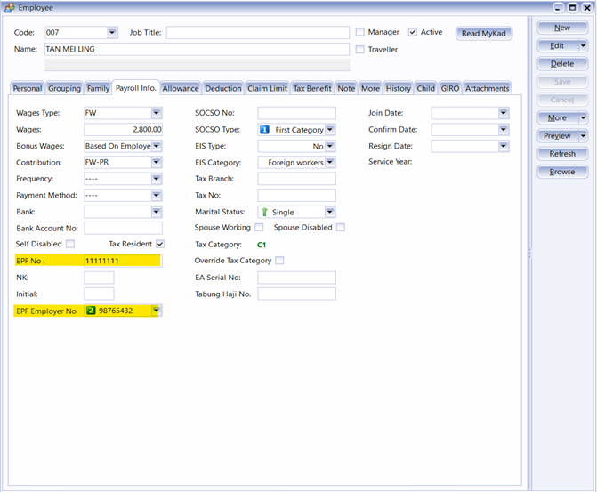

### Step 3 : Generate EPF Submission File

1. Go to **Payroll** → **Statutory Reports (Monthly)** → **Print EPF Borang A…**
    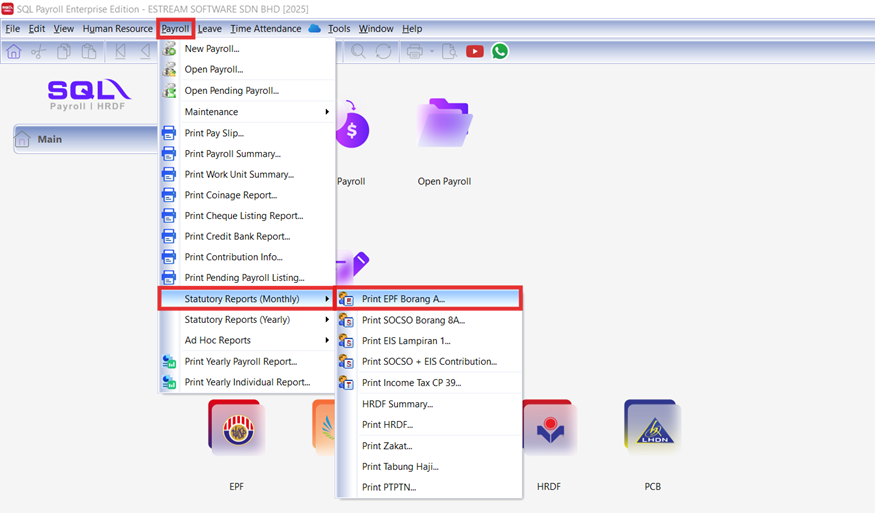

2. Select the Year, Month and payment method for the EPF
    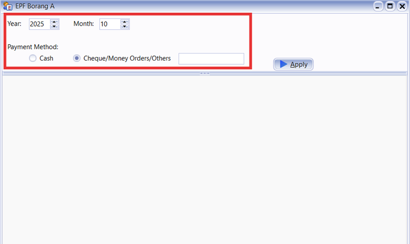

3. Click **Apply**

    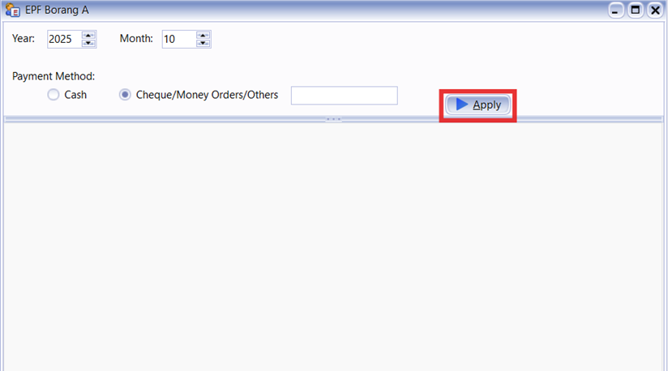

4. The system will group employees based on Employer EPF Number and display the EPF contribution details, including both employee and employer portions.

    *\*Note : If employee's nationality is not Malaysia, he/she will be group to Employer EPF No 2*
    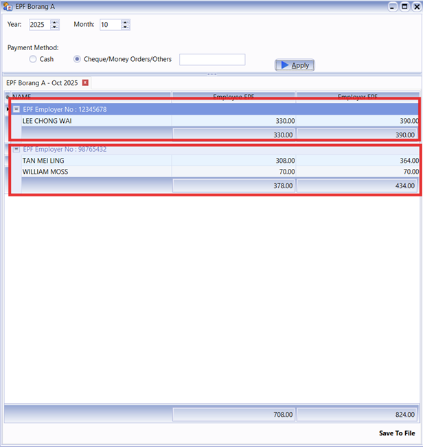

5. Click the **Save to File** to generate the EPF submission text file
    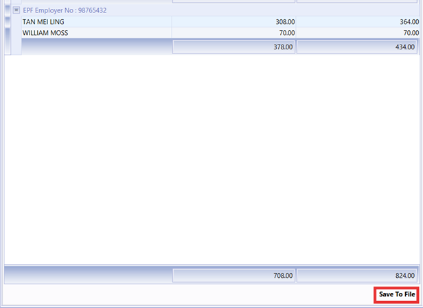

6. Choose the desired format, and click **OK**

    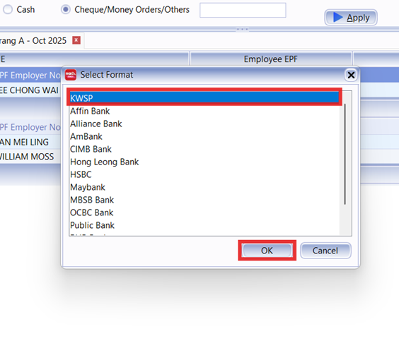

7. Select the download path, then click **Save**
    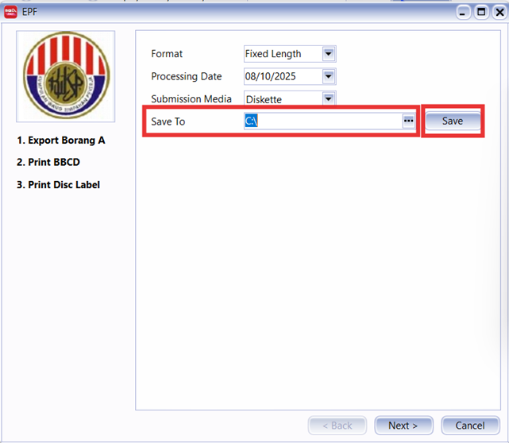

8. Once done, the system will automatically generate 2 text files separately for local and foreign employees
    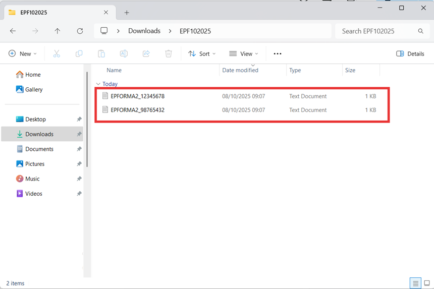

Now, you can upload the files generated from SQL Payroll to KWSP portal for EPF submission!

---

## Frequently Asked Questions (FAQ)

1. What are the employer’s and employee’s share contribution rates for non-Malaysian citizen employees starting from the implementation date?
   - The contribution rates for non-Malaysian citizen employees starting from October 2025 are as follows:
    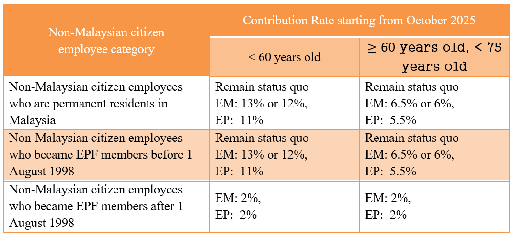

2. What must the non-Malaysian citizen employees do to maintain the employee’s share contribution rate at 11%?
   - To maintain the employee's share contribution rate at 11% after the effective date of the new policy, employees must complete and submit the relevant form to their employer.
   - The employer must then submit an application to contribute above the statutory rate via i-Akaun (Employer). [Download the EPF application form](https://www.kwsp.gov.my/documents/20119/44359/Form_BORANG%20PERMOHONAN%20PENDAFTARAN_PEMBATALAN%20MENCARUM%20MELEBIHI%20KADAR%20BERKANUN_BM.pdf/d0da65c3-3fdd-2904-0ed1-a6fcc514b331?preview)

3. For non-Malaysian citizen employees who have already opted to contribute to the EPF before the effective date of this new policy, do they need to re-register with the EPF?
    - No. Non-Malaysian citizen employees who are already registered and whose EPF member accounts remain active do not need to submit a new membership registration. Their existing member number will remain valid for all dealings with the EPF.

4. Where can members verify their registration status?

   - Registration can be verified through the following channels:

     1. **Verification by employers** via i-Akaun (Employer)
     2. **Verification by members** at any EPF offices

5. What types of work passes require EPF contribution?

   - Non-Malaysian citizen employees who are employed starting from **October 2025 salary** and hold any of the following work passes are required to contribute to EPF:

     1. **Visitor's Pass** (Foreign Workers except Foreign Domestic Helpers)
     2. **Employment Pass**
     3. **Professional Visitor Pass**
     4. **Student Pass**
     5. **Residence Pass**
     6. **Long-Term Social Visit Pass**

    :::note Important Notes

    - The obligation to contribute applies to non-Malaysian citizen employees who are employed and receive wages in the form of money starting from the October 2025 salary
    - Work permission for Professional Visitor Pass (Specialized), Student Pass, Residence Pass and Long-Term Social Visit Pass must be obtained in advance from the Immigration Department of Malaysia

    :::

6. Do employers need new registration for mixed workforce?

   - **No.** If an employer hires both Malaysian and non-Malaysian citizen employees, the employer is **NOT REQUIRED** to submit a new employer registration and may use the existing employer number.

7. When can EPF contributions be stopped for foreign workers?

   - The obligation to contribute for non-Malaysian citizen employees **ceases during the final two (2) months** before the expiry of the employee's work pass, even if the employee is still in service.
