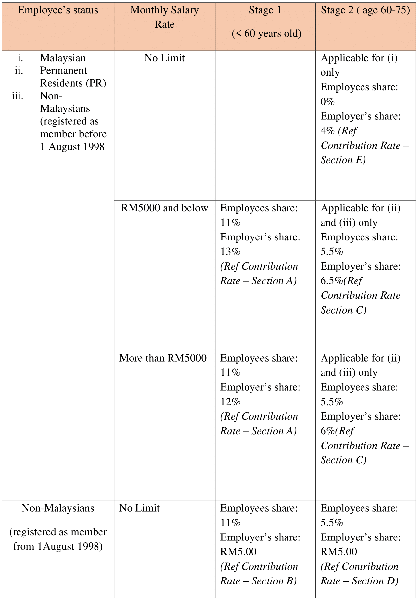
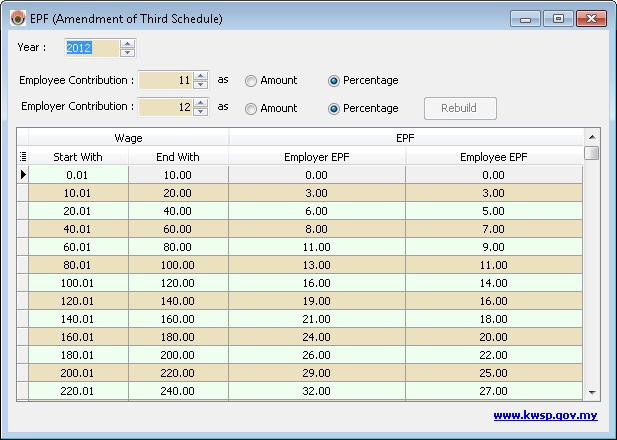

## What is EPF (KWSP)?

- A portion of an employee’s salary and employer’s contribution on behalf of every worker.
- Every company is required to contribute EPF to their staff
- Contribution has to be made to KWSP before the 15th day of every month.

## What Payments Are Subjected to EPF (KWSP)?

## EPF Contribution Rate

## EPF Table

This function is to show a list of EPF Amount which is need to be pay/deduct from the Salary by Employee & Employer.

1. User can manually change the Rate by Amount or by percentage.
2. Just Click Rebuild after the changes.
3. Any changes here will not affect the Process of Payroll.

:::info[Government Official Portal]
    [Kumpulan Wang Simpanan Pekerja](http://www.kwsp.gov.my/)
:::

## Frequently Asked Questions (FAQs)

### How Does SQL Payroll manage EPF contributions?

- SQL Payroll automatically assigns the correct percentage of EPF contributions based on the employees’ salary and other contributing factors.
- In SQL Payroll, you can also set your own EPF contribution rate based on your company’s policy.

:::info Example
You can set the EPF rate at 19% for employees In the management level. The employers’ contribution is tax deductible up to 19% , which is not tax allowable expenses.
:::

### Does bonus affect Employer EPF rate?

- If an employee’s monthly wages is **less than RM5,000** the Employer’s EPF rate will be **13%**.
- But if the employee receives a bonus that causes their wages for that particular month to exceed RM5000, the employer **contribution rate will still remain at 13%**.
- **Why**? This is because the contribution calculation is based on total renumeration. Ed. Wages, overtime, and allowance. It **DOES NOT include bonus and director fees**.

### My employee turns 60 years old this year, what should their EPF contribution rate be?

- If employee is above 60 years old, the employee’s EPF contribution rate will be 0% while the employer’s contribution will be 4%

### Are employees above the age of 75 required to contribute for EPF?

- No. No contributions are required from both parties.

### Are EPF members required to withdraw all funds after age of 75?

- No. EPF members will continue to earn dividends for the remaining portion of their EPF savings up to age 100.
