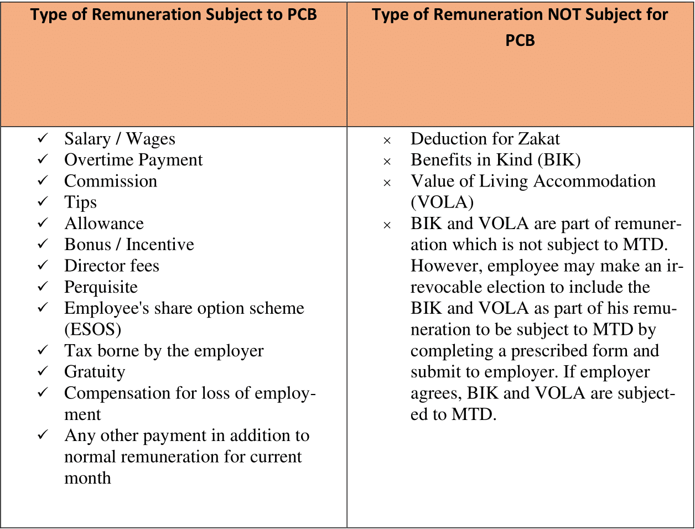

## What is Potongan Cukai Bulanan (PCB)?

- PCB is an income tax deduction from employee’s current monthly renumeration.
- The deduction follows the schedule of PCB or other methods approved by the Malaysian government.

## What is Subjected to PCB?

## Fun Facts

