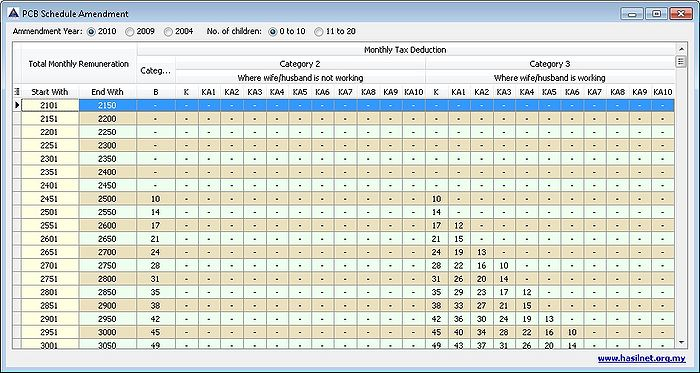

## What is Potongan Cukai Bulanan (PCB)?

- PCB is an income tax deduction from employee’s current monthly renumeration.
- The deduction follows the schedule of PCB or other methods approved by the Malaysian government.

## What is Subjected to PCB?

## PCB Table

This function is to show a list of PCB Amount which is need to be pay/deduct from the Salary by Employee & Employer.

This Table is for employer who does not use computerised payroll software or proses payroll manually.

:::info[Government Official Portal]
    - [Inland Revenue Board Of Malaysia (LHDN)](http://www.hasil.gov.my/)
    - [For PCB Calculation Checking](http://ekl.hasil.gov.my/pcbcalc/index.php?&lang=may)
:::

## Fun Facts

## PCB & CP38 Receipt No & Date

