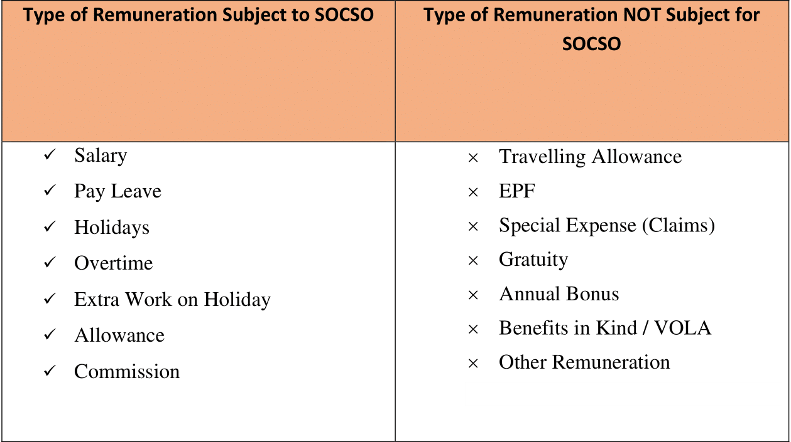
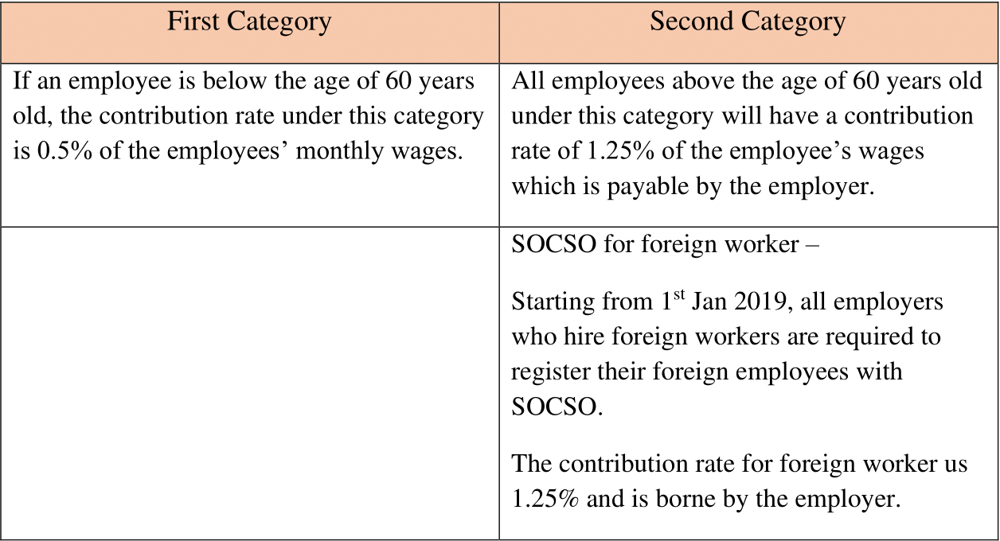

## What is Social Security Organization (SOCSO)?

- SOCSO is a social security organization that is also known as PERKESO (Pertubuhan Keselamatan Social).
- SOCSO provides medical and financial assistance to employees that have had their abilities impaired due to accidents or diseases.
- SOCSO also provides assistance to the family of the employees if death were to occur.

## SOCSO First Category and Second Category

