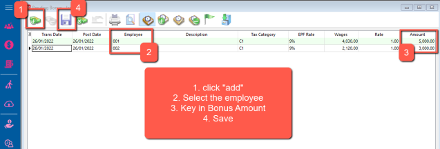

## Process Adhoc Bonus in SQL

### Steps & Instructions

1. Payroll | Open Pending Payroll

    

2. Click On Bonus

    

3. Update the information accordingly

    

4. Go under Payroll | new Payroll | Adhoc

    

5. Process

    
