## UBS Payroll
### Type Information/Data Import

1. Maintain Branch (branch.dbf)
2. Maintain Category (category.dbf)
3. Maintain Department (dept.dbf)
4. Maintain Project (project.dbf)
5. Maintain Race (race.dbf)
6. Maintain Allowance (awtable.dbf)
7. Maintain Deduction (dedtable.dbf)
8. Maintain Employee (pmast.dbf)

### Requirement
1. UBS Payroll Version 9 and above
2. UBS Payroll Data (after restore)
3. SQL Payroll Application
4. Empty Database of SQL Payroll

### Steps
If your pc do not install UBS Payroll follow step 1 , if you had install UBS Payroll in your pc IGNORE step 1

1. Extract your UBS Payroll file by using 7zip.

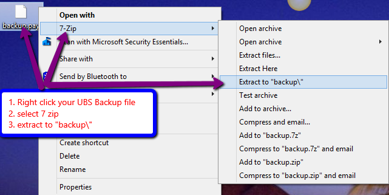

- Download 7 Zip to extract UBS Payroll Backup file.
Download Path for 7 Zip : Window 32 Bits : https://www.7-zip.org/a/7z2501.msi Window 64 Bits: https://www.7-zip.org/a/7z2501-x64.msi

2. Create a Empty Database in SQL Payroll

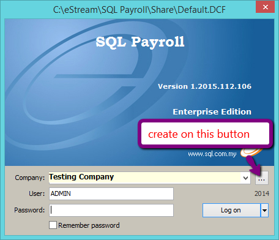

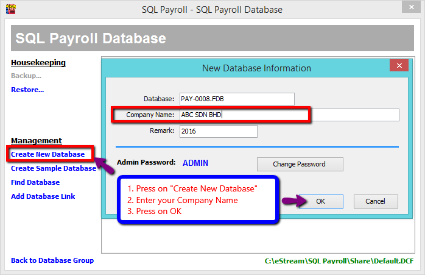

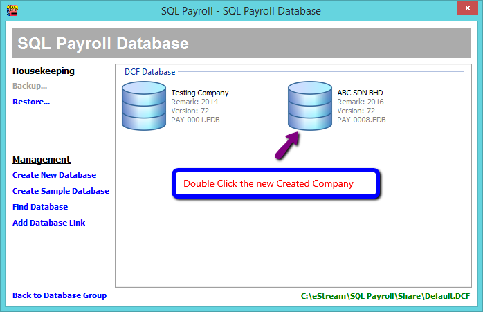

3. Login the Empty Database of SQL Payroll

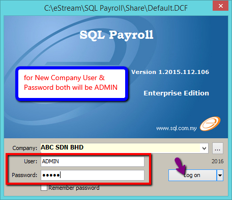

4. Click File | Import Data | UBS Payroll

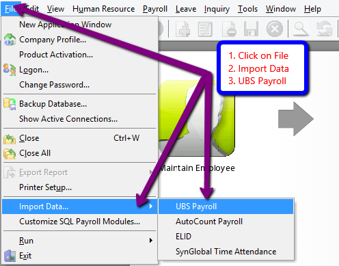

5. Select the the extracted backup folder or UBS Payroll Directory Folder & Click Ok to Start Import

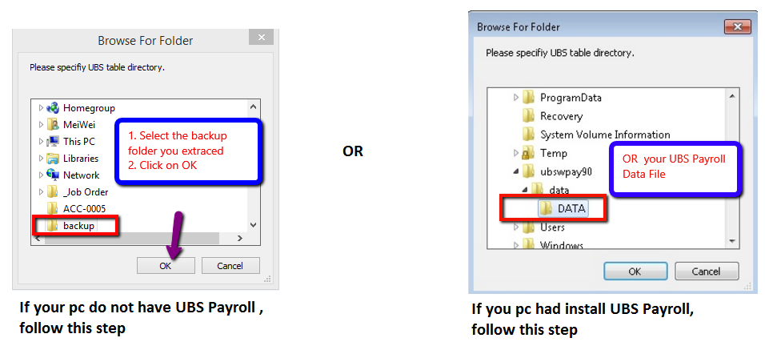

If failed to connect and prompt message "Provider cannot be found. It may not be properly install".
You need to download and install the file "VFPOLEDBSetup.msi" from: https://www.microsoft.com/en-my/download/details.aspx?id=14839

6. Click Close to finish import.
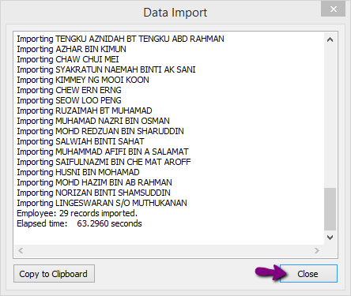

7. Go Human Resources | Maintain Employee to check all your Employee List imported successfully from UBS Payroll.

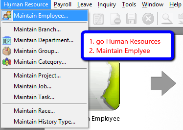

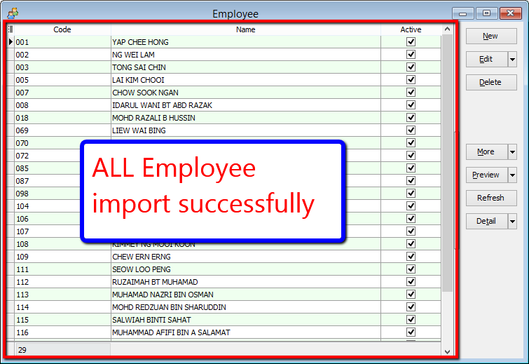

### FAQ

1. Get message "Provider cannot be found ....it may not be properly installed" when try to import the UBS backup folder.
Answer: The computer need to add Microsoft Visual FocPro Driver in ODBC Data Source Adminstrator (control panel)

## AutoCount Payroll
### Type Information/Data Import

1. Company Profile (PROFILE)
2. Maintain Payment Method (BANK)
3. Maintain Department (DEPT)
4. Maintain Race (RACE)
5. Maintain Allowance (ALLOWANCE)
6. Maintain Deduction (DEDUCTION)
7. Maintain Employee (EMPLOYEE)

### Requirement
1. Backup of Autocount Payroll File which normally the file extention is P01 (Eg. SAMPLE COMPANY SDN BHD [2012] - 20120606.P01)
2. SQL Payroll Application
3. Empty Database of SQL Payroll

### Steps
If your pc do not install UBS Payroll follow step 1 , if you had install UBS Payroll in your pc IGNORE step 1

1. Login the Empty Database of SQL Payroll
2. Click File | Import Data | AutoCount Payroll

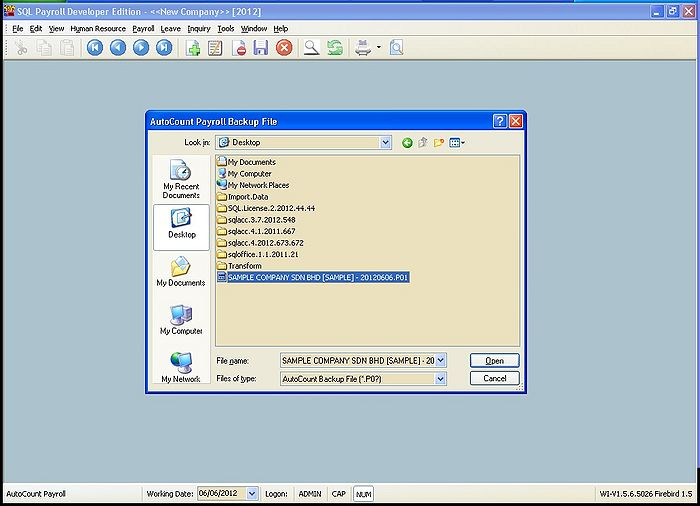

3. Select the Autocount Backup File & Click Open

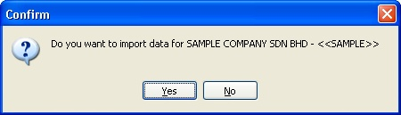

4. Click Ok To Start Import

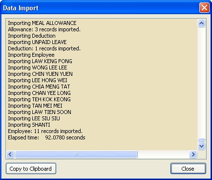

5. Click Close to Finish import.

## Others
### Type Information/Data Import

1. Pending Overtime
2. Pending Deduction
3. Leave Application
4. Pending Wages
5. Pending Unpaid Leave

### Steps
Below example is import Pending Overtime & is applicable for other Attendance System

1. Click File | Import Data | [Select the Time Attendance] (eg ELID, SynGlobal Time Attendance, etc)

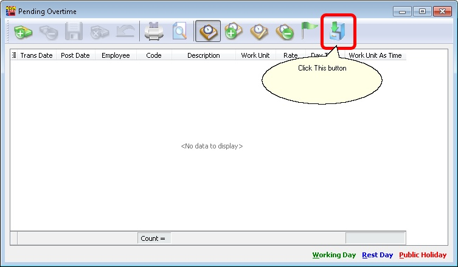

2. Click the 3 Dot Button to Open

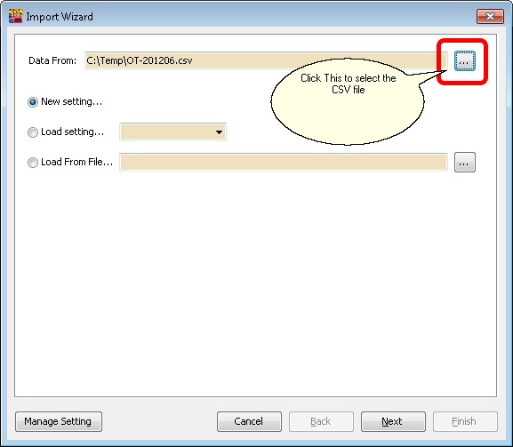

|  Field | Properties  |   
|---|---|
|Data From|Is the path for the CSV file to be import.|   
|New Setting...|Create New Setting for New Import.|   
|Load Setting...|Use the saved Setting created/saved on last import from Database.|   
|Load From File...|Use the saved Setting created/saved on last import from External XML File.|
|Manage Setting Button|For Delete the saved Setting created/saved on last import from Database (See below picture).|

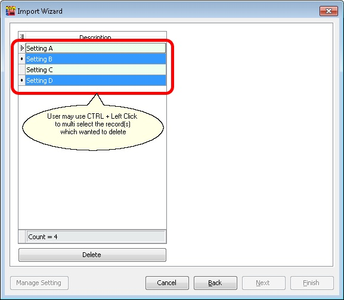

3. Click Next

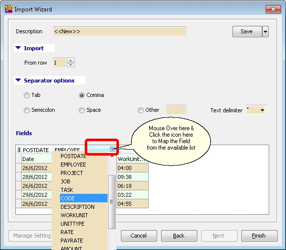

|Field|Properties|
|---|---|
|Description|Setting Name.|
|Save button|Save the current setting for future use.|
|From row|From which row number in the CSV file start to import.|
|Separator Options|Type of separator in the CSV file.|
|Field|Which Column To Map and Import.|

4. Click Finish button after finish select & Map all the fields.

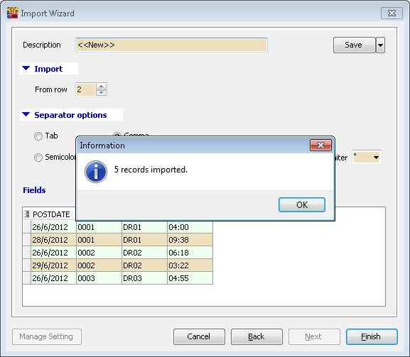

5. Click Ok

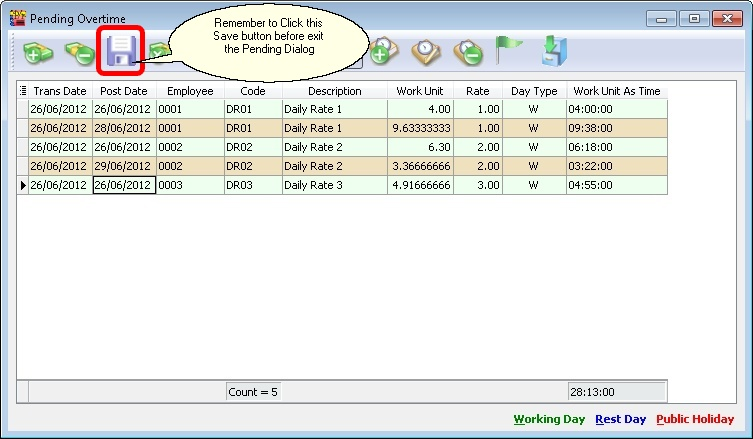
