## Maintain Employee

Whenever a new staff/worker/person/crew enter the company, Maintain Employee is the place where user needs to key in the details

1. Navigate yourself to the Maintain Employee panel

   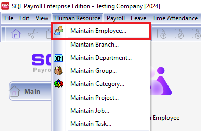

   \*OR Click on the home page "Maintain Employee"\*\*

   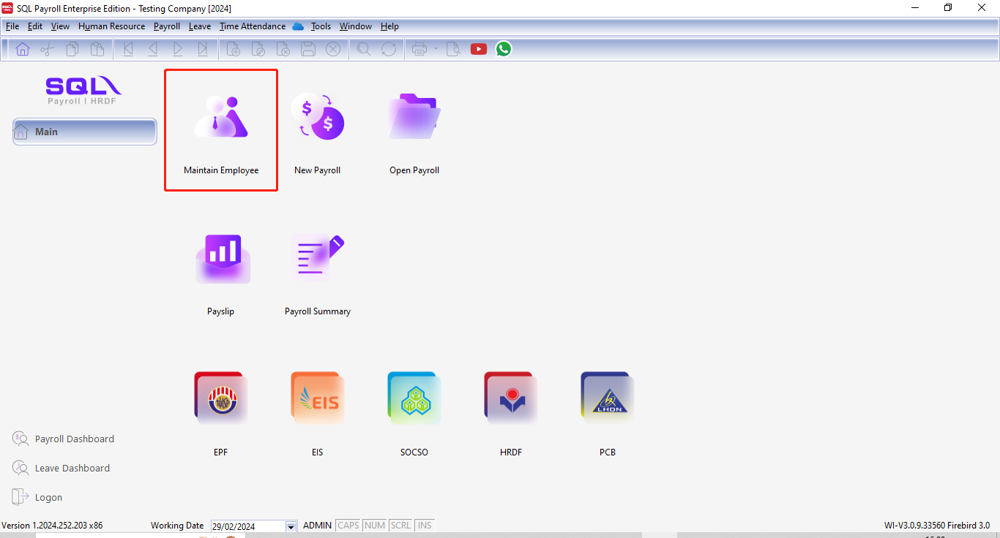

2. Click new to create new employee

   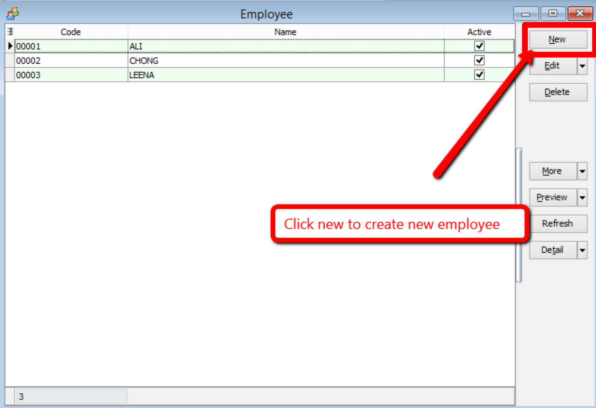

3. Key in the employee’s personal details

   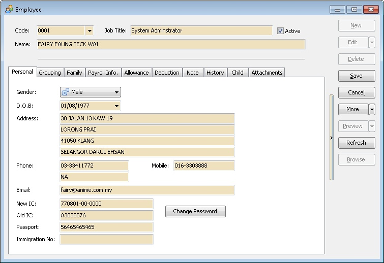

### Personal

Click the *Change Password* button & enter the password if you wanted to allow the Employee to login to see his/her own payroll data & report
Remember to untick the *Active* for any employee had resign before process the payroll.

  

| Field Name      | Properties |
|-----------------|------------|
| Code            | Definition: Employee code |
|                 | Field Type: Alphanumerical |
|                 | Length: 30 |
| Job Title       | Definition: Employee Job Title |
|                 | Field Type: Alphanumerical |
|                 | Length: 60 |
| Name            | Definition: Full Employee Name |
|                 | Field Type: Alphanumerical |
|                 | Length: 160 |
| Active          | Definition: Unchecked if the selected employee is resigned. |
|                 | Field Type: Boolean |
| Gender          | Definition: The employee Sex |
|                 | Data Options: Male or Female |
| D.O.B           | Definition: The employee Date of Birth |
|                 | Field Type: Date (dd/MM/YYYY) |
| Address         | Definition: Employee Correspondence Address |
|                 | Field Type: Alphanumerical |
|                 | Length: 60 (for Each Line) |
| Phone           | Definition: Employee Correspondence Phone Number |
|                 | Field Type: Alphanumerical |
|                 | Length: 20 (for Each Line) |
| Mobile          | Definition: Employee Handphone Number |
|                 | Field Type: Alphanumerical |
|                 | Length: 20 |
| Email           | Definition: Employee E-Mail Address |
|                 | Field Type: Alphanumerical |
|                 | Length: 60 |
| New IC          | Definition: Employee New Identity Card Number |
|                 | Field Type: Numerical |
|                 | Length: 20 (XXXXXX-XX-XXXX) |
| Old IC          | Definition: Employee Old Identity Card Number |
|                 | Field Type: Alphanumerical |
|                 | Length: 20 |
| Passport        | Definition: Employee Passport Number |
|                 | Field Type: Alphanumerical |
|                 | Length: 20 |
| Immigration No  | Definition: Employee Immigration Number |
|                 | Field Type: Alphanumerical |
|                 | Length: 20 |
| Change Password | Definition: A password for Employee so he/she can self login to print his/her report (Eg EA, payslip, etc) |
|                 | Field Type: Alphanumerical |

### Grouping

In this tab is use for report grouping for the selected employee. It can be either by

- [Branch](/usage/HR/HR%20Setup/HR%20Setup#maintain-branch)
- [Department](/usage/HR/HR%20Setup/HR%20Setup#maintain-department)
- [Group](/usage/HR/HR%20Setup/HR%20Setup#maintain-group)
- [Category](/usage/HR/HR%20Setup/HR%20Setup#maintain-category)
- [Project](/usage/HR/HR%20Setup/HR%20Setup#maintain-project)
- [Job](/usage/HR/HR%20Setup/HR%20Setup#maintain-job)
- [Task](/usage/HR/HR%20Setup/HR%20Setup#maintain-task)
- [Race](/usage/HR/HR%20Setup/HR%20Setup#maintain-race)
- [History Type](/usage/HR/HR%20Setup/HR%20Setup#maintain-history-type)
- [Announcement](/usage/HR/HR%20Setup/HR%20Setup#maintain-announcement)

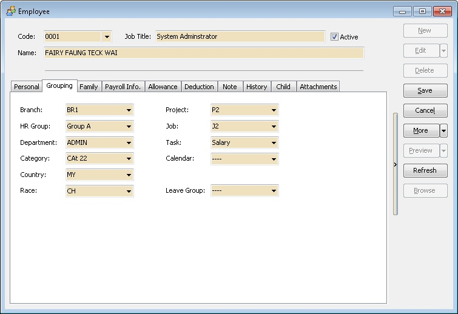  

### Family

In this tab is use to keep the his/her spouse/family information.  
It is useful in case anything happen to the employee we able to inform/contact his/her spouse/family

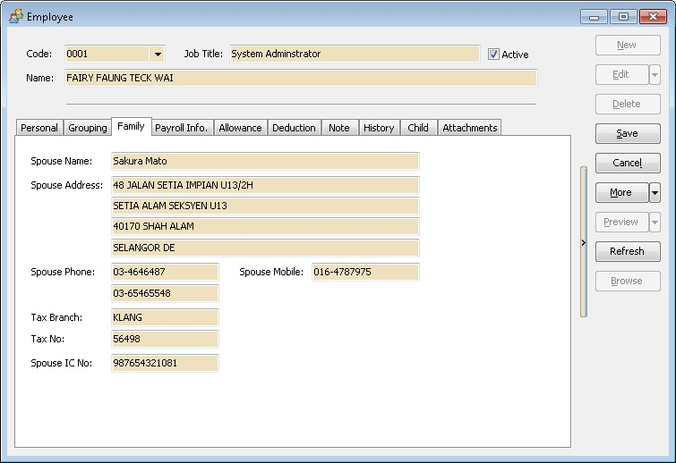  

| Field Name     | Properties |
|----------------|------------|
| Spouse Name    | Definition: Employee husband/wife full name |  
|                | Field Type: Alphanumerical                  |  
|                | Length: 160                                 |  
| Spouse Address | Definition: Employee husband/wife Correspondence Address |  
|                | Field Type: Alphanumerical                  |  
|                | Length: 60 (for Each Line)                  |  
| Spouse Phone   | Definition: Employee husband/wife Correspondence Phone Number |  
|                | Field Type: Alphanumerical                  |  
|                | Length: 20 (for Each Line)                  |  
| Spouse Mobile  | Definition: Employee husband/wife Handphone Number |  
|                | Field Type: Alphanumerical                  |  
|                | Length: 20                                  |  
| Tax Branch     | Definition: Employee husband/wife Tax Branch |  
|                | Field Type: Alphanumerical                  |  
|                | Length: 40                                  |  
| Tax No         | Definition: Employee husband/wife Tax Number |  
|                | Field Type: Alphanumerical                  |  
|                | Length: 20                                  |  
| Spouse IC No   | Definition: Employee husband/wife New Identity Card Number |  
|                | Field Type: Alphanumerical                  |  
|                | Length: 20                                  |  

### Payroll Info

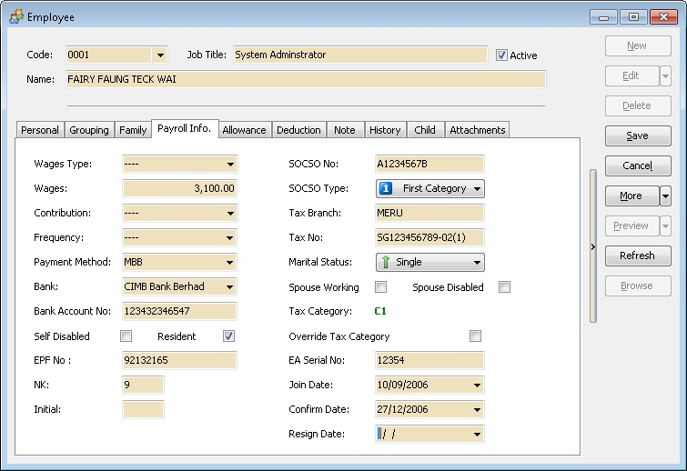  

| Field Name       | Properties | Field Name       | Properties |
|------------------|------------|------------------|------------|
| Wages Type       | Definition: Employee [Wages](/usage/payroll/maintenance/maintain-wages) Category Type | SOCSO No        | Definition: Employee SOCSO Number |
|                  |            |                  | Field Type: Alphanumerical |
|                  |            |                  | Length: 20 |
| Wages            | Definition: Employee wages amount | SOCSO Type      | Definition: Employee SOCSO Category |
|                  | Field Type: Numerical |                  | Data Options: First Category, Second Category or No SOCSO |
| Contribution     | Definition: Employee [Contribution](/usage/payroll/maintenance/maintain-contribution) Type | Tax Branch      | Definition: Employee Tax Branch |
|                  |            |                  | Field Type: Alphanumerical |
|                  |            |                  | Length: 40 |
| Frequency        | Definition: Employee payment [Frequency](/usage/payroll/maintenance/maintain-frequency) | Tax No          | Definition: Employee Tax Number |
|                  |            |                  | Field Type: Alphanumerical |
|                  |            |                  | Length: 20 |
| Payment Method   | Definition: Employer [Payment Method](/usage/payroll/maintenance/maintain-payment-method) | Marital Status   | Definition: Employee marriage status |
|                  |            |                  | Data Options: Single, Married, Divorced or Widow |
| Bank             | Definition: Employee Bank | Spouse Working  | Definition: Tick if the Employee husband/wife is working |
|                  |            |                  | Field Type: Boolean |
| Bank Account No  | Definition: Employee Bank Account Number | Spouse Disabled | Definition: Tick if the Employee husband/wife is disable person |
|                  | Field Type: Alphanumerical |                  | Field Type: Boolean |
|                  | Length: 20 |                  | |
| Self Disabled    | Definition: Tick if the Employee is disable person | Tax Category    | Definition: Employee Tax Category. Only can select if Override Tax Category is Tick. |
|                  | Field Type: Boolean |                  | |
| Resident         | Definition: Untick if the Employee Foreigner | Override Tax Category | Definition: Tick if don't wanted System Automatic Calculate the Employee Tax Category |
|                  | Field Type: Boolean |                  | Field Type: Boolean |
|                  | Non-Resident requirement and tax rate, refer to [Non-Resident](https://www.hasil.gov.my/en/individual/individual-life-cycle/how-to-declare-income/non-resident/) |                  | |
| EPF No           | Definition: Employee EPF(KWSP) Number | EA Serial No    | Definition: Employee EA Serial Number (Given by LHDN Department) |
|                  | Field Type: Alphanumerical |                  | Field Type: Alphanumerical |
|                  | Length: 20 |                  | Length: 8 |
| NK               | Definition: Employee NK Code (can be seen on EPF Borang A) | Join Date       | Definition: Employee Join the Company Date |
|                  | Field Type: Alphanumerical |                  | Field Type: Date (dd/MM/yyyy) |
|                  | Length: 1 |                  | |
| Initial          | Definition: Employee Initial Code (Given by EPF Department) | Confirm Date    | Definition: Employee Confirmation Date |
|                  | Field Type: Alphanumerical |                  | Field Type: Date (dd/MM/yyyy) |
|                  | Length: 3 |                  | |
|                  |           |     Resign Date             |Definition: Employee Resign Date |
|       |  |                  | Field Type: Date (dd/MM/yyyy) |

### Allowance

In this Tab is to enter the Fixed [Allowance](/usage/payroll/maintenance/maintain-allowance) entitled for each month for selected Employee.

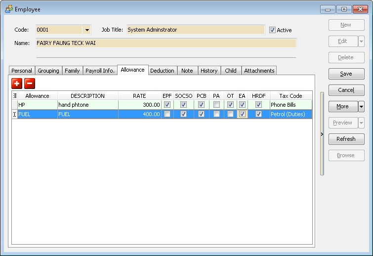  

### Deduction

In this Tab is to enter the Fixed [Deduction](/usage/payroll/maintenance/maintain-deduction) entitled for each month for selected Employee.

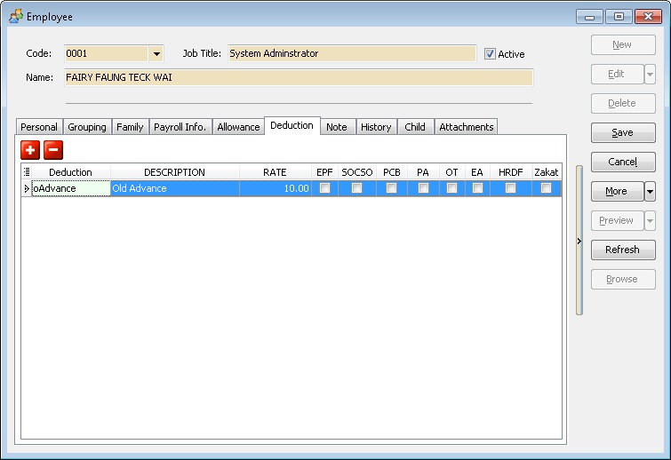 

### Note

In this Tab user can load the Photo & other Information for the selected Employee.  
For Photo please try  

   1. Save in Jpeg file.
   2. The Jpeg file size limit as 200KB

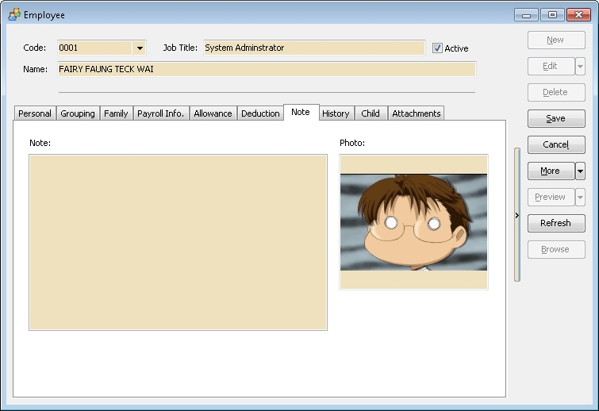 

### History

In this tab is to show the list of history changes in this selected Employee.  
Select the Increment at the type column in order to print the Increment Letter (HR.Employee.Increment.Report).  

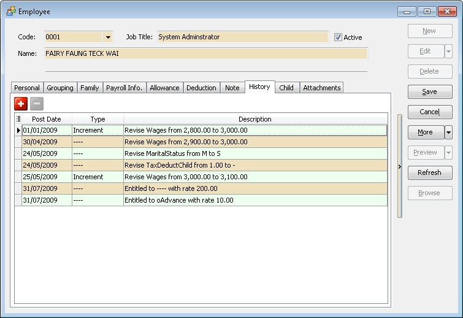 

| Field Name   | Properties                          |
|--------------|-------------------------------------|
| Post Date    | Definition: Date of the data changes |
|              | Field Type: Date                    |
| Type         | Definition: Changes [History Type](/usage/HR/HR%20Setup/HR%20Setup#maintain-history-type)    |
| Description  | Definition: Detail of Data changes  |

### Child

In this tab is to list out all taxable children(s).

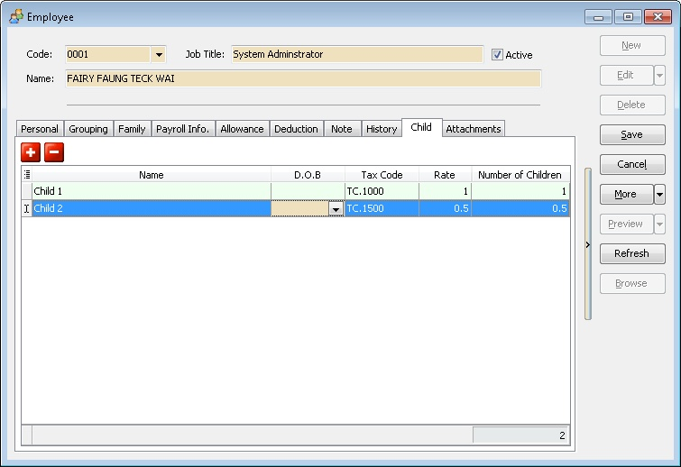 

| Field Name         | Properties                                                                                           |
|--------------------|------------------------------------------------------------------------------------------------------|
| Name               | Definition: Employee Tax Deductable Children full name                                                |
|                    | Field Type: Alphanumerical                                                                            |
|                    | Length: 160                                                                                          |
| D.O.B.             | Definition: Employee Tax Deductable Children date of birth.                                           |
|                    | Field Type: Date (dd/MM/yyyy)                                                                         |
|                    | Data Option: Optional (i.e. may leave it empty if don't wanted system calculate the Children Age)     |
| Tax Code           | Definition: Tax Deductable Children code.                                                             |
| Rate               | Definition: Rate for Tax Deductable                                                                   |
|                    | Field Type: Numerical                                                                                 |
|                    | Data Options: 1 or 0.5                                                                                |
| Number of Children | Definition: Number of Children is use for Tax Calculation. (Auto Calculate)                           |

### Attachments

Here user can attach the file to selected employee (eg Letter of Offer).  
Make sure the file is keep in the server as the system only keep the file link/path only.  

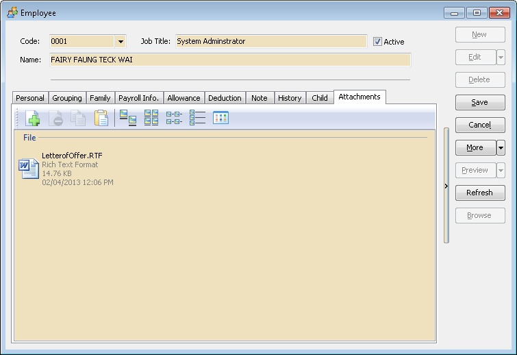

## Maintain Branch

This is useful for user had many branch company but the salary is paid from HQ.

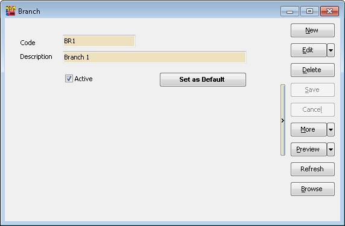

| Field Name     | Properties                                                                 |
|----------------|----------------------------------------------------------------------------|
| Code           | A Branch Code (Max 20 Character)                                           |
| Description    | A Full Description for Branch (Max 160 Character)                         |
| Active         | Untick it if the selected branch code is unavailable                       |
| Set as Default | Click This button if wanted the selected Branch Code to be Auto Assign this Branch Code on New at [Maintain Employee](/usage/HR/HR%20Setup/HR%20Setup#maintain-employee) |

## Maintain Department

A division of a large organization such as Account, Marketing & etc.

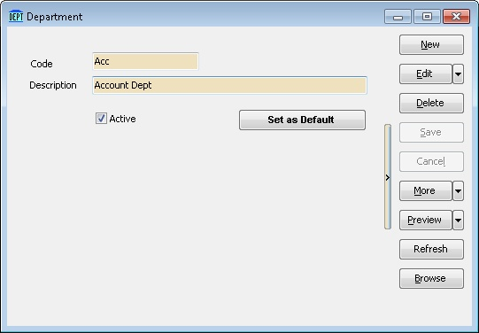

| Field Name     | Properties                                                                 |
|----------------|----------------------------------------------------------------------------|
| Code           | A Department Code (Max 20 Character)                                       |
| Description    | A Full Description for Department (Max 160 Character)                      |
| Active         | Untick it if the selected Department code is unavailable                   |
| Set as Default | Click This button if wanted the selected Department Code to be Auto Assign this Department Code on New at [Maintain Employee](/usage/HR/HR%20Setup/HR%20Setup#maintain-employee) |

## Maintain Group

This is another type of report grouping by Group type.

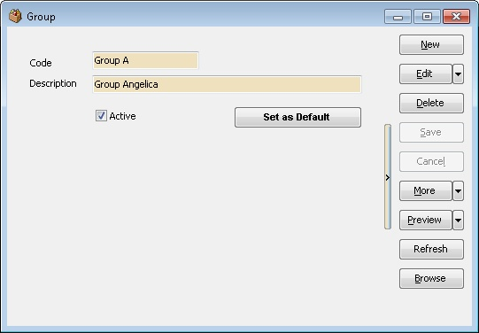

| Field Name     | Properties                                                                 |
|----------------|----------------------------------------------------------------------------|
| Code           | A Group Code (Max 20 Character)                                            |
| Description    | A Full Description for Group (Max 160 Character)                          |
| Active         | Untick it if the selected Group code is unavailable                        |
| Set as Default | Click This button if wanted the selected Group Code to be Auto Assign this Group Code on New at [Maintain Employee](/usage/HR/HR%20Setup/HR%20Setup#maintain-employee) |

## Maintain Category

User also can divide the employee by class or division.

| Field Name     | Properties                                                                 |
|----------------|----------------------------------------------------------------------------|
| Code           | A Category Code (Max 20 Character)                                         |
| Description    | A Full Description for Category (Max 160 Character)                        |
| Active         | Untick it if the selected Category Code is unavailable                     |
| Set as Default | Click This button if wanted the selected Category Code to be Auto Assign this Category Code on New at [Maintain Employee](/usage/HR/HR%20Setup/HR%20Setup#maintain-employee) |

## Maintain Project

User also can Group the employee by Project which the employee work at.

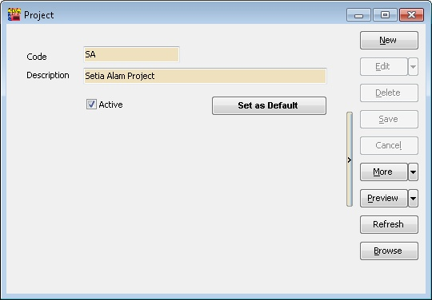

| Field Name     | Properties                                                                 |
|----------------|----------------------------------------------------------------------------|
| Code           | A Project Code (Max 20 Character)                                          |
| Description    | A Full Description for Project (Max 160 Character)                         |
| Active         | Untick it if the selected Project Code is unavailable                      |
| Set as Default | Click This button if wanted the selected Project Code to be Auto Assign this Project Code on New at [Maintain Employee](/usage/HR/HR%20Setup/HR%20Setup#maintain-employee) |

## Maintain Job

User also can Group the employee by Job Type in report.

| Field Name     | Properties                                                                 |
|----------------|----------------------------------------------------------------------------|
| Code           | A Job Code (Max 20 Character)                                              |
| Description    | A Full Description for Job (Max 160 Character)                             |
| Active         | Untick it if the selected Job Code is unavailable                          |
| Set as Default | Click This button if wanted the selected Job Code to be Auto Assign this Job Code on New at [Maintain Employee](/usage/HR/HR%20Setup/HR%20Setup#maintain-employee) |

## Maintain Task

User also can divide the employee by piece of work to be done or undertaken.

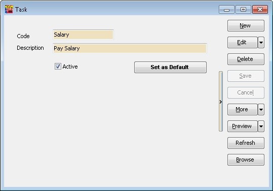

| Field Name     | Properties                                                                 |
|----------------|----------------------------------------------------------------------------|
| Code           | A Project Code (Max 20 Character)                                          |
| Description    | A Full Description for Task (Max 160 Character)                            |
| Active         | Untick it if the selected Task Code is unavailable                         |
| Set as Default | Click This button if wanted the selected Task Code to be Auto Assign this Task Code on New at [Maintain Employee](/usage/HR/HR%20Setup/HR%20Setup#maintain-employee) |

## Maintain Race

User also can Group the employee by Race Type in report.

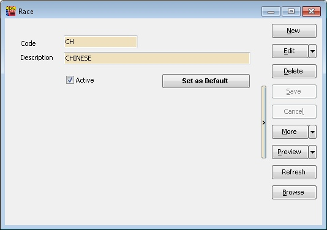

| Field Name     | Properties                                                                 |
|----------------|----------------------------------------------------------------------------|
| Code           | A Race Code (Max 20 Character)                                             |
| Description    | A Full Description for Race (Max 160 Character)                            |
| Active         | Untick it if the selected Race Code is unavailable                         |
| Set as Default | Click This button if wanted the selected Race Code to be Auto Assign this Race Code on New at [Maintain Employee](/usage/HR/HR%20Setup/HR%20Setup#maintain-employee) |

## Maintain History Type

This is to use to allow user to Group the Changes in the Maintain Employee

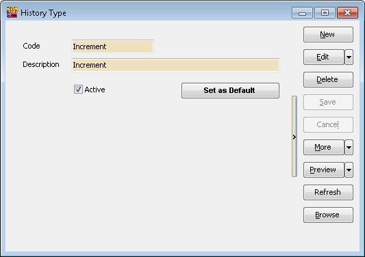

| Field Name     | Properties                                                                                     |
|----------------|------------------------------------------------------------------------------------------------|
| Code           | A History Type Code (Max 20 Character)                                                         |
| Description    | A Full Description for History Type (Max 160 Character)                                        |
| Active         | Untick it if the selected History Type Code is unavailable                                     |
| Set as Default | Click This button if wanted the selected History Type Code to be Auto Assign this History Type Code on New Changes at [Maintain Employee](/usage/HR/HR%20Setup/HR%20Setup#maintain-employee) |

## Maintain Announcement

This is to used to create, manage, and distribute company-wide or employee-specific announcements within the payroll and HR system, allowing users to share information, updates, or important reminders with their team

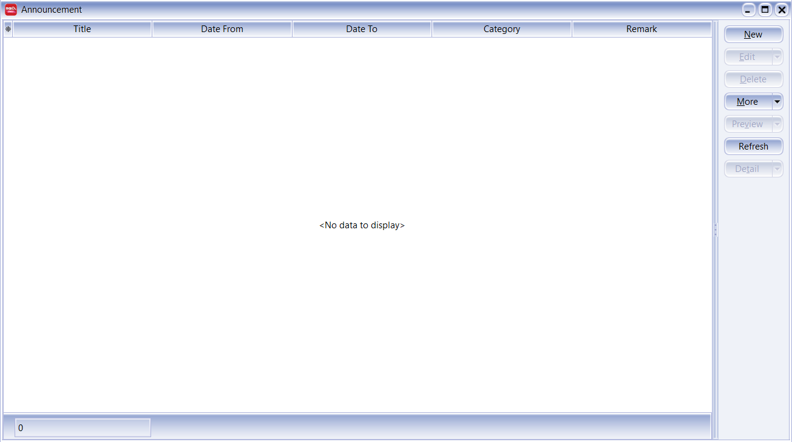

| Field Name | Properties |
|-------------|-------------|
| Title | The title or subject of the announcement. |
| Date From | The start date when the announcement becomes active. |
| Date To | The end date when the announcement expires or becomes inactive. |
| Category | The classification or type of announcement (e.g., General, System Update, Event). |
| Remark | Additional notes or comments related to the announcement. |

## Print History Lisitng

This provides a comprehensive record of all past history types for employees, and is able to furthur and filter, sort and group the employees witth the fields below

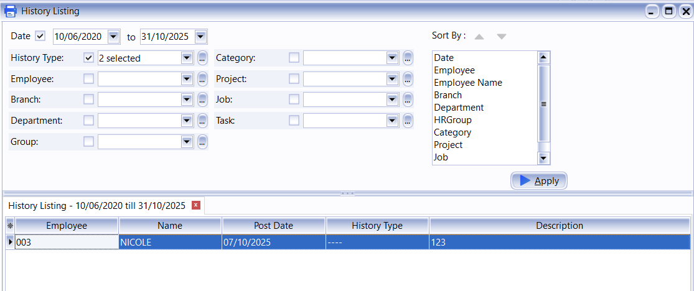

This is how the report generated will look like

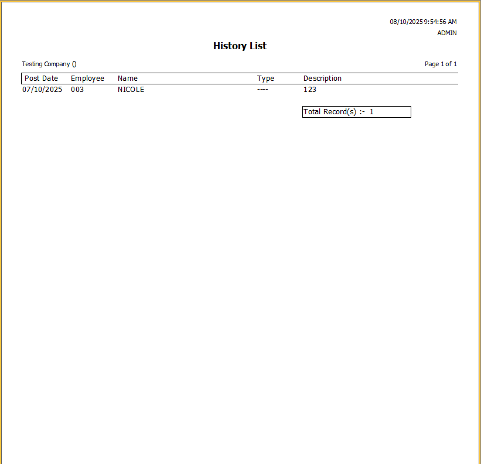