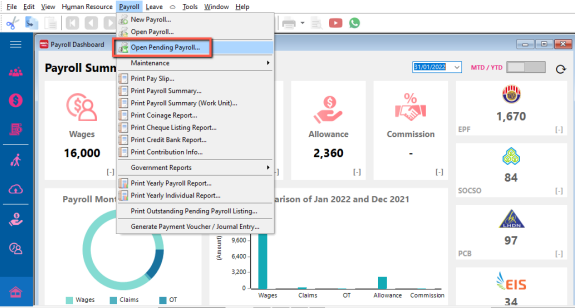
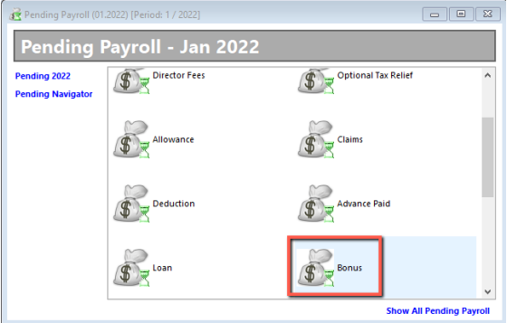
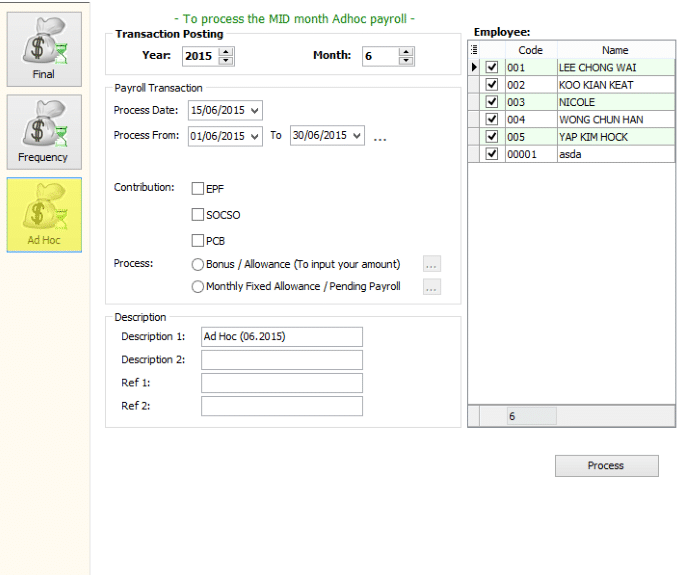
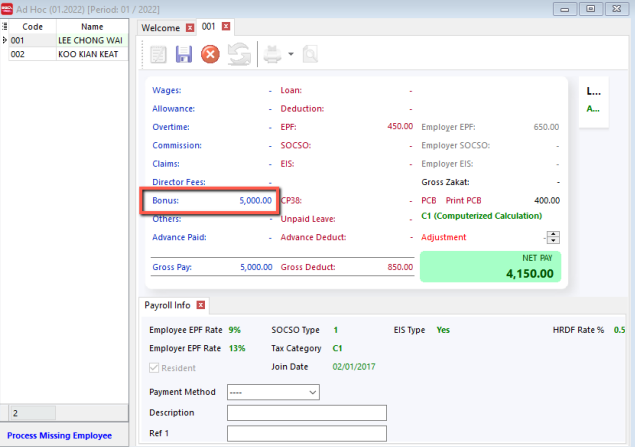

## Setup

1. Navigate to Payroll > Open Pending Payroll

    

2. Click On Bonus

    

3. Update the information accordingly

    

4. Go to Payroll > new Payroll > Adhoc

    

5. Process it and you are done 🥳

    
