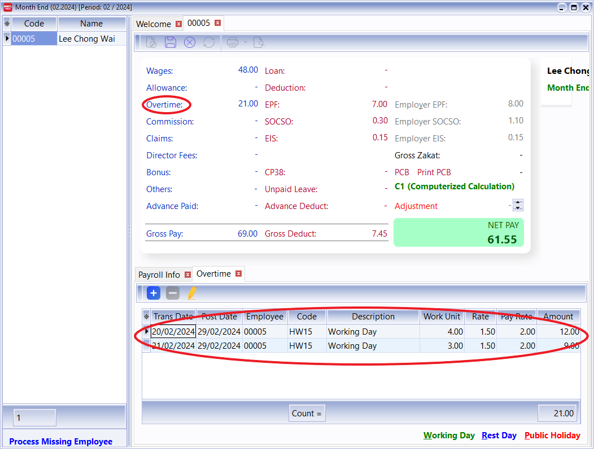

:::info
This guide explains how to set daily payment for your employees. Given the below example:

- Pay rate per day = RM 16.00
- Normal working hour = 8 hours

:::

## Setup

1. Define the contributions settings

   1. Navigate to **Payroll** > **Maintenance** > **Maintain Contribution**
   2. Create new contribution, let said the contribution code is “DAILY.”
   3. Define the following items:
      - Working Day Per Month = 1
      - Working Hour Per Day = 8

   

2. Input the daily rate in maintain employee

   1. Navigate to **Human Resource** > **Maintain Employee**
   2. Input the daily rate (RM16.00 per day) in the Wages field.
   3. Set the contribution to “DAILY”.

   

3. Open pending payroll – Wages

   1. Navigate to **Payroll** > **Open Pending Payroll**
   2. Go to Wages Pending.
   3. Key-in the daily working records for an employee.
      - Work unit = 1 day
      - Rate = RM16.00 per day

   

4. Open pending payroll – Overtime

   1. Navigate to **Payroll** > **Open Pending Payroll**
   2. Go to Overtime Pending.
   3. Key-in the daily working records for an employee.
      - Code = HW15 (OT Hourly Rate)
      - Work Unit = No.of hours (OT)
      - Rate = 1.5 rate per hour (OT)

   

5. Final payroll process

   1. Navigate to **Payroll** > **New Payroll**
   2. Click on Final followed by Process button.

   

6. Check the wages records

   1. Click on the Wages to retrieve the detailed wages records.
   2. You will see the records are posted from wages pending for the month.

   

7. Check the overtime records

   1. Click on the Overtime to retrieve the detailed wages records.
   2. You will see the records are posted from Overtime pending for the month.
      - Working Day Per Month = 1 (from Maintain Contribution)
      - Working Hour Per Day = 8 (from Maintain Contribution)
      - Wages = RM16.00 (from Maintain Employee)

   Based on the above information,

   - Daily Pay Rate = RM16.00 / 1 day = RM16.00 per day
   - Hourly Pay Rate = RM16.00 / 8 hrs = RM2.00 per hour

   Therefore, the overtime calculation is
   |Code|Work Unit|Rate|Pay Rate|OT Pay Rate|Amount|
   |:--:| :-----: |:--:|:------:|:---------:|:----:|
   |HW15|4hrs|1.5|2.00|RM2.00 x 1.5 = RM3.00|RM3.00 x 4 hrs = RM12.00|
   |HW15|4hrs|1.5|2.00|RM2.00 x 1.5 = RM3.00|RM3.00 x 3 hrs = RM9.00|

   
