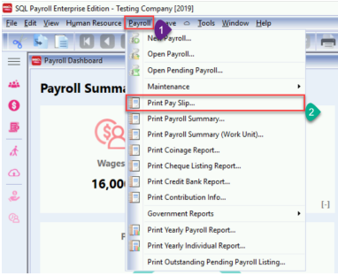
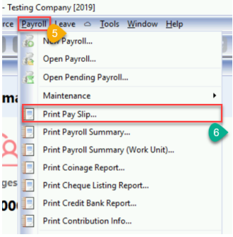

:::info[note]
Make sure you had done setting the template in Maintain Employee.
:::

## Setting in Maintain Employee

You can [CLICK HERE](<https://wiki.sql.com.my/wiki/Fast_Report_-_E-Mail_Client_(Batch)_%26_E-Mail_(Native)#Version_1.2021.196.166_.26_above>) to go Batch Email Link

1. Click on 3.2.2 Version 1.2021.196.166 & above

   

2. Scroll down until see this Sample E-Mail Template (Version 1.2021.196.166 & above) > Click on Expand

   

3. Copy all

   

4. Open your SQL Payroll System

5. Navigate to **Human Resource** > **Maintain Employee** and click New

   

6. Click 🔽 beside **More**

   

7. Click on Paste Employee

   

8. After Paste Employee you will see Employee Code as **EMAIL** and the PDF Password Setting at **Note**

   

## Setting PDF Password

### Scenario 1 : Setting Employee Name 2 as password

:::info[note]
Only available in Version 1.2021.2066.174 & above
:::

1. At Note Tab:

   - **[UseName2]** Put 1 to enable it
   - **[GlobalPassword]** and **[PrivatePassword]** make sure is empty

   ```txt
   [UseName2]
   1

   [GlobalPassword]

   [PrivatePassword]
   ```

   

2. Under Employee profile set the password at **Name 2**

   > For Example : **_testing_** is the PDF Password

   

### Scenario 2 : Setting Global PDF Password by UseName and ICPass

> **\_UseNameICPass** - This setting is to use Employee Name and IC set as PDF password

1. At Note Tab:

   - **[UseName2]** Put 0 to disable it
   - **[PrivatePassword]** is empty

   ```txt
   [UseName2]
   0

   [GlobalPassword]
   UseNameICPass

   [PrivatePassword]
   EmployeeCode=Password
   ```

2. The first character of Employee Name (In Uppercase)

3. Second character is @

4. The subsequent 6 characters is the last 6 digits of NRIC or Passport Number

   For example :

   > Name : LEE CHONG WEI
   >
   > NRIC : 961212-01-4321
   >
   > The password is : **L@014321**

   

### Scenario 3 : Setting Global PDF Password

:::info
This settings configures **all employees** to have the same password
:::

1. At Note Tab:

   - **[UseName2]** Put 0 to disable it
   - **[PrivatePassword]** is empty

   ```txt
   [UseName2]
   0

   [GlobalPassword]
   BatchEmail

   [PrivatePassword]
   EmployeeCode=Password
   ```

2. set the PDF Password below **[Global Password]**

   For example as below :

   > The PDF Password is **_‘BatchEmail’_**

   

### Scenario 4 : Setting Private/ Individual Password

:::info[note]
Private Password - Each Employees got their own PDF Password

Must set for all Employees
:::

1. At Note Tab:

   - **[UseName2]** Put 0 to disable it
   - **[GlobalPassword]** is empty

   ```txt
   [UseName2]
   0

   [GlobalPassword]

   [PrivatePassword]
   EmployeeCode=Password
   001=LEE
   002=KOO
   ```

2. Under **[PrivatePasssword]**, put employee code and their password following the format below:

   ```txt
   Format : EmployeeCode=Password
   ```

   For Example as below :

   ```txt
   001=LEE ('LEE' is the PDF Password)

   002=KOO ('KOO' is the PDF Password)

   ```

   

## Send Payslip by Batch Email

### E-Mail Client (Batch)

:::info[note]
Make sure your pc had install window email (Ex : Outlook or Thunderbird)
:::

1. Go to Payroll > Print Pay Slip ...

   

2. Filter your process you wish to batch email > Apply

   

3. Click 🔽 Beside Printer icon

4. Click on Export to E-Mail Client (Batch)

   

5. Select your payslip format > OK

   

6. After click ok will prompt window and show has been sent to recipient email, mean success send out

   

### E-Mail SMTP (Batch)

:::info[note]
Make Sure you had create App Password

- If you’re using Gmail , you can [CLICK HERE](https://support.google.com/accounts/answer/185833?hl=en) to create your App Password

:::

1. Go to **File** > **Company Profile**

   

2. Select Email Setting from the tabs

3. Fill in your email detail

   > \*\*Password : Is your App Password

   

4. Go to **Payroll**, click **Print Pay Slip**

   

5. Filter your process you wish to batch email > Apply

   

6. Click 🔽 Beside Printer icon

7. Click on Export to E-Mail SMTP (Batch)

   

8. Select your payslip format > OK

    

9. After click ok will prompt window and show has been sent to recipient email, mean success send out

    
