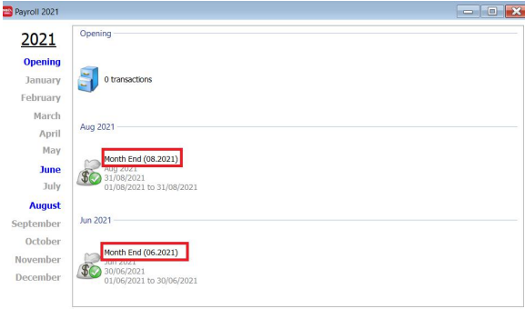
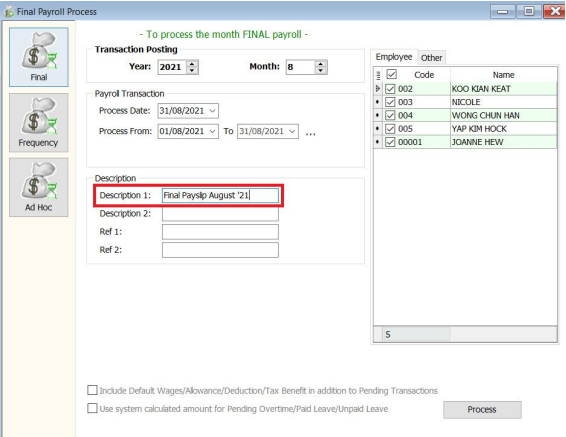
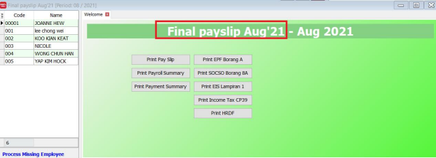
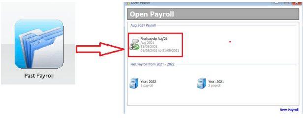
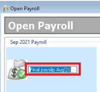

:::info
Picture below shows a default payroll description
:::

## Setup

1. Go to menu: **Payroll** > **New Payroll**

2. Select the month, and key in the description that you want in “Description 1”.

    

3. Press Process

    

4. You will see the description on the top of the month end.

5. If you click on “Past Payroll” icon and you will see the month end description that you created.

    

    To change the payroll description AFTER processed,

6. At Open Payroll, press F2 key and amend the description directly.

    
