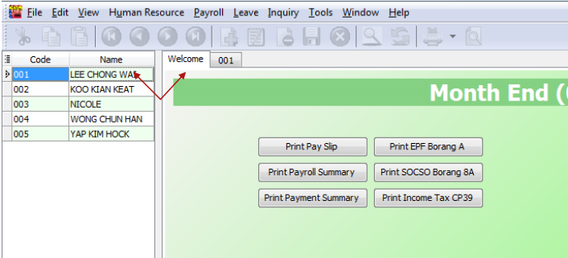

## Setup

1. On top of your screen, look for **Human Resource** > **Maintain Employee** > double click any one of the employee and go into this screen

    

    :::info[note]
    Make sure you have selected the correct wages type and key in the wages amount
    :::

    

   - This screen is to set your employees monthly fixed allowance
   - Click on the ‘+’ button where the red arrow pointed, then select the type of allowance that you maintained in allowance maintenance
   - Key in the amount in the rate column, and tick on the deductions that need to be calculated, and remember to save after done.

2. On top of your screen, look for **Human Resource** > **Maintain Employee** > double click any one of the employee and go into this screen

    

   - Select the correct year and month , for those that are not cut off at month end you can click on the ‘…’ button at where the red arrow pointed to select the cut off day.
   - Description2, ref1 and ref2, you can key in as reference purpose.

   1. Click on the process to proceed, then you will see the screen below

        

   2. Click on the print payslip to check on the amount that calculated from system

        

        You can scroll to the right to check completely

        

   3. Assume it is all correct amount, just click on the preview to check on how it will be printed out with 5 kinds of designs

   4. After you have selected your prefer format, you can direct print / export to documents that you want

        - Refer image below to export to other documents, for printing jiust click on the printer icon at the most left

            

        - The image below is a sample of pdf file after exported

            

   5. Follow the steps below:

         1. Back to step **2.ii**

            

            - This is print payroll summary (a quick summary to check on all those wages, allowance, gross pay, epf , socso etc… of all employees)

            - Refer back to Steps 2.iii and 2.iv to export / print it out

         2. **Payment summary**

            

            

            Click on the Blue coirage report, then you will go to a screen that show you how the cash notes is being paid to the employees.

         3. **Result**

            For print epf borang a , socso borang 8a

            - It will display the employee epf, socso / employer epf, socso correspondingly.

                

            - You can double click your employee name to check on its individual’s amount

                
