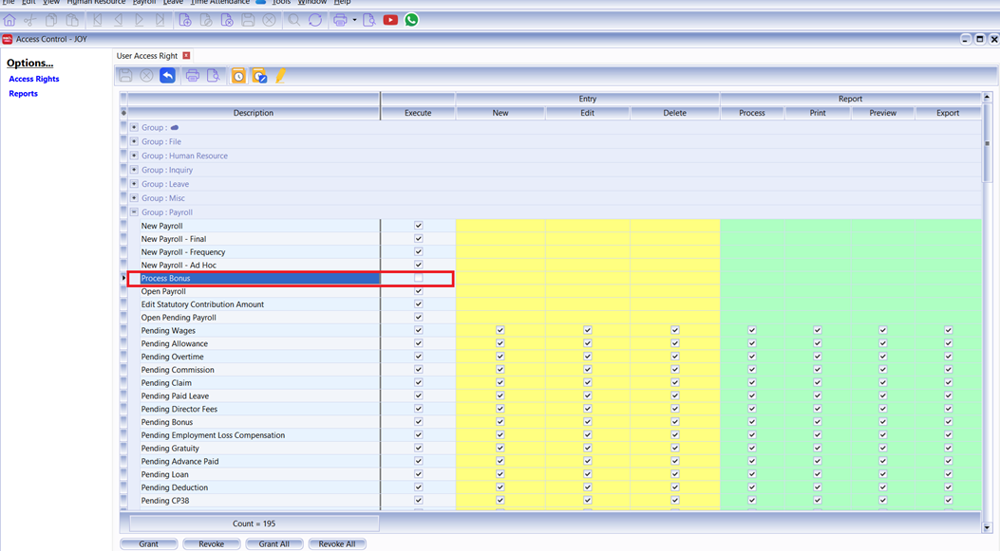
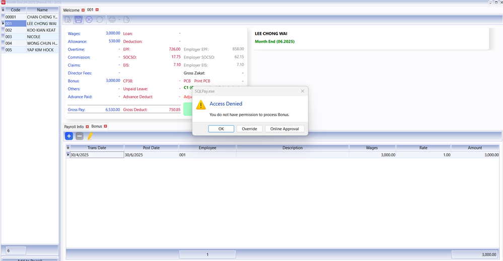
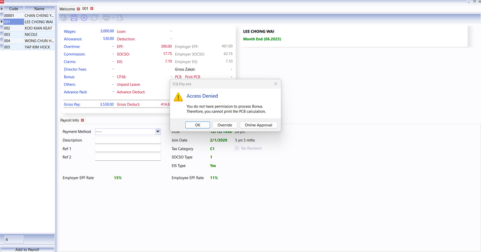
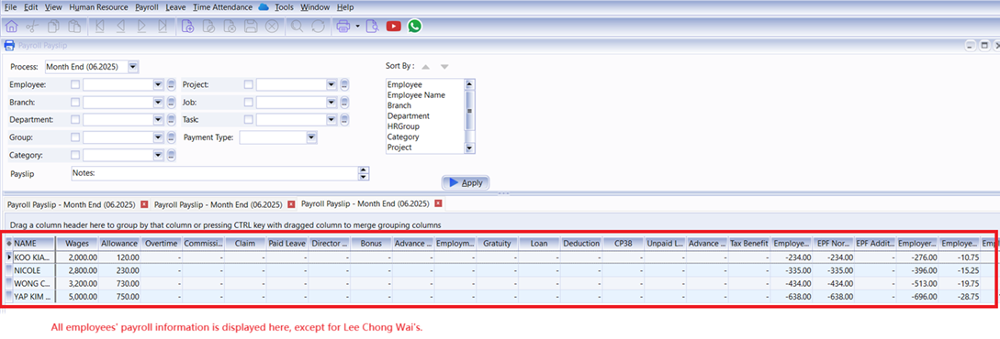
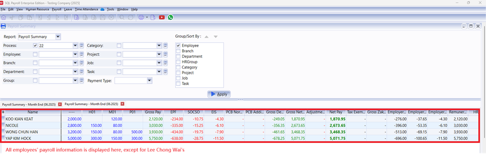
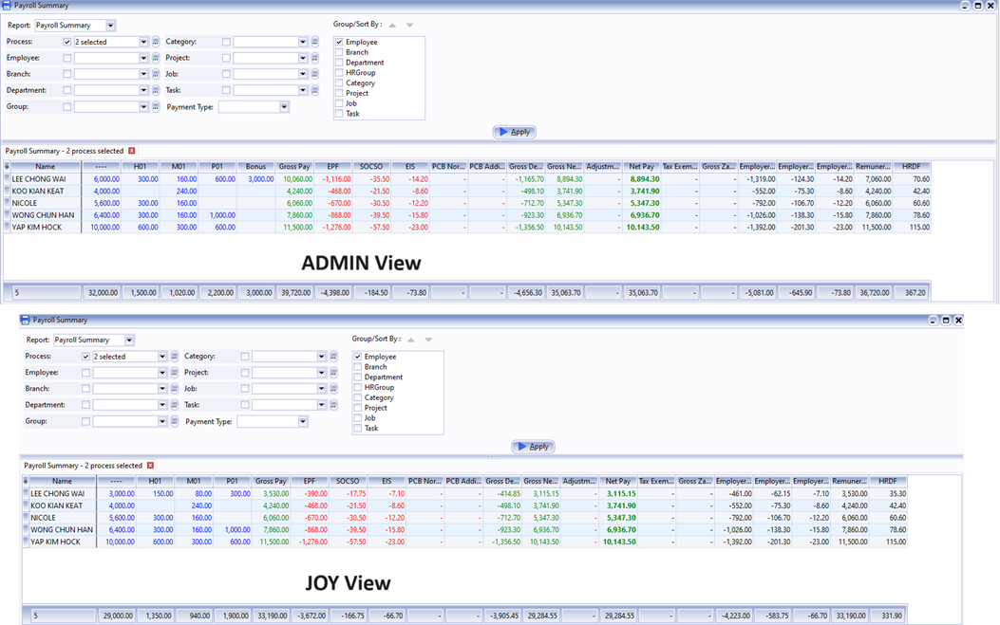

This guide explains how to maintain the confidentiality of bonus distributions by restricting access to bonus-related information.

For example, JOY is a new staff member in the HR department who needs access to employee records like leave and attendance but should not see bonus details. Follow these steps to hide bonus information in SQL Payroll:

## Revoke Process Bonus access right

1. Login as **ADMIN**.
2. Go to **Tools** > **Maintain User** > **New** to create a new user ID for JOY.
3. Go to **Access Control**.

    

4. Click on Process Bonus and Untick (Revoke) the Process Bonus option for users who should not have access to bonus information.

    

## What happens when you revoke the Process Bonus access right?

If JOY does not have the **Process Bonus** access right, the following restrictions apply:

### Access Denied on Payroll Preview

If JOY tries to preview an employee’s payroll (e.g., Lee Chong Wai) after a bonus has been processed by another user, the system will display an **Access Denied** message.

    

### Cannot Save Bonus Entries

If JOY attempts to enter a bonus amount for an employee and clicks **Save**, the system will immediately show an **Access Denied** error.



### Restricted PCB Access

During month-end payroll processing, even if an employee no longer has a bonus, JOY will be unable to click **Print PCB** if a bonus was previously processed for that employee.



### Hidden Payslip Formats

When JOY previews payslip formats, she can only see employees whose bonuses have not been processed. The payslip for Lee Chong Wai (who has a bonus) will be hidden.



### Payroll Summary

Once a payroll is processed with a bonus, the affected employee’s details are no longer visible in the list for JOY.

When JOY clicks **Apply**, the payroll details for Lee Chong Wai are hidden. She can still view the summary for other employees without bonuses, but Lee Chong Wai’s information is excluded.



If multiple processes are selected in the Payroll Summary, only those without bonuses will be displayed. Any process containing bonus-related information (wages, allowances, etc.) will be excluded from the summary.



## Revoke Report Access Right

In SQL Payroll version 220 and above, you can revoke specific user access rights for payroll reports. To prevent a user from seeing bonus amounts, ensure the following reports are unticked in their **Access Control** settings:

    ```text
    Process Bonus
    Pending Bonus
    Print EPF Borang A
    Print SOCSO Borang 8A
    Print EIS Lampiran 1
    Print SOCSO + EIS Contribution
    Print Income Tax CP 8 / CP 159
    Print Income Tax e-Data Praisi
    Print Income Tax CP 8D
    Print Income Tax CP 39
    Print Income Tax CP 22A
    Print Income Tax CP 22B
    Print Income Tax CP 21
    Print Income Tax EA Form
    Print Income Tax EC Form
    Print Income Tax Lampiran B (PCB Audit)
    Print Income Tax Lampiran 2 (PCB Audit)
    Print Income Tax PCB 2(II)
    Print Yearly Payroll Report
    Print Yearly Payroll Report - Wages
    Print Yearly Payroll Report - Allowance
    Print Yearly Payroll Report - Overtime
    Print Yearly Payroll Report - Commission
    Print Yearly Payroll Report - Claim
    Print Yearly Payroll Report - Bonus
    Print Yearly Payroll Report - Director
    Print Yearly Payroll Report - Paid Leave
    Print Yearly Payroll Report - Employment Loss Compensation
    Print Yearly Payroll Report - Gratuity
    Print Yearly Payroll Report - Advance Paid
    Print Yearly Payroll Report - Loan
    Print Yearly Payroll Report - Deduction
    Print Yearly Payroll Report - CP38
    Print Yearly Payroll Report - Unpaid Leave
    Print Yearly Payroll Report - Advance Deduct
    Print Yearly Payroll Report - Tax Benefit
    Print Yearly Payroll Report - Optional Tax Relief
    Print Yearly Payroll Report - EPF
    Print Yearly Payroll Report - SOCSO
    Print Yearly Payroll Report - EIS
    Print Yearly Payroll Report - PCB
    Print Yearly Payroll Report - Gross Pay
    Print Yearly Payroll Report - Gross Deduct
    Print Yearly Payroll Report - Gross Net Pay
    Print Yearly Payroll Report - Adjustment
    Print Yearly Payroll Report - Net Pay
    Print Yearly Payroll Report - HRDF
    Print Yearly Individual Report
    Print Pending Payroll Listing - All
    Print Pending Payroll Listing - Bonus
    Generate Payment Voucher / Journal Entry
    ```
