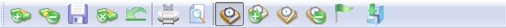
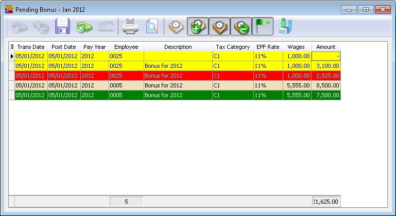
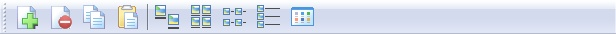

## Introduction

On top of every Grid Data entry user will see a list of some function buttons shown as below.

### Type 1

Below is the detail of each button (From Left)

| Button Name | Properties |
|--------------|-------------|
| Append | To insert/add new record(s). |
| Delete Selection | To delete selected record(s). |
| Save | Save the record(s). |
| Cancel | Cancel the current change(s). |
| Revert Record | Undo edits to the currently selected record. |
| Print | Print the grid list. |
| Preview | Preview the grid list. |
| Show Default Record | Show normal grid layout. |
| Show Inserted Record | Show only newly added/appended record(s). |
| Show Modified Record | Show only changed record(s). |
| Show Deleted Record | Show only deleted record(s). |
| Highlight | Show indicators for:   - **Insert:** Yellow  - **Delete:** Red  - **Modified:** Green    Refer to the image below for highlight examples.   This can only be used if the current changed record(s) are unsaved (i.e. before clicking **Save**).|
| Import Data | Import data from an external file (e.g., CSV or TXT file). |

### Type 2

Below is the detail of each button (From Left)

| Button Name | Properties |
|--------------|-------------|
| Append | To insert/add new record(s). |
| Delete Selection | To delete selected record(s). |
| Copy | To copy the selected record(s). |
| Paste | Paste the copied record(s). |
| Icon | Show records in icon view. |
| Small Icon | Show records in small icon view. |
| List | Show records in list view. |
| Details | Show records in detailed view. |
| Tiles | Show records in tiles view. |
