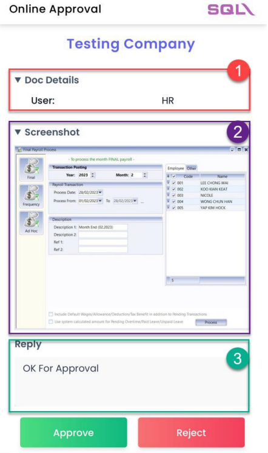

## Use cases

These **ALL** can use Online Approval for user :

| Module       | Access Right                                                                                                                    |
| ------------ | ------------------------------------------------------------------------------------------------------------------------------- |
| Logon Screen | - No access right to change password                                                                                            |
| ALL module   | - ALL Module with execute but have no access right for pront / preview or export                                                |
|              | - Unable to Grid Export                                                                                                         |
| Payroll      | - Process/ Delete Month End Outside Acceptable Transaction Date                                                                 |
|              | - Have right for Open Pending Payroll but without access right for execute or process right for pending Allowance, Overtime etc |
|              | - Payroll Report -Payroll \| print report \| have execute right without process report                                          |
| View         | - Not allowed to view Payroll or Leave Dashboard                                                                                |

## Sample Scenario

> For example : If we set Maintain Acceptable Transaction Date date from 01/03/2023

1. Process Year 2023 February month end

2. Click process > prompt a dialog box to override > click **_Online Approval_**

   

   1. Tick the ID that you choose to get approval

   2. You can choose to send by **Whatsapp**, **Send by Email** or **Send by Whatsapp & Email**

      

3. You will received a message at whatsapp or email send by system

   - **Senario 1 : Send By Whatsapp**

     > You will received a message > Click that link

     

   - **Senario 2 : Send By Email**

     > You will received an email > Click **_‘CLICK HERE FOR MORE ACTIONS’_**

     

4. Login **Gmail Address** that you setting in maintain user **Open ID (Google)**

   :::info[note]

   - This step is for those send by **whatsapp** and **not use Gmail** to received notification
   - Those use **Gmail Address** to received notification and approve can jump to **Step 6**

   :::

   

5. Enter your **Gmail Password**

   

6. After Login **Gmail** you will see this window

   

7. You can click on **_Doc Detail_** and **_ScreenShot_** to see the detail

   1. **Doc Detail** : To show User Name

   2. **ScreenShot** : To see the process screen

   3. **Reply** : You can left a message and click Approve or Reject

      

   :::info[note]
   After Approve or Reject you can go back SQL Payroll, you will see below screen
   :::

   - **Scenario 1 : Approve Override**

     > a. Message : Approve Message
     >
     > b. The green tick will appear after approve
     >
     > c. Click **OK** to save that transaction

     

   - **Senario 2 : Reject Override**

     > a. Message : Reject Message
     >
     > b. The cross will appear after reject
     >
     > c. The OK button is disabled after reject, click Cancel

     

     After Click Cancel System will Prompt back to this dialog box

     

## Setup

### Step 1 : Navigate to Tools > Maintain User

   

### Step 2 : Edit User

1. Double click the user will be set for Approval > Edit

   

   

### Step 3 : Set Approval Person

1. Setting The Detail For Approval Person (ONLY GMAIL CAN LOGIN TO APPROVE OR REJECT)

   1. Mobile number - To which whatsapp number to get notification for approval only

   2. Email - To which email address to get notification for approval only

   3. Open ID (Google) - Gmail for approve or reject

   :::info[note]
   If receive notification email and approve email is Gmail, do setting only at **3. OPEN ID (Google)** and leave **2.Email** column blank
   :::

   

   For Example :

   - **Senario 1 : Use Same Gmail to Received Notification and Give Approval**

     > Your Gmail address is : `XXXXXX@gmail.com`

     1. Open ID (Google) : `XXXXXX@gmail.com`
     2. Email : **Left as blank**

     

   - **Senario 2 : Use Different email to received notification and give approval**

     > - To Give Approval Gmail Address is : `XXXXXX@gmail.com`
     > - To Received notification Address is : `XXXXXX@estream.com`

     1. Open ID (Google) : Put your gmail address `XXXXXX@gmail.com`
     2. Email : `XXXXXX@estream.com`

   

### Step 4 : Setting SMTP

:::info[note]

- This Setting is for user who want to **use Email to send Notification**
- If use whatsapp to send approval can skip this step

:::

1. Make Sure you had create App Password

   - If you’re using Gmail , you can [CLICK HERE](https://support.google.com/accounts/answer/185833?hl=en) to follow the steps to create your App Password
   - After get App Password, return to your SQL Payroll

2. Click on Email Setting

3. Your Email SMTP Host

4. Your Email SMTP Port

5. Your Email SMTP Connection Security

6. Your Email Address

7. Your Apps Password

8. Your Email Sender Name

9. After done setting click Save

   
